Wikidata, projet frère de [[Wikipédia]] mené par la fondation Wikimédia développé dès 2006 pour faciliter le passage à un [[web sémantique]], ouvert à la contribution en 2012. 
Tout le contenu est placé sous licence CC:0 ce qui en France (où l'on ne peut pas créditer les auteurs), cela correspond à la CC:by

Voir présentation sur https://wikidata4science.dbelveze.fr 

contenu : https://wikidata4science.dbelveze.fr/presentation.html#/section-12

10% des éléments correspondent à des personnes
30% des éléments correspondent à des publications [[@braisherNewZealandThesis2025]]


# 1 liens associés

• Histropedia :http://histropedia.com/timeline-everything.html et un jeu associé https://wikitrivia.tomjwatson.com/
• Open Food Facts and Wikidata https://docs.google.com/presentation/d/1_WRGmyM7N6bsP4UPmdu1zeNC71By3RHEZNYs6wOCPfI
• Wikidata:Robots https://www.wikidata.org/wiki/Wikidata:Bots/fr
• Wikidata:Outils https://www.wikidata.org/wiki/Wikidata:Tools/fr
• Wikidata:Administrateurs https://www.wikidata.org/wiki/Wikidata:Administrators/fr

# 2 intérêt de Wikidata pour la recherche

présentation de Juliette Halimi 16 juin 2021

[résidences de Wikimédien.ne.s organisées par le GIS URFIST](https://www.ouvrirlascience.fr/un-partenariat-pour-renforcer-les-liens-entre-wikipedia-et-lenseignement-superieur-et-la-recherche-francaise-dans-un-contexte-de-science-ouvert/) ([[URFIST]])
[wikifier la science](https://fr.wikipedia.org/wiki/Projet:Wikifier_la_science)

Les concepts dans [[OpenAlex]]. Tous les articles sont reliés à des concepts, tous les concepts sont des éléments wikidata et ont donc un identifiant Wikidata, il y avait, en 2022, 65000 concepts et donc wikidata ID dans OpenAlex répartis de façon hiérarchique dans 19 classes principales ([[@priemOpenAlexFullyopenIndex2022]]). 

## 2.1 présentation de Wikidata

Lien avec les projets frères de Wikimedia
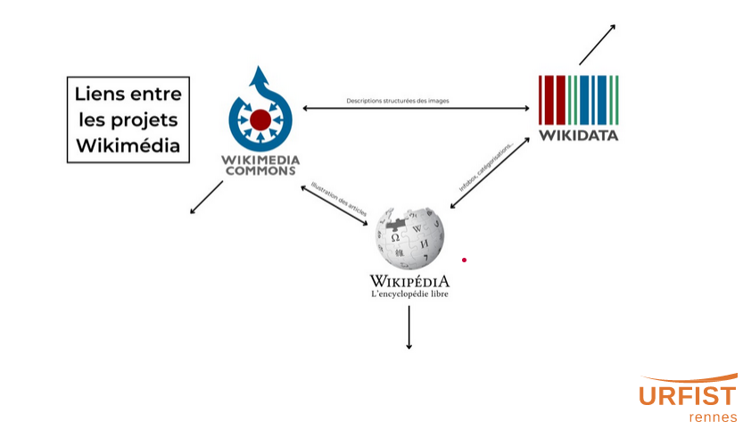

élément = item de base (Q) , Licence CC0

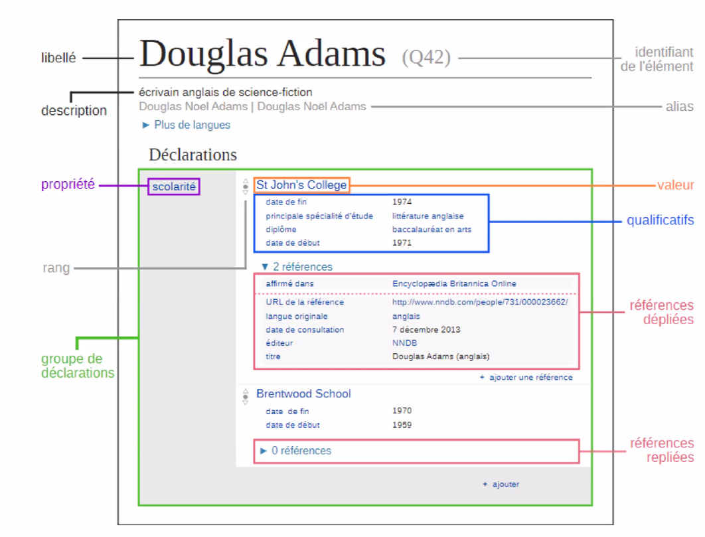

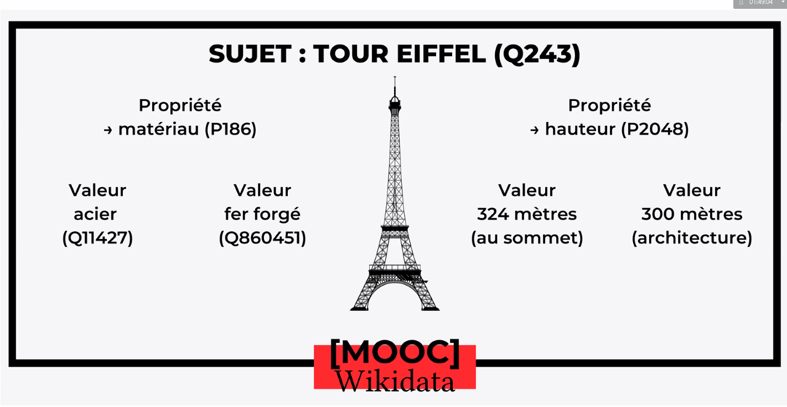

Lien avec le [[web sémantique]] "thing not string" (concept pas chaîne de caractère)
Passer d'un mot à un concept : cat / chat - élément chat

élément Douglas Adams ([Q42](https://www.wikidata.org/wiki/Q42))

triplet : sujet + propriété + valeur

Le guide du voyageur galactique = nature = oeuvre littéraire

## 2.2 exemples d'utilisation de données


taxons parents de la baleine bleue 

```sparql
#defaultView:Graph
SELECT ?item ?itemLabel ?pic ?linkTo
WHERE
{
  wd:Q42196 wdt:P171* ?item
  OPTIONAL { ?item wdt:P171 ?linkTo }
  OPTIONAL { ?item wdt:P18 ?pic }
  SERVICE wikibase:label {bd:serviceParam wikibase:language "en" }
}
```

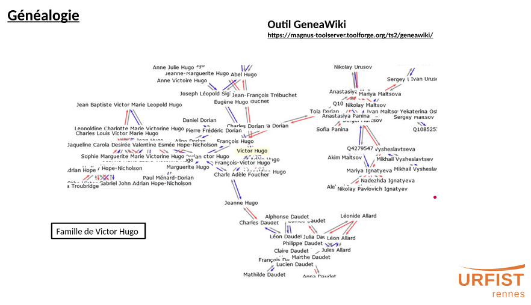
construction d'un arbre généalogique à partir des propriétés "père", "mère"
Où l'on voit qu'Alphonse Daudet et Victor Hugo étaient parents...

Lexicographie


Histoire : sorcières brûlées en Ecosse

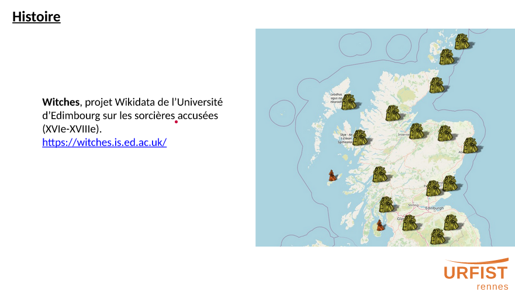

Art


## 2.3 Scientométrie et [[Science ouverte|science ouverte]]

Wikidata : point de convergence d'entités ouvertes et accessibles à la recherche

faire en sorte que les chercheurs aient tous un identifiant Wikidata (éventuellement en lien avec [[IdRef|IDREF]] et [[ORCID]])
visibilité numérique harmonisée 
wikidata = centralisation des identifiants, point fort de Wikidata reconnu par les institutions de recherche français. 

Outil Scholia

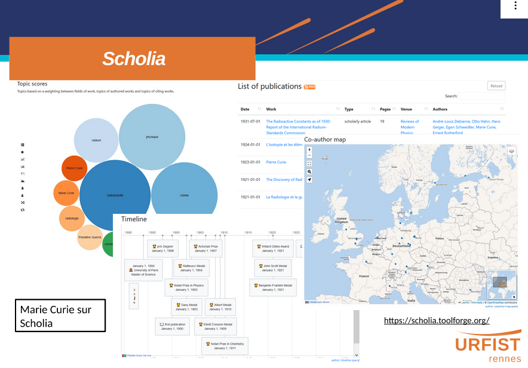

Scholia interroge les ressources de Wikidata pour créer un rapport scientométrique : liste publis, carte de localisation géographique de ses co-auteurs, timeline. 

Tout cela est généré automatiquement sur [Scholia](scholia.toolforge.org)

Scholia est une partie du projet Wikicite : accroissement des citations dans les projets de Wikimédia. 

Wikicite : ambition bibliographique de Wikidata

Guides d'harmonisation de l'information des données sur Wikidata

- [[wikidata ESR]] se mettre d'accord sur les propriétés qu'il faut utiliser pour décrire les acteurs de l'enseignement et de la recherche française : pour quelle propriété on doit renseigner quelle valeur


## 2.4 présentation d'outils qui permettent d'interroger Wikidata pour collecter des données

Extraire et importer des données. 

[[Sparql]] ressemble à SQL avec quelques subtilités
Point d'accès Sparql de Wikidata : https://query.wikidata.org
S'inspirer des requêtes des autres pour les adapter à ses propres requêtes. 

Autre outil [[Open Refine]]: tableur très puissant permettant d'aligner des données avec Wikidata (réconciliation des données avec Wikidata)

avec le [[R (logiciel)]], un [[package]] existe pour transformer des données dans le format de Wikidata (https://www.rdocumentation.org/packages/WikidataR/versions/2.3.3)

Quickstatements : faire des modification de masse sur des éléments Wikidata

peut se faire à travers une API et R : 

```r
# Add a statement to the "Wikidata sandbox" item (Q4115189)
# to say that it is an "instance of" (P31) of Q1 (the universe).
# The instruction will submit directly to wikidata via the API
# (if you include your wikimedia username and token)

write.wikidata(items        = "Wikidata Sandbox",
               properties   = "instance of",
               values       = "Q1",
               [format](https://rdrr.io/r/base/format.html)       = "api",
               api.username = "myusername", 
               api.token    = , #REDACTED#
               )
#note: l'élément wikidata sandbox est une instance de Q1 (Univers)
```
Le token de l'[[API]] se trouve sur https://quickstatements.toolforge.org/#/user (après s'être identifié)

exemple : ajout de la propriété "employé par" et de la valeur "Université de Rennes" pour les items "Muriel Hissler", "Mikaël Kepenekian" et "Gilles Salbert"

```r
library(WikidataR)
write_wikidata(items        = c("Muriel Hissler","Gilles Salbert",  "Mikaël Kepenekian"),
               properties   = "P108",
               values       = "Q1987282",
               format       = "api",
               api.username = "nom d'utilisateur Wikimedia", 
               api.token    = "mettre ici le token récupéré sur https://quickstatements.toolforge.org/#/user"
)
```


Mix'n'match : import de données de manière groupée dans Wikidata

## 2.5 Wikidata dans les Humanités numériques

synthèse de [[@zhaoSystematicReviewWikidata2023]]

wikidata (contenu) : base de données
- contenu multilingue
- contenu ouvert et lié à d'autres (Linked Open Data)
- contenu générique
- contenu éditable
- contenu collaboratif

wikidata(forme) : ontologie
- vocabulaire de référence
- graphe de connaissance

"a good starting point for projects that intend to link their data to existing datasets"

"The National Library of Israel converts its metadata to LOD by exporting metadata to Wikidata and creating new items on Wikidata for each selected manuscript [P33]"


# 3. Wikidata et identifiants de recherche

Ce qui suit sont les notes prises lors de la conférence de Pierre-Yves Baudouin du 27 octobre 2023 (support de la présentation [présente sur Zenodo](https://zenodo.org/records/10047281). 

L'Infobox de chaque article présente des champs modifiables. Dès qu'une donnée est modifiée dans Wikidata, cela met à jour l'infobox

utilisation en bas des articles, dans la section *Liens externes*

Tout le monde peut proposer la création d'une propriété (par exemple pour y associer un nouvel identifiant)

utiliser des [[expression régulière|regex]] pour récupérer les identifiants dans les URL provenant d'une base de donnée. 

3 outils pour faire des centaines ou des milliers de modifications à faire : 

- Mix'n'Match (voir supra)
- [[Open Refine]] (alignements entre données wikidata et autres identifiants provenant d'autres bases de données)
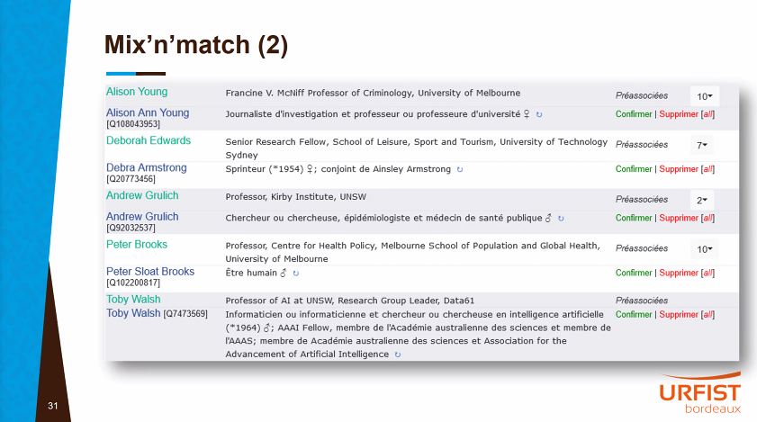

nécessité de faire des recherches complémentaires pour être sûr de ne pas associer des homonymes entre eux. 
logiciel utile pour travailler à l'alignement de données (BDD / wikidata)


utilisation de l'ID RadioFrance dans Wikidata (évolution). Travail réalisé notamment pour améliorer le [[référencement web]]

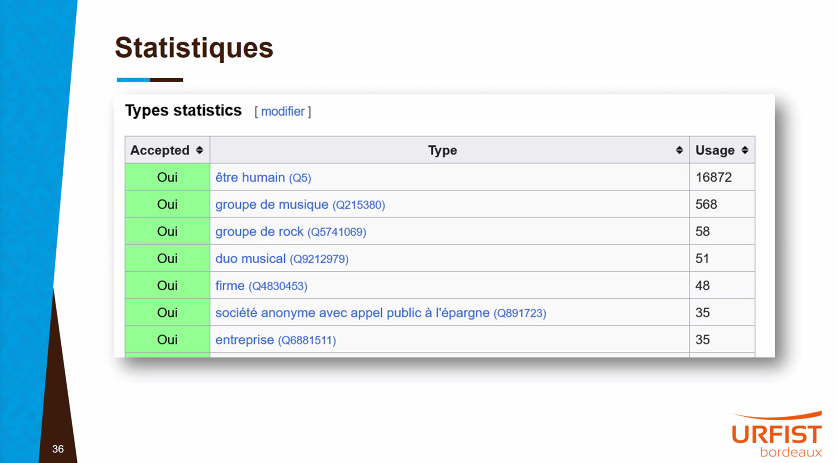
Répartition des types d'éléments sur Wikidata

[Wikidata Thesis Toolkit](https://www.wikidata.org/wiki/Wikidata:WikiProject_Wikidata_Thesis_Toolkit)

Gestion des contraintes dans la saisie des données

saisie des données hétérogènes due à une inégale maîtrise des référentiels (si on compare à un catalogue de bibliothèque)
choix divergents selon les bénévoles

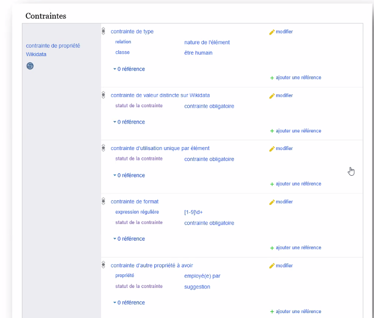
wikidata prévient quand il y a risque de doublon
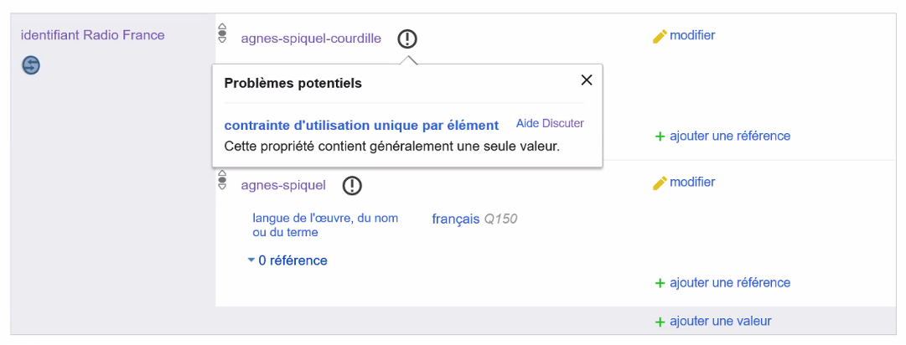

message d'alerte
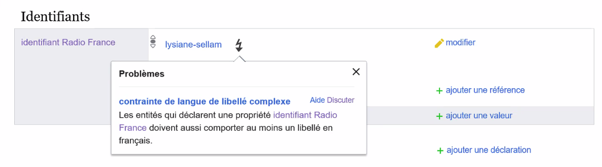
rapport de contraintes
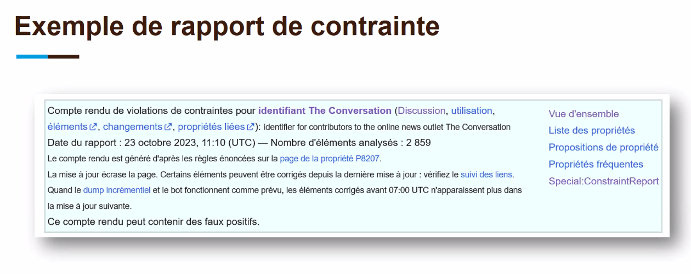

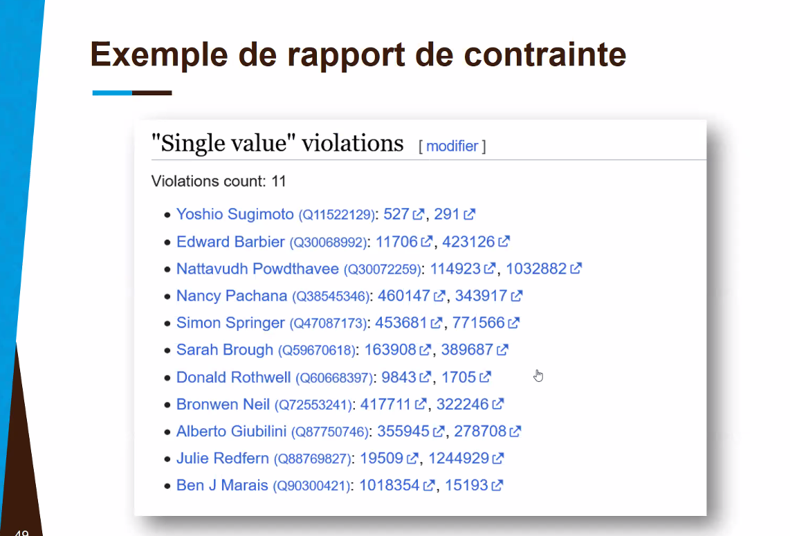


avalanche d'identifiants provenant de WD à la fin de l'article de Victor Hugo : Question de la communauté : lesquels afficher ? comment justifier le choix ? 

notion de catégorie cachée dans Wikipédia. 

Mir@bel renvoie vers les articles Wikipédia quand ils existent. 


wikidata invisibilisé dans ce montage

biais de genre : remplir la propriété sur le genre (ou le sexe)

alignement fait entre wikidata et d'autres corpus (universalis, Britannica, Oxfort, Who's who), cela permet de mesurer le [[biais de genre dans Wikipedia]] 

parité dans les émissions télévisuelles ou audiophoniques : 

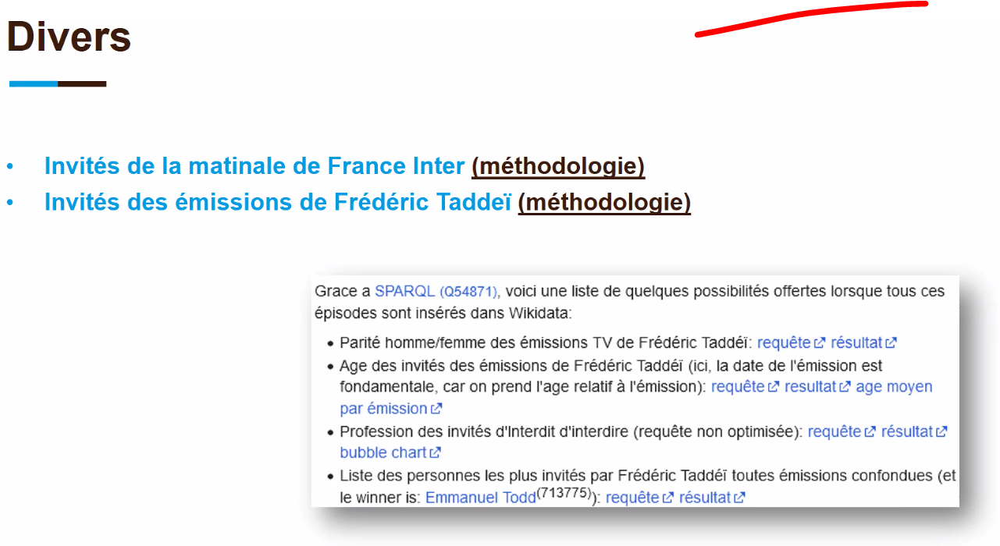
idéal pour des recherches sur le genre dans les médias

critères d'admissibilité : il n'y en a pas sur WD (contrairement à WP) tout ce qui existe peut se retrouver sur WD, mais plus l'élément créé est anecdotique et moins il risque d'être mis à jour en cas de changement (par exemple chercheur promu ou muté dans une autre université)

Démo: ajout d'un Qid pour un auteur qui a publié dans the conversation et n'est pas encore lié à Wikidata. 

Travail de recherche collaboratif : compléter les éléments si on s'intéresse à un corpus particulier et qu'on veut que ses données soient complètes. 


# Envoi vers Wikidata depuis OpenRefine

voir [[formation URFIST à OpenRefine]] et [[Open Refine]]

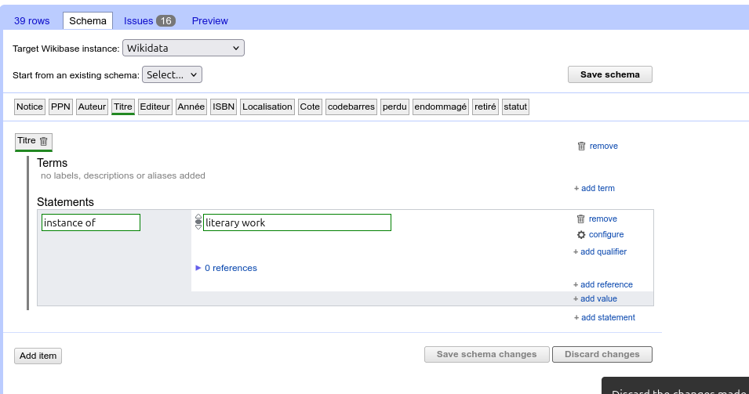
1. Réconcilier les données en partant d'une colonne (par exemple titre ou auteur)
2. créer une colonne pour le label
3. dans les extensions (en haut à droite), sélectionner wikibase
4. choisir "edit wikidata schema"
5. créer le schéma de correspondance

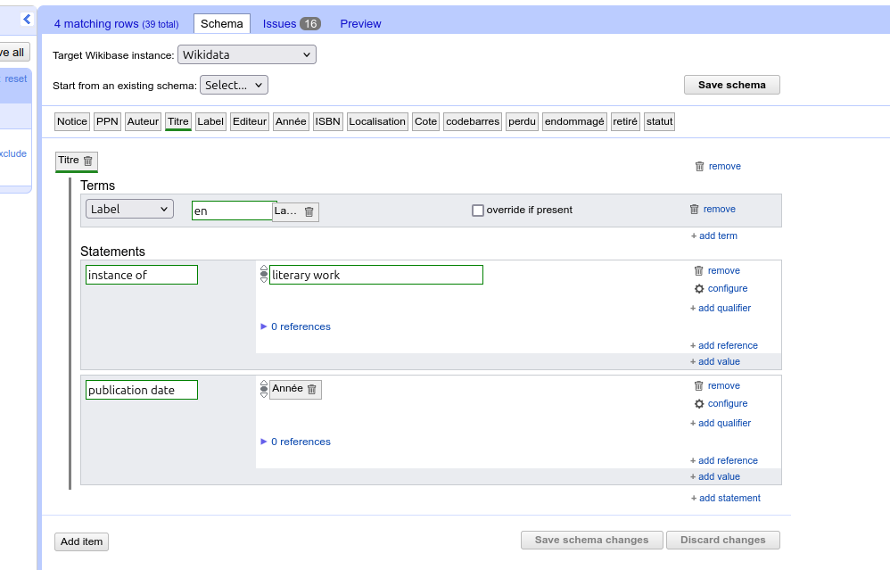

Quand le schéma est complet, l'envoyer vers Wikidata


# 4 bibliographie

