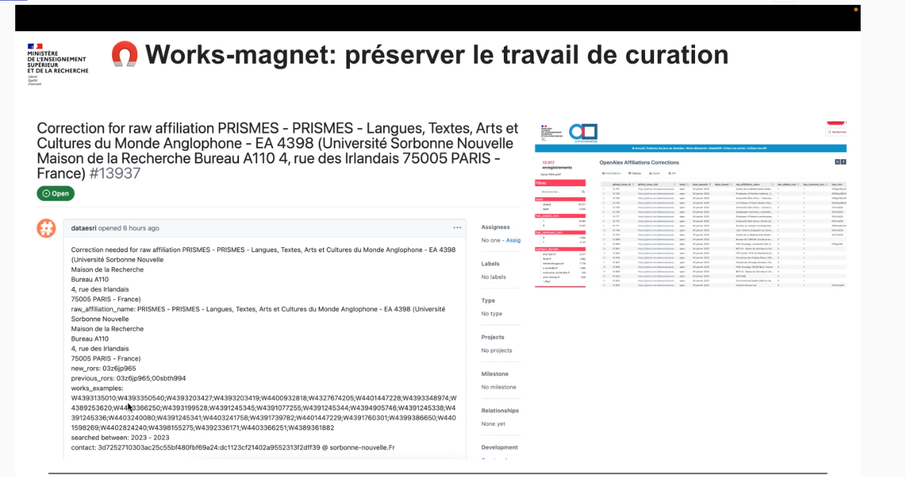
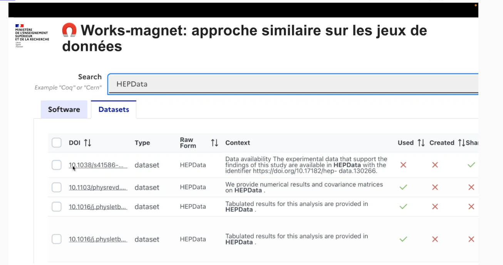
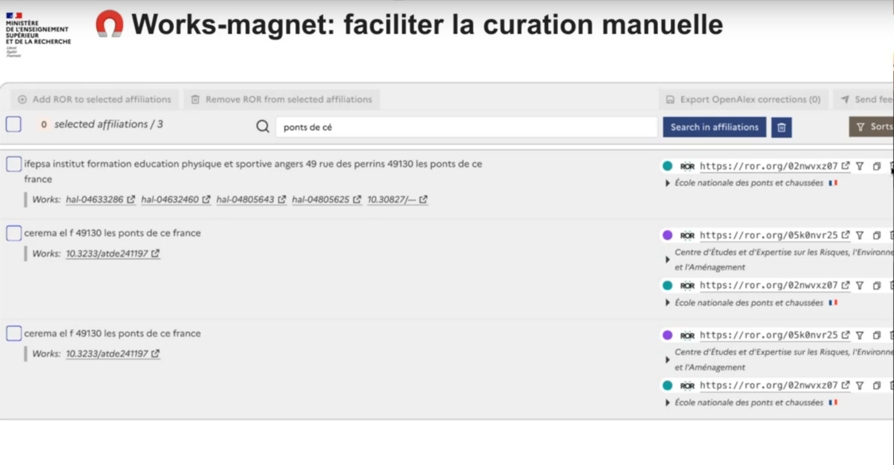

https://works-magnet.esr.gouv.fr/

Un outil, plusieurs fonctionnalités

- Amélioration des métadonnées calculées par IA
- Alignement affiliations / ROR dans OpenAlex
- Mentions de logiciels et jeux de données dans le texte intégral  
- Constitution de corpus / aide au repérage
- des publications
- des jeux de données dans les entrepôts

# Amélioration des métadonnées

[[ROR]], [[OpenAlex]] 
rend visible le produit d'[[API]](Ror, et OpenAlex) et corriger les métadonnées (absence de ROR dans un résultat d'OpenAlex ou mauvais ROR à corriger par exemple)
Les propositions de correctifs sont mis à disposition sur une forge [[Github]] moissonnée par OpenAlex

voir [[@jeangirardBarometreScienceOuverte2025]]

exemple de correction (remplacement d'un ROR par un autre), le mail de la personne qui a fait la modif est [[Chiffrement|chiffré]]

repérage des datasets et des codes source à partir d'un organisme de réfléchir.

WM propose des oeuvres en relation avec un labo, à nous de confirmer que le ROR associé est le bon (colonne de droite) ou bien de le corriger. 

# Se constituer un jeu de donnée sur les métadonnées de publications et de dépôts de données
(présentation par Anne Lhôte)

$\newline$
# bibliographie
$\newline$

---
title: works magnet
subtitle:
id: 20250304_works magnet
author: Damien Belvèze
date: 2025-03-04
link_citations: true
bibliography: biblio/Obsidian.bib
biblio_style: csl\ieee.csl
aliases: []
tags: []
---

$\newline$
# bibliographie
$\newline$

