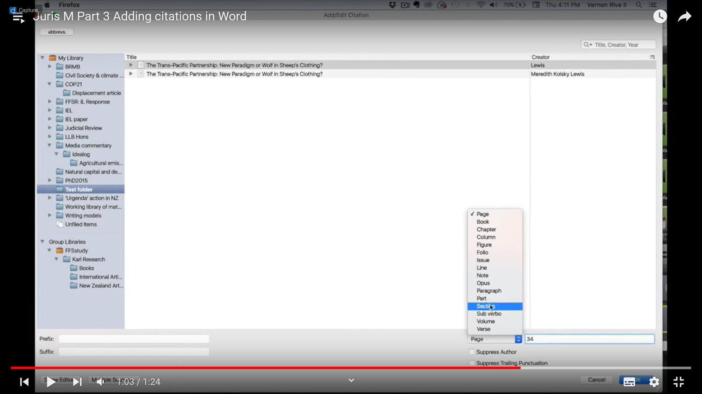

Gestionnaire de références bibliographiques multiplateforme libre et gratuit. 
Fonctionne avec des [[styles CSL]]

# installer Zotero sur un poste sous GNU/Linux

documentation (comportant les lignes de commande) sur le [forum Ubuntu](https://doc.ubuntu-fr.org/zotero)

# Zotero pour les juristes

## Utiliser Juris-M

[Juris-M](https://juris-m.github.io/), fork de Zotero (peut également servir en langues O : possibilité d'afficher le titre dans l'écriture originelle et en translittéré)
Gestion des abréviations : https://juris-m.readthedocs.io/en/latest/abbrevs.html
Cass ~plen > Cour de cassassion séance plénière

## Trouver un style biblio pour Zotero dans le domaine du droit

Guide de citation de Cujas (= guide Ref-lex) : 
https://biu-cujas.univ-paris1.fr/fr/node/1024

[Guide de citation de l'URFIST et de l'Ecole Doctorale de droit de Bordeaux](https://www.zotero.org/styles/universite-de-bordeaux-ecole-doctorale-de-droit)

# Rendre un site opérant avec Zotero

# Utiliser Zotero avec Rstudio
  
Pour utiliser Zotero avec [[R (logiciel)|R]], suivre le manuel de Scsalinsky [[@scskalickyZoteroTutorial2022]]

# Envoyer une copie du document dans une archive du web

Memento > Robustify 
alternative au snapshot (alléger sa KB)

# Modifier un style

[Diaporama](https://docs.google.com/presentation/d/1upzyvIhP6f3twI7IaBMjrZuIadiOIEm9-RDODf2FXLU/edit?usp=sharing) pour présenter la structure d'un style CSL
Possibilité de trouver des exercices pratiques dans le [billet d'Hypothèses](https://zotero.hypotheses.org/3746) sur les "petites modifications de style"

# Importer des références

## Depuis un document Word, ODT ou PDF

[RefExtractor](https://rintze.zelle.me/ref-extractor/): limites importantes de l'outil, à l'origine les réf à extraire doivent avoir été créées avec Zotero ou Mendeley. Pas de traitement des PDF

[Cermine](http://cermine.ceon.pl/cermine): traite les PDF

[Anystyle](https://anystyle.io/): copier-coller des bibliographies
Essai avec [[Floridi.pdf]]

# Copie rapide

(quick copy : https://stackoverflow.com/questions/69276886/shortcuts-to-copy-bibtex-and-citation-key-in-zotero)
Ctrl+maj+C (par défaut)
permet d'exporter avec un [[raccourcis-clavier]] une citation sous la forme d'un enregistrement en [[bibtex|BibTex]] ou autre...

# édition en groupe de champs dans Zotero

![[zotero_bulk_edit.js]]

Certains concepteurs de revues de littérature aiment donner une vision graphique de leur corpus avec des outils d'analyse et de [[visualisation de données|visualisation de données]] comme Tableau Public ou [[Lodex]], par exemple, donner sous la forme d'un camembert la part représentée dans la collection par différentes langues (anglais, français, italien, etc.). Cela ne peut se faire que si la variable langue est correctement renseignée de façon automatique. Or sur certains sites, pour une référence en français on aura "fr", sur d'autres "fr-FR", sur d'autres encore "french" ou "français". Pareil pour les autres langues évidemment ("en","en-US", "english", "English", "eng", etc.). Comment adopter la même forme pour tous les articles en anglais ou en français ? On ne va évidemment pas retoucher tous les items d'une collection qui peut en contenir plusieurs milliers mais utiliser des scripts pour le faire par groupe (par exemple en indiquant que les formes "en","en-US","eng", etc. devront être exprimée par "English"). 

Le script de thalient-ai permet de faire ça et bien d'autres choses : [https://github.com/thalient-ai/zotero-scripts/blob/main/zotero-bulk-edit/src/zotero_bulk_edit.js](https://github.com/thalient-ai/zotero-scripts/blob/main/zotero-bulk-edit/src/zotero_bulk_edit.js "https://github.com/thalient-ai/zotero-scripts/blob/main/zotero-bulk-edit/src/zotero_bulk_edit.js")

Voici un exemple d'usage de ce script : [https://video.univ-rennes1.fr/permalink/v1268af4fca2dp7avzaf/iframe/](https://video.univ-rennes1.fr/permalink/v1268af4fca2dp7avzaf/iframe/ "https://video.univ-rennes1.fr/permalink/v1268af4fca2dp7avzaf/iframe/")
# Gérer les tags 
voir extension Actions and Tags dans[Zotero avancé, Frédérique Flammerie](https://github.com/fflamerie/zotero_modules/blob/main/content/zotero_modules_COURS.md#3-optimiser-lorganisation-de-sa-biblioth%C3%A8que-avec-actions-and-tags)

# Gérer les moteurs de recherche

Aller là où sont stockées les références, dans Zotero>locate, modifier le fichier engines.json

Récupérer les moteurs de recherche de votre choix sur la [page de configuration des moteurs](https://github.com/bwiernik/zotero-tools/blob/master/engines.json)

D'autres moteurs peuvent être ajoutés à cette liste. 

