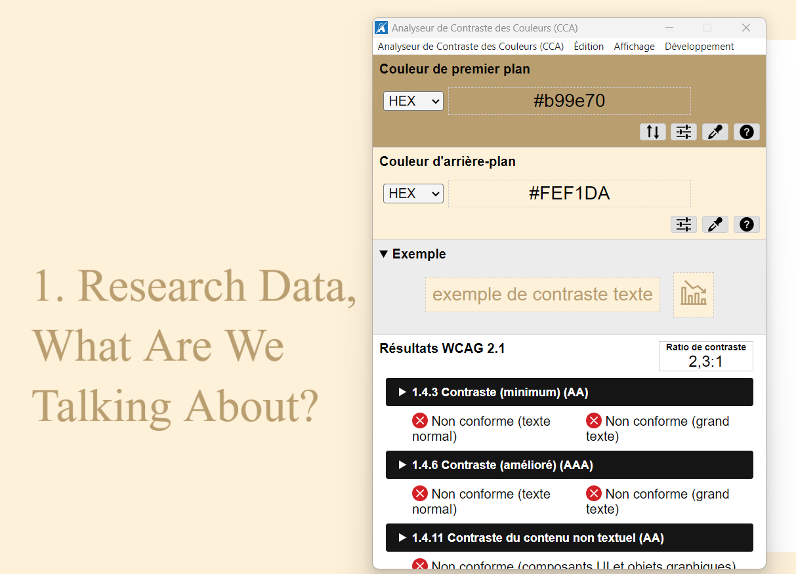
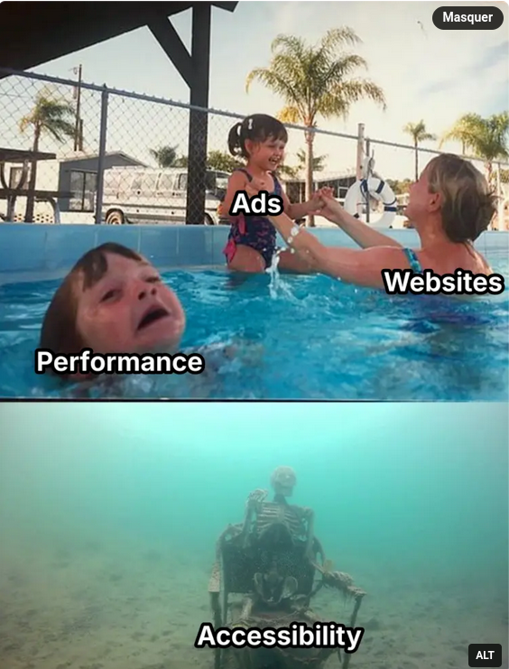

# Principes

Editeurs de texte plus adaptable que les traitements de texte aux problèmes d'accessibilité
[[@perretMauvaisOutilPropos2023]]

Méthodes et techniques pour les mémoires, thèses et travaux de recherche [[@ministeredelenseignementsuperieurdelarechecheetdelinnovationMemoiresThesesPublications2023]]

# traitement de texte

[LibreOffice, vérificateur d'accessibilité](https://help.libreoffice.org/latest/fr/text/swriter/01/accessibility_check.html?DbPAR=WRITER)

alt-text : 

> Reading alt text like you read that little thing at the museum that explains to you what the painting is actually about and what you're even looking at

source : https://carfree.city/@sanae/111936518641884238

Comment écrire du [Alt-Text](https://www.perkins.org/resource/how-write-alt-text-and-image-descriptions-visually-impaired/)
### contraste

étude du contraste avec https://www.tpgi.com/color-contrast-checker/

# le business de la publicité contre l'accessibilité

Springer, au nom du [[droit d'auteur]], veut empêcher les navigateurs de bloquer les pubs sur les pages qui appartiennent au groupe. Les possibilités de paramétrage des pages en faveur de l'accessibilité sont les victimes collatérales de cette nouvelle offensive. 

$\newline$
# bibliographie
$\newline$

