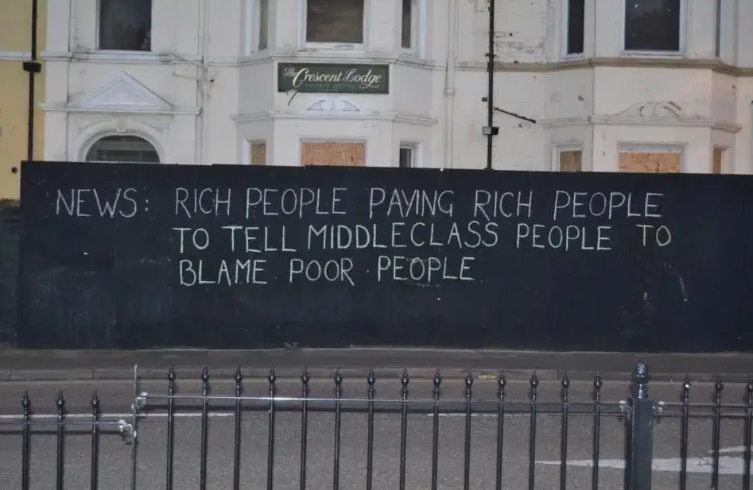

> La théorie des effets d'agenda soutient que si les individus ne sont pas influencés par des informations unitaires, ils sont sensibles à la manière dont les grands enjeux sont fixés pendant une campagne électorale

(source [[@cardonCultureNumerique2019]], p269)

>indépendamment de la façon dont on parle de la personne. Il n’y a pas de bad buzz

(Claire Sécail, à propos de la réponse de Cyril Hannouna à son travail, [[@garrigosHanounaEstPilier2022]])

# agenda setting vs agenda building

**agenda setting** (=mise à l'agenda) : lorsque les médias imposent aux politiques et à l'opinion des sujets de préoccupation

**agenda building** : lorsque des entrepreneurs de cause (*claimsmakers*) dictent aux médias ou aux politiques ou aux deux les sujets dont on doit débattre. 

Depuis Howard Becker ("Outsiders"), on sait que les problèmes sociaux ne sont pas médiatiquement ni politiquement traités en fonction de leur importance statistique mais selon des positions plus ou moins élevées dans l'appareil médiatique ou politique par ces entrepreneurs de cause. 
Ces derniers peuvent susciter ou amplifier par exemple une [[panique morale]] pour faire avancer leur cause qu'elle soit progressiste ou réactionnaire (la répression sécuritaire, le désarmement, la fin de la filière nucléaire, etc.)

Si les médias seuls pouvaient faire une élection, Balladur aurait gagné la Présidentielle de 1995 (Le Monde indiquait dans ses colonnes que le match était déjà joué) alors qu'il n'a pas atteint le second tour. Le Pen, détesté de la très grande majorité des médias en 2001 n'aurait pu accéder au second tour de l'élection présidentielle suivante, le Oui l'aurait emporté au référendum sur le traité constitutionnel européen de 2005 alors que c'est le non qui a gagné à 55%, Juppé aurait été élu en 2017 alors qu'il n'était même pas candidat aux Présidentielles, mais les principaux médias lui donnaient la meilleure cote. 
Les médias ne font donc pas l'élection mais ils déterminent de quoi va parler l'élection. En dehors des élections, les médias dominants [[dépolitisation|dépolitisent]] les enjeux sociaux, ce qui profite à la droite et surtout, dans une campagne, tout comme en dehors d'une campagne, ils fixent la liste des sujets dont on va parler. Ainsi les médias dominants ne déterminent pas **ce qu'il faut penser** mais plus subtilement **à quoi il faut penser** (https://www.blast-info.fr/emissions/2024/glucksmann-bardella-zemmour-macron-les-candidats-preferes-des-medias-GhzY3hI0SlWfHawbDmc4Gw)
## Weaver et Elliot

Pour Weaver et Elliot, l'agenda setting est la manière dont les médias imposent leur agenda au public, et l'agenda building est la manière dont leurs sources imposent leur agenda aux médias.

(source: [[@lecrosnierYaEditeurDans2023]])

Il s'agit donc d'une autre acceptation du media building consiste à observer que les médias, pour des raisons économiques (coût de production d'une information originale) sont sous perfusion d'informations déjà constituées ([[bâtonnage de dépêches]]) ou bien sous le robinet de sources officielles (hommes et femmes politiques)

Dans un papier de 1987, Dan Berkowitz[[@berkowitzTVNewsSources1987]], expose trois façons de voir le rôle du journaliste dans la sélection de l'information à faire paraître au public: 

- **rôle de sélection**: le journaliste choisit en fonction de son éthique professionnelle les infos qui lui proviennent de ses sources pour en porter un certain nombre à la connaissance du public
- **rôle d'affirmation des valeurs dominantes** : le journaliste choisir les sujets qui confirment la position du groupe dominant ou affirme les valeurs dominantes
- **rôle de compétition** : dans un domaine très concurrentiel où le travail journalistique doit être rapide, le rôle du journaliste consiste à retranscrire directement ce que disent ses sources à l'audience. 

Cette troisième façon de voir le rôle du journaliste inspire à Berkowitz sa théorie de l'agenda building

# les applications de la théorie de l'agenda setting

Claire Sécail dans sont récent travail sur TPMP et Cyril Hannouna a utilisé une méthode tirée de l'agenda setting pour mettre en lumière la centralité de la figure de Zemmour dans cette émission phare de Cnews. Qu'on le critique ou qu'on le loue, qu'on parle de lui ou qu'on le fasse parler, un candidat comme [[Eric Zemmour]] bénéificie toujours de cette exposition alors que l'Arcom, régulateur des temps de parole sur les chaînes de télévision, n'agit que sur les temps de parole effectifs des candidats. Ainsi une chaîne peut mettre en lumière uniquement les sujets sur lesquels un candidat est expansif, passer sous le boisseau les sujets sur lesquels il n'a rien à dire ou bien dont il se désintéresse, invisibiliser les autres candidats comme l'a fait Hanouna tout au long de la campagne de 2022, sans pour autant déroger aux règles fixées par le régulateur des médias[[@garrigosHanounaEstPilier2022]] : 

> Je mobilise des notions qui sont éprouvées en recherche depuis les années 1970, telle la « mise à l’agenda » : qu’est-ce qu’on donne à voir et à penser au public plutôt qu’autre chose, sur une personne, un thème… Donc je vais compter du temps d’antenne pour un candidat même s’il y a des critiques émises sur le plateau parce qu’il est centralisé, qu’on ne parle pas d’un autre. Alors que l’Arcom va faire une distinction entre du positif et du négatif. Quand un propos n’est pas favorable à un candidat, il ne va pas le compter dans le temps d’antenne.

# bibliographie

