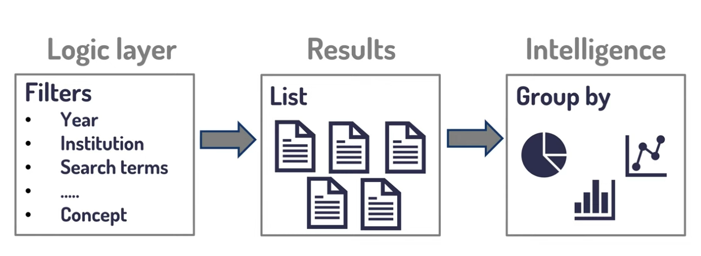
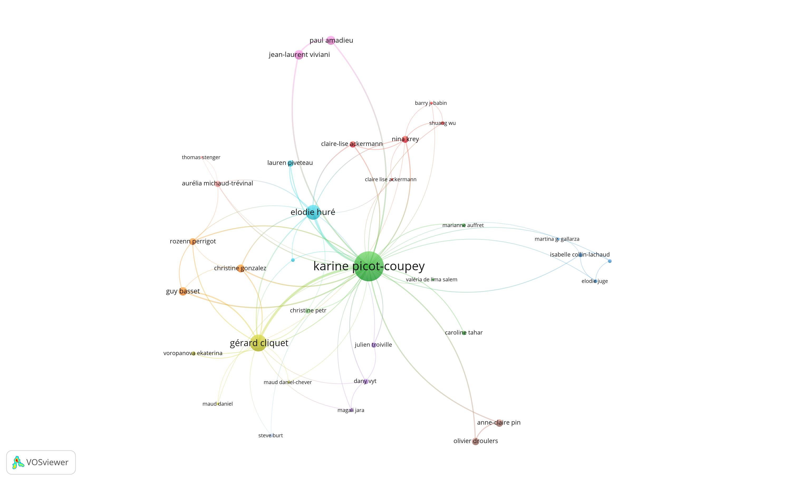

voir [[OpenAlex]]

analyse bibliométrique avec OpenAlex et Lodex, voir [[OpenAlex et Lodex]]

recherche de base. 
Polite pool dans l'URL (comportant un mail) = garantit de meilleurs temps de réponses. 

`https://api.openalex.org/work?mailto=YOUR_EMAIL@example.com`

````
https://api.openalex.org/works?mailto=damien.belveze@univ-rennes.fr?filter=title.search:cubist,publisher:https://openalex.org/P4310319965
````


mailto: qui envoie la requête
filter: quel filtre est utilisé (filter=nomdufiltre:filtre)
group-by: création de groupes dans les résultats. 

````
https://ai.openalex.org/works? mailto:____@___&filter=filtre:___filtre___&group-by:___groupe____
````

```
https://api.openalex.org/works?filter=institutions.id:https://openalex.org/I56067802,publication_year:2010-2020&group-by=publication_year
```

donne la liste des publications répertoriées pour l'Université de Rennes chaque année entre 2010 et 2020


# Analyser la production d'un laboratoire en matière de publications en Open Access

Publications CREM à partir de l’ID OpenALex (voir requête précédente) : 

[https://api.openalex.org/works?filter=institutions.id:I4210088544](https://api.openalex.org/works?filter=institutions.id:I4210088544) 

Publication pour la seule année 2022 :  

[https://api.openalex.org/works?filter=institutions.id:I4210088544,publication_year:2022](https://api.openalex.org/works?filter=institutions.id:I4210088544,publication_year:2022) 

Résultat : 127 publications

Publication en open access pour l’année 2022 :  

[https://api.openalex.org/works?filter=institutions.id:I4210088544,publication_year:2022,is_oa:true](https://api.openalex.org/works?filter=institutions.id:I4210088544,publication_year:2022,is_oa:true)

résultat : 50 publications sur 127 
Récupérer la production qui n'est pas en OA

Quel type de publication en open access pour l’année 2022 : 

[https://api.openalex.org/works?filter=institutions.id:I4210088544,publication_year:2022&group_by=oa_status](https://api.openalex.org/works?filter=institutions.id:I4210088544,publication_year:2022&group_by=oa_status) 

(83 publications fermées, 39 en Green OA, 2 en Gold OA, 2 chez des éditeurs hybrides, 1 en [[Bronze Open Access]], 0 en statut inconnu) Il y a un différentiel de 6 unités avec le chiffre précédent, mais le total est bien 127, ce qui laisse penser que le filtre is_oa est moins performant que le groupement par type d’open access.
# comparer le nombre d'articles citant un article donné dans le WOS et dans OpenAlex

définition de la notion de Citation missing gap [[@rodriguesWebScienceCitation2023a]]

## OpenAlex

1. trouver l'identifiant de l'article cité par son DOI: https://api.openalex.org/works/https://doi.org/inscrireiciledoi
2. accéder aux DOI des articles qui citent cet article : https://api.openalex.org/works?filter=cites:Widentifiantdel'articledansOA&select=doi
3. récupérer sous la forme d'une liste les DOI présents dans le document Json : 
    - copier-coller en format texte le document JSON
    - coller le texte dans Notepad++ (chercher > marquer > copier le texte marqué). Utiliser comme expression régulière https://doi.org/[a-zA-Z0-9./()-]+
    - on obtient une liste de DOI, récupérer le fichier RIS correspondant à ces DOI en utilisant le service en ligne https://www.sciencedz.net/en/tools/doi2ris-doi-to-ris-converter.php
    - télécharger le fichier obtenu et l'envoyer dans Zotero


# analyser la production d'une université avec Open Alex

<iframe width="560" height="315" src="https://www.youtube.com/embed/FbbeUGd6i-4?si=iPgMcvT6pVq5v6Hy" title="YouTube video player" frameborder="0" allow="accelerometer; autoplay; clipboard-write; encrypted-media; gyroscope; picture-in-picture; web-share" allowfullscreen></iframe>

Research Intelligence ([[RESINT]]) 
Comprendre dans quels domaines s'oriente la recherche de tel ou tel acteur. 




# Analyser les publications d'un auteur

trouver l'ID Open Alex d'un auteur (exemple avec Karine Picot-Coupey)
Chercher un article de KPC (par exemple, sélectionner celui-ci : 10.1016/j.jretconser.2017.08.011)

https://api.openalex.org/works/mailto=damien.belveze@univ-rennes.fr/https://doi.org/10.1016/j.jretconser.2017.08.011
chercher "Picot"
on trouve l'ID Open Alex de KPC : A5042558874

ou plus simplement, utiliser l'interface publique : https://explore.openalex.org/
chercher Karine Picot


Sur VosViewer, entrer cet ID
choisir : co-authorship, réduire à 1 le nombre d'articles co-écrit pour apparaître dans le [[graphe]]: 



changer pour [[co-citation]]

## Analyser la production d'articles par concept

https: //api.openalex.org/works?filter=concept.id:C28631016,concept.id:C132651083
permet d'obtenir des articles en rapport avec la gestion des forêts et le changement climatique.
Visualiser la production par institution sur le sujet : 
https://openalex.org/works?page=1&filter=concepts.id%3AC28631016%2BC132651083&group_by=authorships.institutions.lineage

## D'OpenAlex à VOSViewer

> The third option is to make an API call outside [[VOS viewer]], to save the data resulting from the API call in a JSON file, and to provide the JSON file an input to [[VOS viewer]]. This option has the advantage that it offers full flexibility. For each API, the URL provided in Table 2 offers information explaining how a call to the API can be made [[@vaneckVOSviewerManual]], (p30-31).

create > create a map based on text data > download data through API

## Visualiser des données issues d'OpenAlex avec Lodex

[[Lodex]] : outil de [[traitement de données]] proposé par l'INIST-CNRS

https://github.com/Inist-CNRS/lodex-use-cases/tree/master/openalex

voir [[OpenAlex et Lodex]]


$\newline$
# bibliographie
$\newline$


