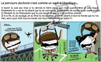
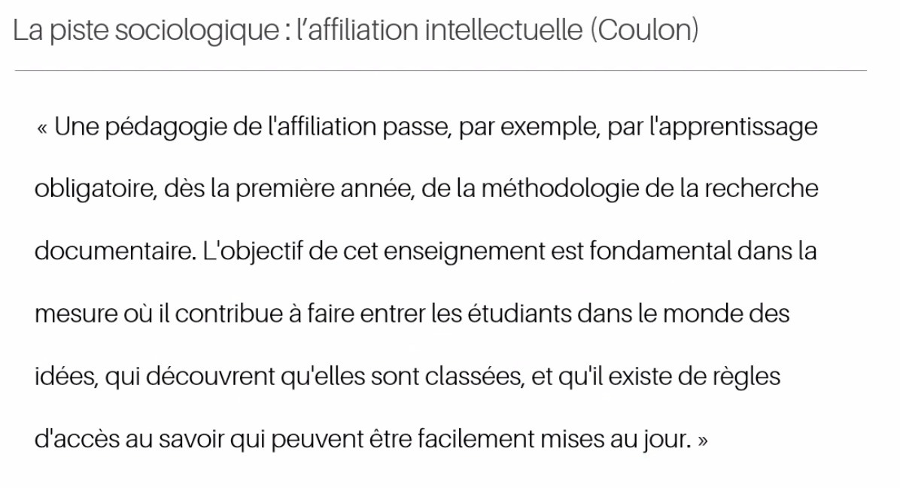

# définition de la compétence

ingrédients : savoirs acquis + savoir-êtres
tour de main : savoir-faires

On va se rendre compte de la compétence de quelqu'un par son savoir-faire (output)
(Alain Le Boterf)

Niveaux de compétence : 
Notion, application, maîtrise, expert.

L'expert, c'est celui qui est capable de transmettre ce qu'il sait (la maîtrise n'inclut pas la transmission)

# le mantra "sortir de la zone de confort"

axe Y : compétence peu utlisée -> compétence beaucoup utilisée
axe X : compétence appréciée par l'agent -> compétence peu appréciée

| | |
|:---:|:---:|
| zone de développement | zone de confort |
| zone grise | zone d'effort |

le but de la montée de compétence est de faire passer les gens de la zone de développement à la zone de confort. 

Sur le mantra "sortir de sa zone de confort[[@wildingPleaseStopTelling2018]]"

# Pourquoi les compétences dans l'enseignement supérieur

"L'approche par compétences : une belle rose mais avec des épines"(conférence d'Yvan Pigeonnat (INP))

pourquoi les compétences dans l'enseignement supérieur 
- meilleure employabilité ? 

est-ce bien le but de l'université de préparer à l'employabilité
avons-nous réellement des problèmes d'employabilité

Les démarches compétences provoque des choses que l'entreprise aime bien (réactivité, adaptation), mais ce n'est pas une raison suffisante pour passer à l'APC

- meilleur engagement des étudiants dans leur formation ? 

C'est ce levier qui plaide le plus en faveur de l'APC

Est-ce que les tutelles ont vraiment raison de nous y inciter. Oui mais elles ne s'y prennent pas forcément très bien

exemple du jean à faire sécher. Les étudiants ont  les compétences physiques requises mais ils ne les appliquent pas à une situation concrète (analogie avec les les fils à haute tension, aux téléphériques, etc.)

autre exemple : projet GL de l'Ensimag

1 mois à temps complet par groupes de 5 à réaliser un prototype de [[compilation|compilateur]] sur la base d'un cahier des charges
groupes consitués au chois des étudiants
certains groupes constitués des formules 1 académiques réalisent des prototypes très moyens, voire mauvais

Pourquoi : manque de compétences transversales (cf. communiquer les uns avec les autres, documenter)

Lutter contre les savoirs validés sur le plan scolaire mais inutilisables dans la vraie vie de citoyen et de professionnel

La compétence doit revêtir un caractère intégrateur (et pas additif) ; elle intègre des connaissances empruntées à plusieurs domaines

compétence pluridisciplinaire, mêlant des apprentissages transverses et coeur de métier. Nécessite d'être exercée dans un cadre réaliste.

# alignement pédagogique

engager les étudiants dans une démarche réflexive. cela prend du temps, du coup pas très raisonnable de penser qu'on puisse travailler plus de trois compétences par semestre. 

Pédagogie par objectifs -> démarche par compétence complètement intégrée en complète [[interdisciplinarité]]

à un pôle, les UE disciplinaires vivent indépendamment les une des autres et sont des ressources pour le développement des compétences
à l'autre pôle chaque UE est pluri-disciplinaire

Définir le référentiel de compétences de la formation en respectant un cadre théorique opérationalisable
"authenticiser" autant que faire se peut les différentes mises en situation
les évaluer en termes de compétences
dégager du temps de travail étudiant pour les engager dans une démarche réflexive concernant le développement de leurs compétences, capitalisée dans un dispositif type port-folio

# l'écueil sémantique

Savoir distinguer [[compétence]] et savoir-faire : qu'est-ce qui différencie l'un et l'autre ? 
Il est nécessaire de se doter d'un cadre théorique et de s'entendre sur les définitions.
Le cadre théorique est un guide mais on peut aussi parfois faire des incartades à ce cadre

Jacques Tardif : la compétence est 

> un savoir-agir complexe consistant en une mobilisation et une combinaison efficace de ressources ([[Savoirs|savoirs]], [[savoirs-faire]], [[savoirs-être]]) internes ou externes dans une famille de situation"

attitude : position basse / on va voir si on peut vous aider à progresser dans tel ou  tel domaine. Question de posture.

cette vision est-elle compatible avec les fiches [RNCP](https://www.francecompetences.fr/recherche_certificationprofessionnelle/) (France Compétences) ?

France Compétences : vision davantage métier bcp plus parcellaire, ce que l'on pourrait trouver dans une fiche de poste

Ces deux visions sont-elles compatibles ? 

Dans une très large mesure, c'est compatible à condition de résoudre cet écueil linguistique. Savoir traduire les compétences selon Tardif en compétences selon le RNCP. 
compétence RNCP = apprentissage critique ou  ressource pour Tardif

très dangereux d'entrer dans l'APC par les fiches RNCP : 
- risque de perdre le caractère intégrateur du RNCP
- possible absence de rencontre du coeur de métier et du tranverse) contextualiser le transverse par la discipline. 

Jean-François Jousseaume assure en réponse à cela (à propos des port-folios qui doivent intégrer l'APC) que l'APC doit toujours avoir comme référence les fiches RNCP, car c'est une obligation nationale. 
Pas de RNCP = pas de possibilité pour un service de formation continue de vendre des blocs de compétence

# Critiques à l'égard des APC

## les disciplines non professionnalisantes sont plus réservées à l'égard des APC

retards plus importants dans l'implémentation de cette approche APC en licence générale qu'en Licence professionnelle ou au niveau master (car le niveau master est plus proche de l'offre de formation continue de l'université qui permet à l'Université de compléter son budget)
Les projets port-folios (Karuta, Mahara) sont très liés aux démarches APC

## critique de la démarche néo-libérale inscrite dans les APC 

Cette critique est portée par une série d'auteurs qui écrivent sur le pseudonyme de Jacques-Alain Marie et publient dans Lundi Matin. Ce site a publié en 2023 plusieurs thèses contre l'approche par compétences

### Première thèse : la compétence détourne l'apprenant du monde pour le centrer sur ses aptitudes

Cette thèse présente l'APC comme une instrumentalisation de la discipline et du monde en général pour doter un individu d'aptitudes transposables d'un contexte à l'autre. Le produit de l'enseignement n'est plus la connaissance, destinée à rapprocher les individus du Monde, mais au contraire à se servir des disciplines et des objects qu'elle étudie pour doter l'individu de savoirs-faire sans rapport direct avec les objets à partir desquelles ces compétences auront été acquises.

> Dans la pédagogie de la compétence, le monde n’est plus ce vers quoi me conduit l’enseignement, ce dont il m’approche, ce à la découverte de quoi il invite : mais ce à partir de quoi (la ressource à partir de laquelle) augmenter le panel de mes aptitudes et de mon pouvoir personnel (cognitif, relationnel, émotionnel, sensible, comportemental, etc.) – à la manière de tel sportif utilisant la montagne comme terrain d’entraînement de soi

[[@marieThesesConceptCompetence2023]]

# Conférence de Samuel Jamet sur l'Approche par Compétences

(CFCB UnivAMU, 28 août 2025)

## A quoi tente de répondre l'approche par compétences

les compétences ne sont pas autosuffisantes

approches situées des apprentissages (par rapport à des gens, par rapport à des choses, par rapport à des dispositifs d'enseignement)

Qui a la légitimité pour définir ces situations

APC : réponse unifiée, cohérente et peut-être globale pour le corps enseignant

généalogie de l'approche par compétences
- origines politiques, économiques et sociales
- origines théoriques et conceptuelles
- portrait robot de l'apprenant selon l'APC

APC : problème de la francophonie, beaucoup moins traité dans le domaine anglo-saxon.

**pros**: Tardif / Coulet / Roegiers / Le Boterf (plutôt constructivistes)
**antis** : Hirt, Crahay, Jean-Marc Bernard (plutôt behavioristes)
**dubitatifs** : Anderson-Lewitt, Bernard, Thiam, Bautiers, Bonnery

## Généalogie théorique et institutionnelle

Le terme des [[compétences]] (skills) existe depuis les années 30, la théorie fleurit après la guerre : Tardif (Canada) + Le Boterf : venant des RH (Tardif) ou de la formation pro
Tout le monde est d'accord que l'APC est au départ issue d'une réflexion des apports économiques. Constatant l'inefficacité des pédagogies de la transmission, les éducateurs se sont demandés ce qu'était un employé qui travaille bien. 
Attentes très importantes de la formation pro, les entreprise ont tendance à faire peser les coûts de formation hors de leurs épaules. 
Années 90 : seconde phase de mise en circulation de l'approche par compétences. 
Pression mise sur l'UE pour définir pour chaque catégorie de métiers des référentiels de compétences ; brancher la formation scolaire sur les besoins de l'entreprise. 
dans les années 2000, c'est l'OCDE qui prend en charge la question des programmes scolaires par le prisme du monde professionnel privé. L'OCDE estime que le stock de savoir n'est peut-être pas aussi important qu'on peut l'imaginer à cause de l'innovation (cf. [[destruction créatrice]] de [[Schumpeter|Joseph Schumpeter]])
On investit dans l'école des compétences qui sont très vite démonétarisées. 
une même éducation standardisation ne va pas convenir à tous les élèves. 
l'OCDE dit que l'école est au service des acteurs économiques, elle n'a pas de bienfait en elle-même, elle doit être gérée comme n'importe quel acteur économique. 
ça touche à notre identité professionnelle ; ce qui est choquant c'est que le rapport est très explicite sur le rôle qu'elle prête aux écoles. 
UNESCO : adaptation et résilience au changement climatique , programme de formation de 10 millions de personnes aux soft et green skills, un exemple d'approche par compétences presque réussie. 

Loi d'orientation pour l'avenir de l'école : 2005, dans le socle commun des connaissances. 
3 institutions de l'enseignement supérieur en tête de pont : Université de Sherbrooke, Université de Louvain, Institut Français de l'Education.

1992, Alain Le Boterf inscrit l'APC dans la ligne du socio-constructivisme, c'est à dire selon la théorie que l'appropriation des savoirs se fait par construction, déconstruction. 
(cf. légende de Sissa, voir Miche Tournier, Le Médianoche amoureux, la nouvelle sur les Echecs : légende qui permet de comprendre les puissances)
Elaborer des chemins vers l'appropriation des compétences. L'enseignant est un défricheur, un étayeur. 

2009, Nico Hirtt : 

Compétences : contexte intégrateur (connaissances, méthodes)

détachement par rapport aux contenus, ce qui importe c'est la situation plus que les contenus. 

Les savoirs ne deviennent que des instruments pour développer des compétences. Dimension téléologique du développement des compétences chez Tardif, l'apprentissage à l'école est voué à augmenter l'employabilité 

Pour les dubitatifs, l'APC serait d'origine plurielle : behavioriste et constructiviste ; l'APC n'a pas d'assise théorique suffisamment consistante. 

Premier problème : Définition de la compétence, voir [[compétence|compétences]]

affiliation intellectuelle de l'étudiant de licence de première année selon [[Alain Coulon]]

# bibliographie

