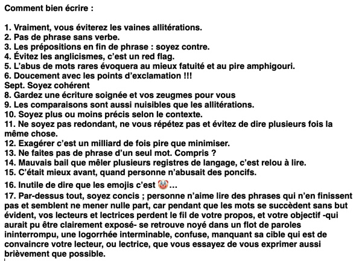
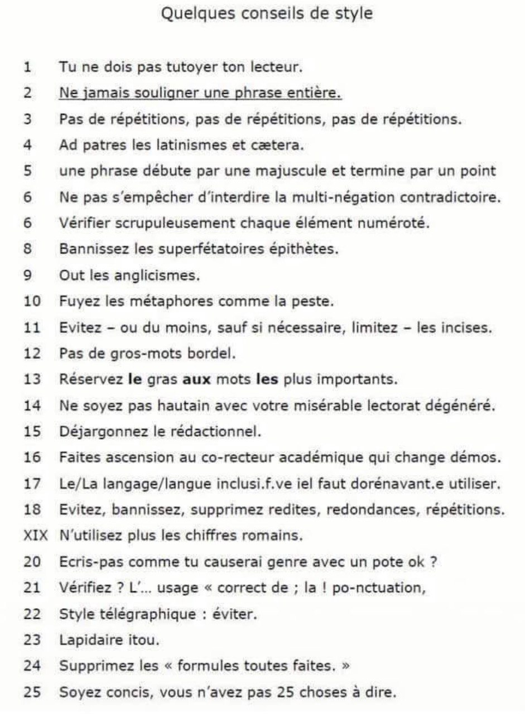
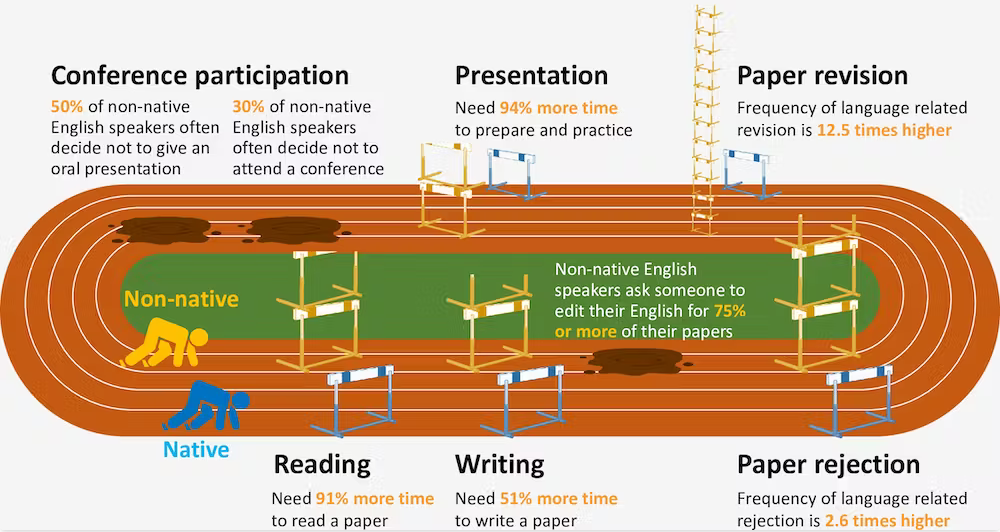
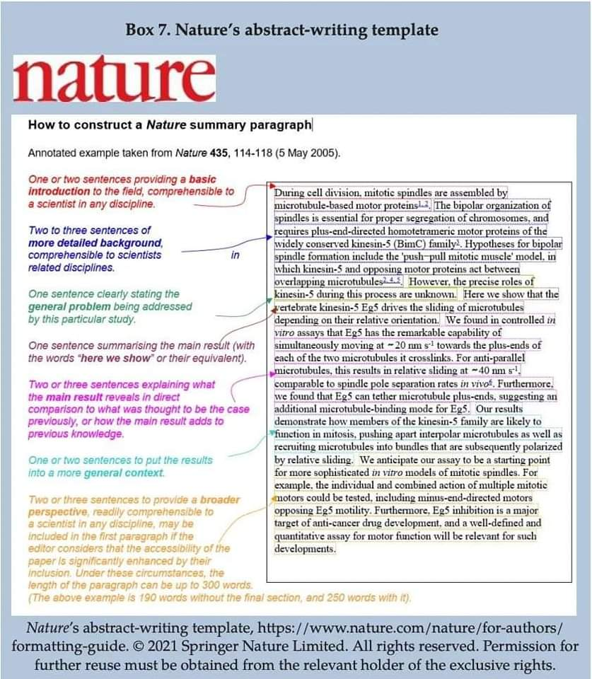
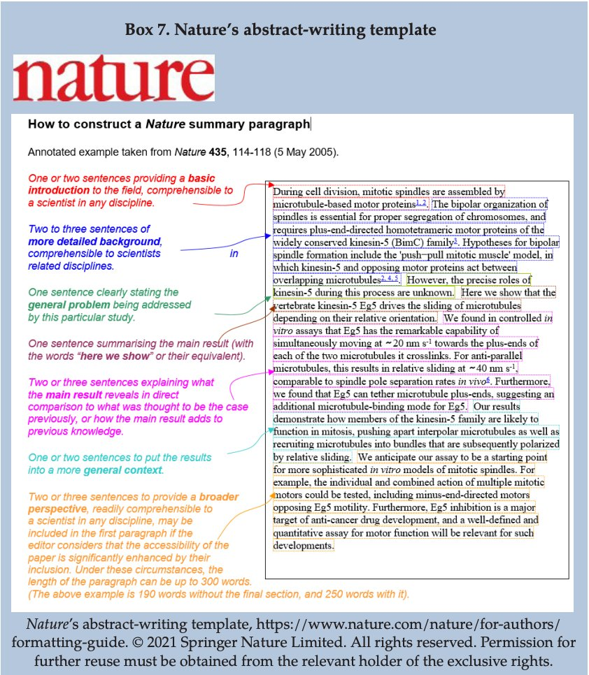
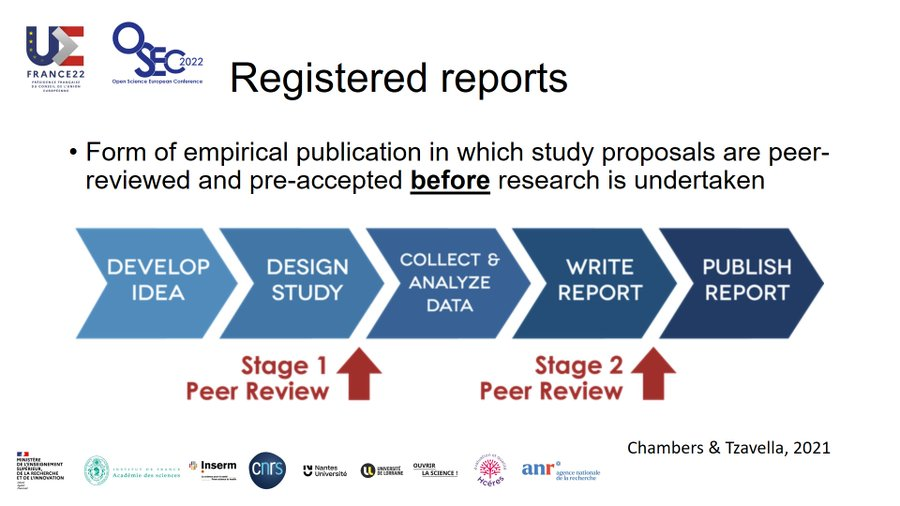

# conseils généraux pour l'écriture des articles scientifiques

# Types d'articles

## revues de littérature

La [[revue de littérature]] conditionne l'ensemble des procédés qui vont permettre d'aboutir à l'article. C'est ce que présente le document ci-dessous diffusé par le compte Twitter @WriteThatPhD

Source : https://twitter.com/WriteThatPhD/status/1382631067069382658

# Question de langues

En LSHS, il reste important d'écrire dans sa langue vernaculaire, car la langue utilise des concepts qui ne sont pas forcément traductibles dans une autre langue. Si toute la sociologie relative à la population française était rédigée en anglais, le regard scientifique sur nous-mêmes en serait complètement diffracté. 
Pour autant, il est aussi important d'être lu par des chercheurs du monde entier et donc de prévoir une version de son article en langue anglaise. 

Lorsqu'on travaille dans le domaine des sciences exactes, le recours à l'anglais est quasiment obligatoire, mais pour les personnes qui n'ont pas l'anglais comme langue maternelle (90% des chercheurs), cela représente un effort supplémentaire, parfois des coûts de relecture à prévoir, et un avantage certains pour les 10% de locuteurs natifs. D'après une étude menée par l'Université de Queensland, le temps supplémentaire qu'un non-anglophone natif doit consacrer à la lecture d'un article est de 91% (3 semaines par an), le temps supplémentaire pour l'écriture d'un article est de 51%, et le temps supplémentaire pour préparer une conférence en anglais est de 94%[[@amanoNonnativeEnglishSpeaking2023]].

Les doctorants sont habitués à considérer que leurs lacunes en anglais qui leur coûtent du stress, du temps de travail supplémentaire et parfois de l'argent (pour faire relire leurs articles) sont leur problème mais c'est le problème de tous les chercheurs et chercheuses qui n'ont pas l'anglais comme langue maternelle et c'est le problème de la Science pour qui la diversité est facteur d'innovation.

Pour Natalia Kucirkova, chercheuse en psychologie de l'enfant, le fait d'utiliser une AI pour traduire ou corriger du texte continue de faire peser la charge de la [[traduction]] sur le rédacteur qui devrait employer ses ressources cognitives davantage au contenu qu'à la langue utilisée. Dans son université norvégienne, les chercheurs comme Natalia Kucirkova, et mêmes les doctorants disposent d'un budget pour faire relire leurs textes en anglais, mais cette facilité crée une inégalité fondamentale entre les universités qui peuvent se le permettre et celles qui ne le peuvent pas. Les reviewers des journaux anglophones qui parfois ne connaissent pas d'autres langues que la leur, ne sont pas du tout enclin ni formés à ne pas juger défavorablement un contenu parce que la langue, bien que compréhensible, pose certains problèmes de syntaxe. 
Selon NK, faire corriger son texte par une IA demande un effort supplémentaire, et représente tout de même un coup (nécessité de s'abonner à un outil pour pouvoir l'entraîner avec des textes de la même revue). Il faudrait donc selon elle, utiliser cet argent dépensé pour l'open access à créer un outil de traduction automatique qui permettrait aux auteurs d'écrire des articles dans la langue de leur choix et aux lecteurs de lire ces textes dans la leur pour que cesse dans la recherche la discrimination basée sur la langue [[@kucirkovaAIWritingTools2023]]. 

# Recours aux assistants type chatGPT

(voir [[grands modèles de langage]])
panorama très éclaté des exigences des éditeurs en matière de tolérance. La transparence est souvent présenté comme une condition de cette tolérance [[@ganjaviBibliometricAnalysisPublisher2023]]. 

# Normes d'édition

## Normes d'édition généralistes

Liste des points typographiques auxquels il faut veiller quelque soit le type de document rédigé. Voir mémo de Jacques-André ([[@andrePetitesLeconsTypographie]])

## Normes d'édition scientifiques

### titre

[choisir un titre significatif](https://blogs.lse.ac.uk/impactofsocialsciences/2014/02/05/academics-choose-useless-titles/)

### Résumé

### mots-clé

### auteurs et affiliations

### introduction

### protocole et méthodes

### paragraphes

dépôt du protocole sur [[Prospero]]

exemple de protocole déposé pour une [[revue de littérature]] : [[@dalgaardProtocolInterventionsAimed2024]]
### syntaxe et vocabulaire

### résultats

### discussion

### conclusion

### Bibliographie

## annexes et accès aux données
