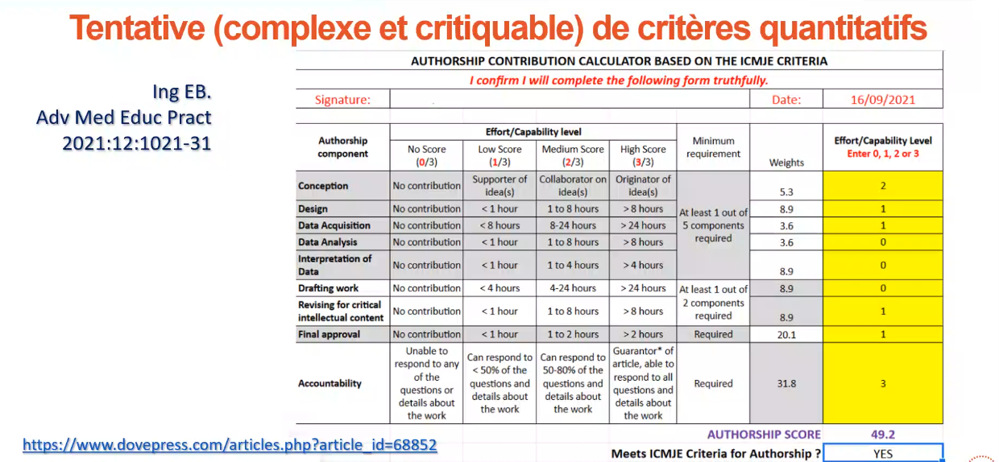

Le fait d'être l'auteur ou de faire partie des auteurs d'un texte. 
Du latin auctoritas qui a donné aussi [[autorité]]
Revendication d'une paternité intellectuelle mais aussi aptitude à être garant et à défendre un texte (même si le droit de rétractation fait partie des droits moraux et inaliénables de l'auteur)
Revendication de droits liés à la reproduction et l'usage de l'article, droits assez souvent cédés à l'éditeur. 

# autorat académique

voir pratiques des [[citations académiques]] et de la [[Citation#dans le contexte académique]]

Recommandations des revues (règles de l'IMCJE)

1. contribution substancielle
2. avoir participé aux rédactions préliminaires
3. avoir validé l'ensemble
4. cautionner l'ensemble du procès de recherche

ces gens là sont des auteurs, les autres sont des contributeurs (et apparaissent comme tels dans Pubmed)

Aucune préoccupation bibliométrique ne doit jouer dans l'ordre des auteurs dans la citation, ce n'est pas conforme à l'intégrité scientifique. 

Cas du statisticien : pas de règle stricte, celui-ci peut être auteur, contributeur ou seulement remercié. 
(source: [[Publier en bonne entente et hors des revues prédatrices]])

Le contributeur n'est pas tenu d'approuver l'ensemble de l'article

# autorat fictif

voir [[Camille Nous]]
voir problème des auteurs fantômes (chercheurs venant du Sud Global et favorisés par le [[Geopricing]] de certains acteurs comme Elsevier) [[@tovani-palonePossibleMalpracticeResearchers2023]]
cf. [[Discussion autour d'une conférence d'Alexandre Serres sur les éditeurs prédateurs]]

# autorat artificiel

voir [[bots]]
[[ChatGPT]] auteur d'un article publié dans [Nature]([https://doi.org/10.1016/j.nepr.2022.103537](https://doi-org.ezproxy1.lib.asu.edu/10.1016/j.nepr.2022.103537))
ChatGPT interrogée sur le problème éventuellement lié au fait qu'un article qu'"il/elle" a écrit sur les soins infirmiers et qui a été publié par Nature, considère que ce n'est pas un problème sur le domaine de la paternité mais que cela pose un problème pour la reconnaissance d'un droit de propriété intellectuelle : qui détient le copyright ?

