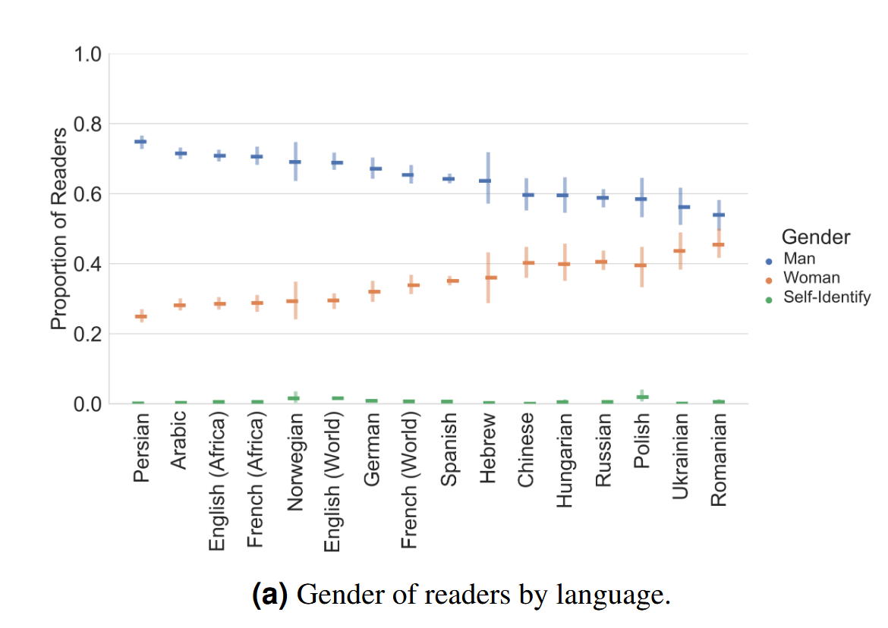

voir [[biais de genre]]

Le biais de [[genre]] dans [[Wikipédia]] est un phénomène connu de longue date et qui ressemble au biais de genre en général dans la contribution sur le web. En septembre 2020, les bios présentes dans Wikipédia n'étaient que dans 6,4% des cas, des bios de femmes
https://twitter.com/lessanspagEs/status/1546389647453855745

Biais de genre dans le lectorat de Wikipédia : 

source : https://arxiv.org/abs/2007.10403

# bibliographie

