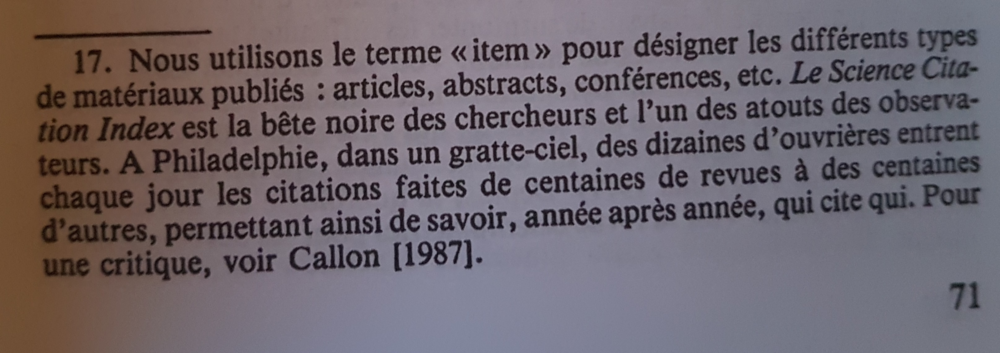
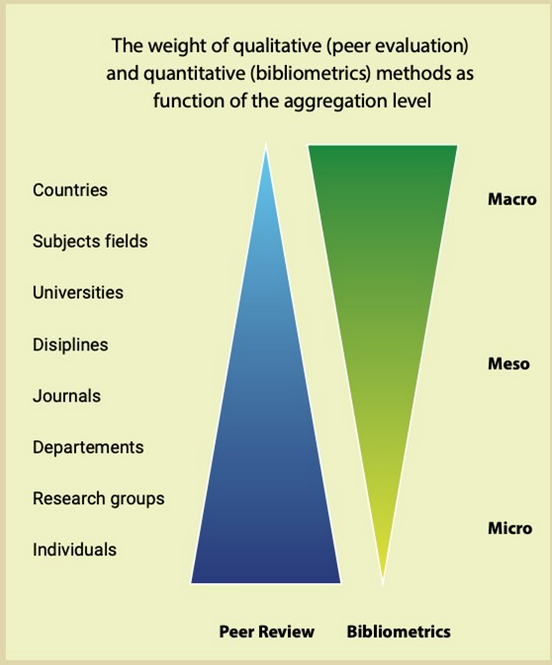

Activité issue du [[New Public Management]] consistant à mesure l'efficacité de la recherche et la rentabilité de tel ou tel financement. 

La bibliométrie qui préexistait a renforcé cette quantification du pilotage de la recherche.
Le [[facteur d'impact]] inventé par Eugène Garfield (aujourd'hui propriété de Clarivates) est longtemps resté le pivot de tout travail d'ordre bibliométrique. 

Extrait de La vie de laboratoire de [[Bruno Latour]]

Pour compléter les métriques citationnelles d'un article, des métriques liées à sa visibilité sur les [[réseaux sociaux]] ont été mises en place dans la décennie 2010-2020. Ces métriques alternatives ont été qualifiées d'alt-metrics (également écrit dans la forme [[altmetrics]])

# facteurs d'impact

Le facteur d’impact (FI) d’une revue à l’année N est calculé en divisant le nombre de citations cette année-là de ses articles publiés les deux années précédentes par le nombre d’articles publiés dans cette revue les années N-1 et N-2.

exercice : 

Si un journal a publié en 2019 120 articles et en 2020, 132 articles et que ces articles ont été cités en 2021 450 fois, quel est le facteur d’impact du journal ? 

Réponse : 504/(120+132) =2

Quel est le facteur d’impact de Plos medicine ? (faire une recherche sur [[Wikipédia]])

## facteurs d'impact frauduleux

voir Cosmos Impact Factor[[@FraudulentFalseMetric]] qui entre autres indexe des revues prédatrices comme le polish journal of science

# classements français

[Le classement des revues du CNRS n'existe plus](https://twitter.com/Enroweb/status/1494085045254037506), mais des revues continuent de s'en prévaloir en 2022

# Biais

## distorsion de concurrence

[[effet Matthieu]] dans le domaine de la bibliométrie : 

"This position is reinforced by  the fact that, unlike other publishers, legacy publishers benefit from a reputation  bonus through the more or less guaranteed indexation of their journals in exclusive  (impact) databases, e.g., Web of Science or Scopus (van Bellen et al., 2024), which  provides a further incentive to publish findings in their outlets."

(source : [[@rothfritzTrappedTransformativeAgreements2024]])

## malversations

### autocitations et citations de complaisance

[[Citation#manipulation des citations|manipulation de citations]]
[[revues népotiques]]
[[Citation#Cartels de citation|cartels de citation]]
### tripatouillages de citations

[[Citation#Ajout de citations dans les métadonnées de l'article qui ne sont pas présentes dans l'article.]]

# Critiques de l'obsession bibliométrique et de ce qu'elle cache (et inventaire de ses conséquences)

Voir Anton Pirogov ([[@pirogovSimplyTyped2024]])

# manifeste pour une bibliométrie plus transparente

## outils bibliométriques

- Scopus
- [[Web of Science]] (propriétaire)
- [[OpenAlex]] (libre)

## Evaluation de la recherche : les rôles respectifs des indicateurs bibliométriques et de l'évaluation par les pairs

L'association [[CoARA]](Coalition for Advancing Research Assessment ) promeut une vision de l'évaluation de la science plutôt basée sur des protocoles qualitatifs humains, transparents et gérés par la communauté comme le [[Révision par les pairs|peer reviewing]] plutôt que sur des indicateurs quantitatifs, opaques et qui sont la propriété d'acteurs privés et financiers. 
Sans nier l'intérêt des indicateurs bibliométriques pour juger de la production scientifique à un niveau macro (pays ou établissement), CoARA estime que les décisions au niveau de l'individu, concernant notamment les promotions et les opportunités de financement devraient reposer sur des évaluations dans le cadre de la révision par les pairs et non sur l'agrégation d'informations bibliométriques. 

(source : [[@RoleScientometricsPursuit2024]])

# Bibliographie
