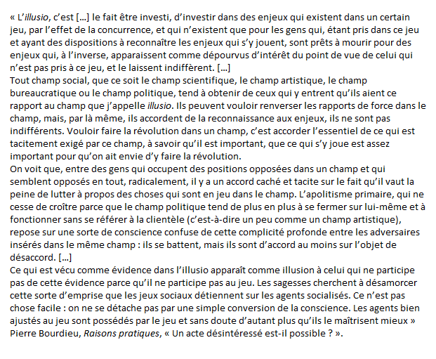
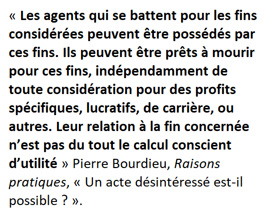

# champs et capitaux

Capital numérique fait référence au concept de capital hérité de [[Pierre Bourdieu]] : chaque champ de l'action humaine (recherche, santé, sport, etc.) mettent en oeuvre des capitaux qui permettent à ceux qui les détiennent d'obtenir dans ce champ des avantages symboliques ou matériels. Les capitaux sont très dépendants du champ considéré. Un poète très riche ne sera pas pour autant considéré comme un très bon poète, un banquier très porté sur la poésie ne sera pas considéré pour cette raison même comme un bon banquier. 

Dans un champ, les dominants sont ceux qui disposent du plus grand nombre de capitaux et sont en mesure de définir quels capitaux sont nécessaires pour conserver une domination sur ce champ. Leur position est donc par nature conservatrice. 

Les dominés peuvent soit se soumettre à cette définition, soit au contraire la mettre au défi, en faisant reconnaître d'autres capitaux comme aussi nécessaires dans le champ considéré. 

La domination dans un champ donné se présente comme un jeu, un jeu où majoritairement les profits passés permettent d'engranger les produits à venir, mais où également il est possible pour des outsiders de prendre la main en suivant au moins pour partie les règles du jeu. 
La reconnaissance des règles du jeu montre l'importance qu'on accorde au jeu. Les concurrents sont tous pénétrés de l'importance du jeu, qui pourra laisser parfaitement indifférent les personnes qui ne sont pas impliquées dans ce champ. Cette passion pour le jeu entrepris dans tel ou tel champ constitue souvent une fin pour l'action, plutôt que la simple conquête de capitaux dans le champ. Cette importance donnée aux enjeux qui ne relèvent que d'un champ, Pierre Bourdieu l'a qualifiée d'**illusion**

Ce goût de chacun.e pour l'illusio va à l'encontre d'une anthropologie primaire d'un individu qui ne serait motivé que l'optimisation de son bénéfice, ce que certains économistes appellent l'[[homo oeconomicus|homo economicus]]. 

slogans matérialisant l'illusio : business is business, l'Art pour l'art

# le capital numérique

$\newline$
# bibliographie
$\newline$

