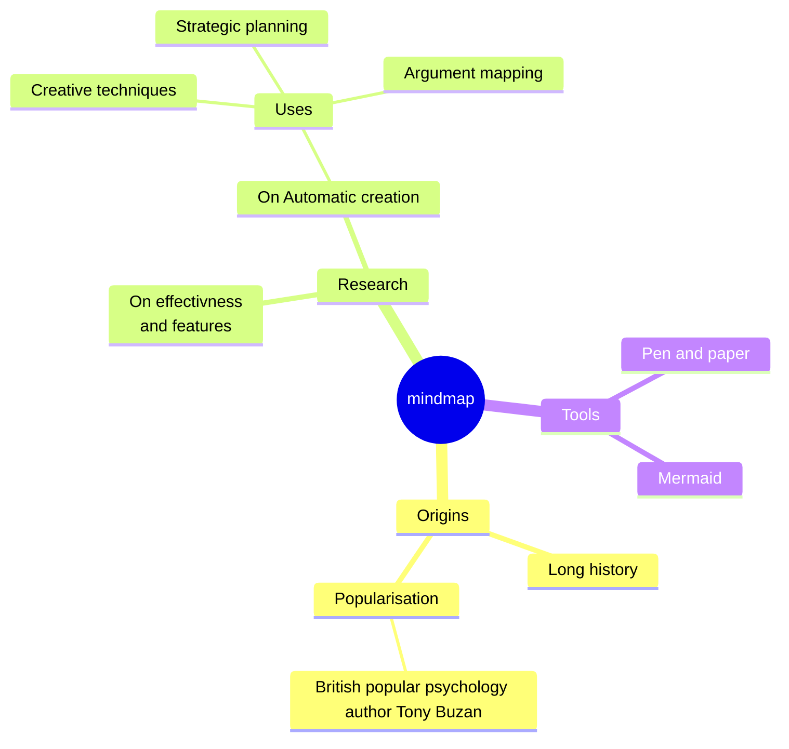

pour les organigrammes, voir [[organigramme]]

# Carte mentale à partir du markdown

## mermaid

## mermaid + Obsidian

syntaxe de base : 

voir plus [ici](https://forum.obsidian.md/t/obsidian-links-in-mermaid/2965/9)

# Carte mentale des arguments 

avec [[Argdown]]

$\newline$
# bibliographie
$\newline$

