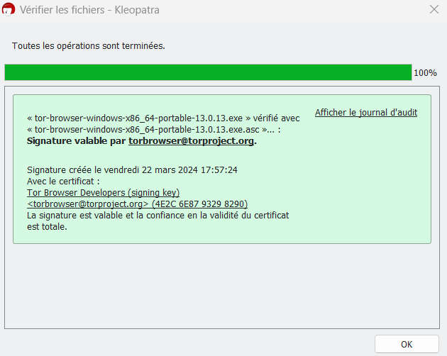

voir [[reproductibilité en compilation du code|reproducible builds]]
voir [[l'enjeu des compilations déterministes]]

# Vérifier une signature avec Kleopatra

GPG est installé de base sur Ubuntu
Installer GPG4win ([[cryptographie asymétrique]] réalisée avec)

envoyer un message à gettor@torproject.org
Récupérer de manière automatique les liens vers Tor depuis trois emplacements différents : 

- Google Drive de Tor Project
- [[Internet Archive]]
- [[Gitlab]] de Tor Project

Ces liens de téléchargement de l'exécutable sont accompagnés de lien de téléchargement des signatures de chacune de ces versions. Il s'agit de signatures produites par des développeurs Tor qui ont utilisé leur clé privée pour signer. La clé publique correspondant à cette clé privée va permettre de déchiffrer la signature.

Télécharger l'exécutable de [[Navigateur Tor|Tor]] (pour windows : .exe) et la signature liée à ce package (.sig ou .asc)

Télécharger les clés publiques liées à l'adresse mail générique de Tor Browser.
Avec le terminal de commande (une fois PGP4win ou GnuPG installés)

```
gpg --auto-key-locate nodefault,wkd --locate-keys torbrowser@torproject.org
```

Ou bien clic droit sur l'exécutable. Kleopatra, module de GPG4Win, indique qu'une clé publique a été trouvée qui a servi à signer ce package, mais cette clé n'est pas connue. Demander à aller chercher la clé. Kleopatra va chercher la clé sur un serveur de clé, c'est la clé d'un développeur de Tor Project. Importer la clé. 
Recommencer le processus de signatures. Si l'exécutable est au même niveau dans l'arborescence que le fichier de signature, GPG4Win va aller vérifier la somme de la signature, celle de l'exécutable et si les sommes coïncident indiquer que la somme du package a bien été calculée




# Vérifier une signature avec GPG

## exemple avec Tor Browser

gpg est installé de base sur Ubuntu ; pour Windows, installer PGP4Win

importer la clé des développeurs depuis le serveur

```shell
gpg --auto-key-locate nodefault,wkd --locate-keys mail@developpeur.org
# donne le condensat de la clé par exemple
# EF6E286DDA85EA2A4BA7DE684E2C6E8793298290 pour la clé torbrowser@torproject.org

```
exporter la clé téléchargée dans un fichier
```shell
gpg --output ./produit.keyring --export condensatdelaclé
# ./cequevousvoulez.keyring
```

télécharger la signature livrée avec le produit

(nomduproduit.asc)

vérifier que la clé des développeurs, la signature livrée avec le produit et le produit lui-même matchent

```shell
gpgv --keyring ./produit.keyring ~/nomduproduit.asc ~/produit.tar.xz

# Pour Tor si cela donne "Good Signature", alors la distribution du paquet est intègre

#                gpgv: Signature made 07/08/19 04:03:49 Pacific Daylight Time  
#                gpgv:                using RSA key EB774491D9FF06E2  
#                gpgv: Good signature from "Tor Browser Developers (signing key) <torbrowser@torproject.org>"
```

## exemple avec VeraCrypt

1. Télécharger la clé publique de VeraCrypt 

D'après le site, son fingerprint doit-être : 

**5069A233D55A0EEB174A5FC3821ACD02680D16DE**

```shell
gpg --import --import-options show-only VeraCrypt_PGP_public_key.asc
# vérifier que le condensat de la clé est bien égal au fingerprint indiqué sur le site https://veracrypt.eu/en/Digital%20Signatures.html
```

Si ça coïncide, charger dans gpg la clé publique de VeraCrypt

```shell
gpg --import VeraCrypt_PGP_public_key.asc
```

Vérifier que la signature chargée avec le produit correspondent bien à la signature publique de Veracrypt 
(cela nécessite au préalable d'avoir charger l'archive et le fichier .sig dans le dossier où on exécute la commande suivante)

```shell
gpg --verify veracrypt-1.26.20-Ubuntu-24.04-amd64.deb.sig veracrypt-1.26.20-Ubuntu-24.04-amd64.deb

# si on a ce résultat ("Bonne signature"), c'est que la version téléchargée est intègre

#gpg: Signature faite le mer. 05 févr. 2025 00:36:17 CET
#gpg:                avec la clef RSA 5069A233D55A0EEB174A5FC3821ACD02680D16DE
#gpg: Bonne signature de « VeraCrypt Team (2018 - Supersedes Key ID=0x54DDD393) <veracrypt@idrix.fr> » [inconnu]
#gpg: Attention : cette clef n'est pas certifiée avec une signature de confiance.
#gpg:          Rien n'indique que la signature appartient à son propriétaire.
#Empreinte de clef principale : 5069 A233 D55A 0EEB 174A  5FC3 821A CD02 680D 16DE
```


$\newline$
# bibliographie
$\newline$


