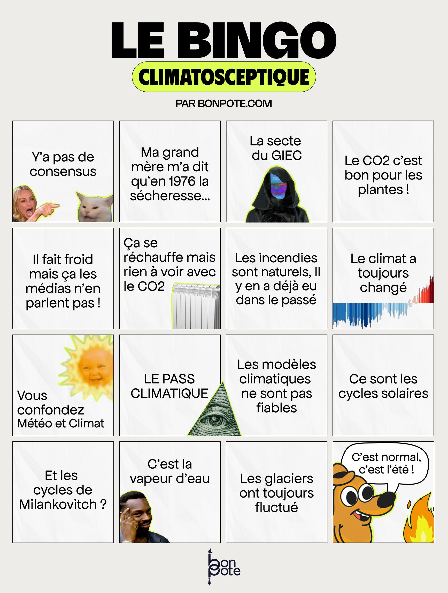

# Différence climato-sceptiques et climato-dénialistes

Les climato-sceptiques sont des personnes qui ont des doutes sur ce que dit la science au sujet du réchauffement climatique, mais le doute est une position scientifique s'il est sincère et pas dirigé vers la négation pure et simple du phénomène dont il s'agit. 
Si le doute s'apparente à une recherche, on peut le prendre pour tel, mais les "climato-sceptiques" qui harcèlent les scientifiques sur Twitter ( voir [[Loi de Brandolini]]) sont en réalité convaincus et persuadés que les autres doivent partager leur vision des choses sur Twitter. Ils sont dans le déni, on parlerait à meilleur droit de "climato-dénialistes", selon [[David Chavalarias]] : 

> Je préfère le terme de “dénialistes” car ils nient la science, en mélangeant des assertions soi-disant de bon sens comme “le CO2 est bon pour les plantes” et une interprétation biaisée des travaux scientifiques. Ça s’apparente à du déni, du détournement, de la manipulation.

( Source : [[@goarClimatScientifiquesPremieres2023]] ) 

