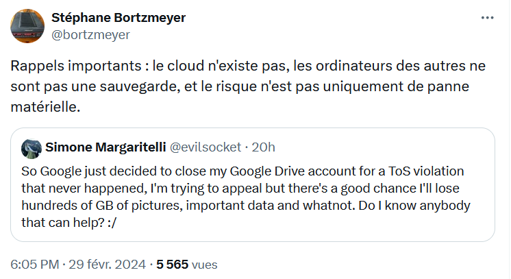

voir [[cloud computing]]

Dans l'incapacité (ou le manque de volonté des décideurs ?) de construire les couches logicielles suffisantes pour fonctionner avec les infrastructures françaises censées gérer les données de ses citoyens, le gouvernement français se tourne vers des logiciels américains tout en considérant que l'hébergement dans des centres de données sur le territoire donne assez de garanties en matière de [[souveraineté numérique]]. 

Le fait de faire tourner du logiciel américain sur une infrastructure dont on contrôle les flux nous garantit-il contre les éventuels [[backdoor|backdoors]] de ce logiciel ? 

voir "Bleu" le cloud de confiance lancé par Orange et Cap Gemini. 
Thalès choisit Google pour lancer un "cloud de confiance"

# hébergement, solutions commerciales

## Gandi (juillet 2023) : 

- Hébergement Web M 1 mois PHP = 9,60 euros

6 euros sur les trois produits suivants pour un total de 6 euros : 

- Volume de stockage 25 Go GandiCloud
- Serveur GandiCloud V-R1 (4,34 euros par mois)
- Première IPv4 GandiCloud

+ renouvellement annuel de nom de domaine : 14,96 euros

## Infomaniak : 

- hébergement web = 5,75 par mois
- [[Kdrive]] solo (2 To, 1 seul utilisateur) = 5,54

# bibliographie

