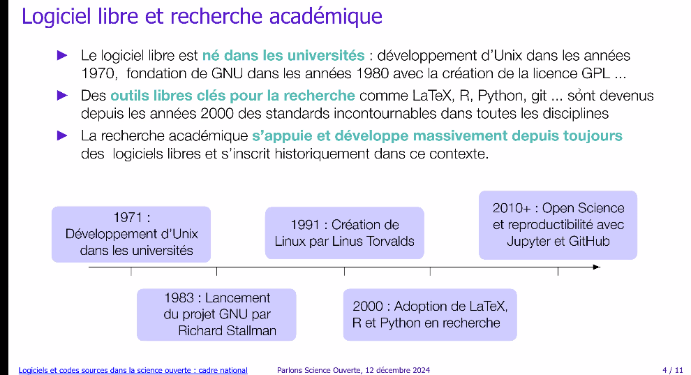
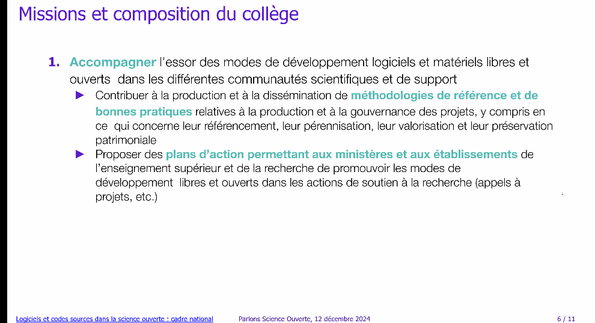
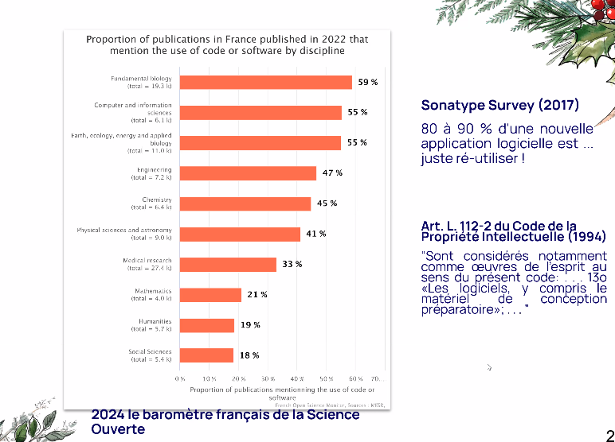

promotion du [[code source]] dans le second plan sur la Science Ouverte (2022)

# Présentation de Violaine Louvet (Grenoble Alpes, membre COSO)

2021 : Premier prix du [[logiciel libre]] de recherche
2022 : création du collège code source et logiciel
2023 : intégration du logiciel dans le [[baromètre de la Science Ouverte]]

interactions avec la [[Dinum]]

composition du collège remise à jour (41 personnes)
- axe 1 : Construction du catalogue national. 
- axe 2 : standards d'archivage de citation et de référencement
- axe 3 valorisation + durabilité (financement du logiciel)
- axe 4 écosystème
- axe 5 : reconnaissance et carrière (cf. prix du logiciel libre de recherche)
- axe 6 : usages algorithmiques des codes sources de recherche ([[grands modèles de langage]])

Lien avec RDA France, lien avec les Ateliers de la donnée, avec [[EOSC]]. 

Catalogue de logiciels développés dans les laboratoires de recherche : état des lieux (infrastructure, métadonnées, accompagnement)
ne pas ajouter de la complexité du côté chercheur (s'intégrer, dans ce qui existe déjà dans l'écosystème du chercheur). 
Violaine Louvet : "l'idée serait d'aller vers du multi-sources. HAL comme base principale de façon automatique, mais aussi d'autres dépôts comme Zenodo, et également des entrées manuelles qui pourraient correspondre à des codes non diffusés. Reste à voir si dans le cadre du COSO, on veut mettre en avant des codes non diffusés ?"

- Utiliser [[HAL]] comme base de données principale. Les notices logiciel dans HAL sont modérées, 
- le deuxième pilier sur lequel on s'appuie c'est [[Software Heritage]], 
- le troisième pilier c'est le Socle interministériel du Logiciel libre (SILL) produit par la DINUM

Repérage des forges (80 forges listées), voir présentation de Daniel Le Berre aux journées EOSC France ([[National Tripartite Event EOSC-FRANCE#Forges logicielles]])

prix du logiciel libre remis depuis 2022 : renforce la visibilité de logiciels exemplaires. 

Intérêt des politiques institutionnelles ; organisation d'un atelier avec RDA France sur la diversité des appropriations de ces initiatives par les institutions. 

question sur la "Science fermée" (cf. Alexandre Monnin )

# Jaime Arias (ambassadeur Software Heritage)

voir [[Software Heritage]]

extrait du baromètre de la science ouverte de 2024

Expérience d'un doctorant qui laisse un code source en lien avec une publi sur la forge de l'organisme et ne peut plus le récupérer après avoir quitté son établissement. 

Karim Boualem à travers HAL les bibliothécaires sont bien placés pour gérer la mise à disposition et le partage du code source, animation d'un réseau au niveau de l'Université sur la Science Ouverte dont code source (Université Paris Sorbonne).

# Lucie Albaret (BU Grenoble-Alpes) Les code de recherche à l'Université GA

2022 : module code source et logiciel. cycle de vie du code source, utilisation des forges

2025 : proposer un module sur la recherche reproductible

site web Sciences Ouvertes, Université Grenoble Alpes. 
fiche pratique synthétique sur les étapes à suivre sur l'ouverture des codes. 

$\newline$
# bibliographie
$\newline$

