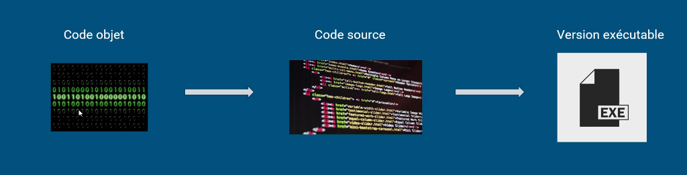

Différences entre données (data) et code (code_source) : 

> Un code vit dans un environnement technique mouvant, dépend souvent de nombreuses dépendances, voir du matériel sur lequel il s'exécute. Il évolue sans arrêt, il peut avoir de nombreux contributeurs. Le cadre juridique est différent de celui des données.

(Violaine Louvet [[code source et logiciel en science ouverte du politique à l'opérationnel]])

Parler de "code" peut-être réducteur sachant qu'un programme a d'abord vocation à révéler ses opérations successives tandis que le code est conçu pour cacher sauf aux initiés 

> Programs must be written for people to read, and only incidentally for machines to execute

Harold Abelson, [Structure and Interpretation of Computer Programs](https://www.goodreads.com/work/quotes/871745)

code = cryptage, il s'agit en fait de faire en sorte le plus possible que le code ne soit pas à déchiffrer mais à lire (préférer "programme" dans certains cas, cf. Cédric Gémy)

Pour le code de recherche voir [[code de recherche]]

code-source de l'alunissage de la capsule d'Appollo XI : https://github.com/chrislgarry/Apollo-11/blob/master/Luminary099/LUNAR_LANDING_GUIDANCE_EQUATIONS.agc#L179

# Code-source vs exécutable

- Algorithme : fonction mathématique qui permet de résoudre un problème. L'algorithme, ce n'est pas du code, c'est le concept, la recette. Si cet algorithme est implémenté dans un programme, alors il faut qu'il soit présenté dans un langage informatique (html, C++, Javascript, etc). L'algorithme est donc implémenté dans le code source
- code-source : traduction de cet algorithme dans un langage informatique compréhensible par l'homme
- exécutable : traduction de ce code-source dans un langage compréhensible par la machine ([[binaire]])
- logiciel : ensemble de fichiers comportant en général du code-source, de la documentation et des exécutables.

(source : [[@louvetLogicielsCodesSources2023]])

# administration des données et code source

voir [[ADAC]]

$\newline$
# bibliographie
$\newline$

