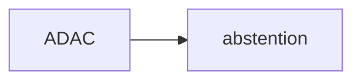

[https://360.articulate.com/review/content/97a1b3d4-5444-4406-957b-fe0153cdc75f/review](https://360.articulate.com/review/content/97a1b3d4-5444-4406-957b-fe0153cdc75f/review)

$\newline$
# bibliographie
$\newline$

