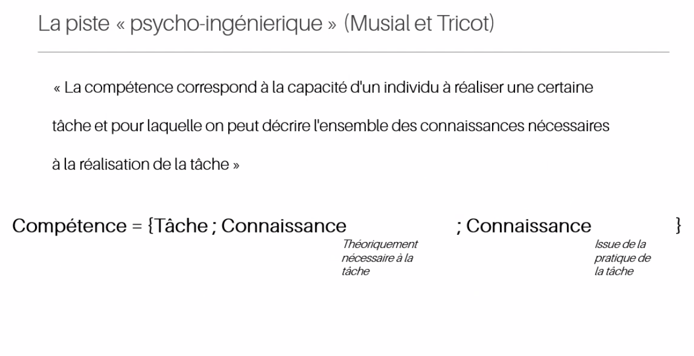

une notion aux contours très flous ; 
"Personne ne comprend vraiment la notion de compétence" ([[Richard Feynman]], 1965)
# approche par compétences

voir [[approche par compétences]]

# compétences informationnelles

voir [[compétences informationnelles]]

# Compétence vs capital

Dans la perspective néo-libérale, le compétence est ce qu'un individu acquiert par le biais de l'éducation ou de la formation. Cette vision est restrictive, dans la mesure où la compétence est souvent héritée (à la manière du [[capitalisme|capital]] dans les familles aisées) d'un milieu social dont l'individu est originel. 
Pour cette raison [[Pierre Bourdieu]] préférait parler de capital linguistique au lieu de compétences linguistiques. 
Julie Denouël propose dans le même ordre d'idées de parler de [[capital numérique]] pour désigner la [[culture numérique]] qui est acquise dans le milieu d'origine plutôt que par les processus d'éducation et de formation. 

Par ailleurs, la compétence est également un capital dans la mesure où on espère la vendre sur un marché. Le marché institue la valeur ou l'absence de valeur d'une compétence.

>Ainsi, convoquer le concept de capital dans l’analyse des usages numériques permet tout à la fois d’observer comment les connaissances, [[savoirs-faire]], etc. peuvent être réinvestis sur différents marchés sociaux (scolaires, professionnels, de sociabilité…) et comment ils peuvent faire l’objet de transmissions intergénérationnelles

source : [[@denouelNumeriqueEducationFormation2022]], p76

Définition d'[[André Tricot]] et Musial : 

