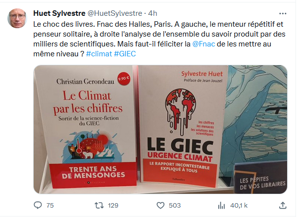

> La fonction du journaliste, c’est d’essayer de produire des vérités. Mais le modèle économique des médias, c’est de fabriquer de la controverse. […] le [[consensus scientifique]] fait moins vendre qu’une polémique

(Patrick Cohen [[@benzPatrickCohenNous2023]])

Sur la question des causes humaines du réchauffement climatique, où situez-vous le consensus (en % des articles publiés qui soutiennent la thèse d'un changement climatique lié à l'activité humaine) : 

klaxoon

97% des études parues sur le sujet entre 1991 et 2011 vont dans le sens de cette thèse. Une étude de 2021 montre que 97,8% des spécialistes pensent que le réchauffement climatique est causé par l'activité humaine et les 20 qui publient le plus sur le sujet sont unanimes sur la question. Le consensus est écrasant. Et pourtant, une étude de 2014 montre que le public pense que ce consensus n'est que de 55%[[@CookWhyweneed2014]]

![[consensus_gap.PNG]]

Comment expliquer cela ? 

# bibliographie

