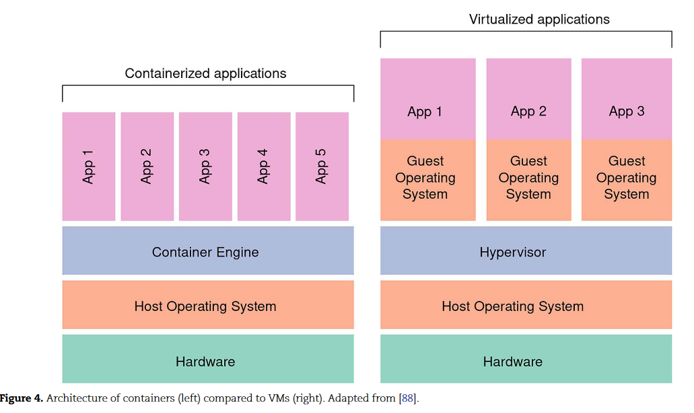

[[conteneurisation d'un script R]]

problème de la reproductibilité du code (voir [[R (logiciel)#question de reproductibilité]] )

Conteneurs logiciels : on pourrait songer à rendre accessible, non seulement son code, mais aussi la machine virtuelle avec laquelle son code pourrait harmonieusement s'appliquer, mais le dossier pèserait trop lourd, sachant qu'un OS prend de la place sur le système hôte et l'exécution du code en serait ralentie. D'où l'idée d'utiliser un container logiciel comme [[Docker]]

> Contrairement aux machines virtuelles traditionnelles, un conteneur Docker n'inclut pas de système d'exploitation, mais s'appuie au contraire sur les fonctionnalités du système d’exploitation fournies par la machine hôte

(source : Wikipédia https://fr.wikipedia.org/wiki/Docker_(logiciel))

légèreté, rapidité : les avantages des conteneurs sur les machines virtuelles expliqués en un schéma : 

(source : [[@ziemannFivePillarsComputational2023]])

pour une alternative aux conteneurs de logiciels voir [[environnement virtuel]]

$\newline$
# bibliographie
$\newline$

