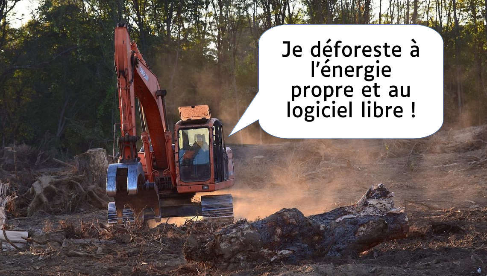
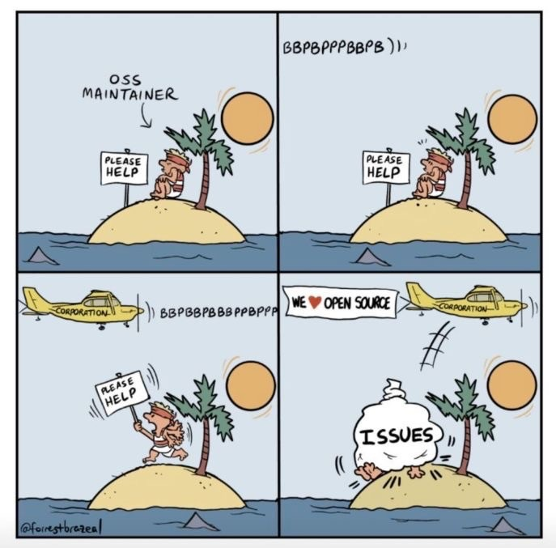

$\newline$
# bibliographie
$\newline$

# difficulté d'adoption du logiciel libre dans les administrations

## un manque de formation et d'accompagnement

L'adoption du [[logiciel libre]] dans les administrations permet de faire immédiatement des économies mais se solde aussi au début par une perte de productivité des agents qui ne retrouvent plus leur marque (le logiciel propriétaire étant la plupart du temps celui avec lequel on a a appris à utiliser un ordinateur). Les premières années, les économies réalisées en frais de licence sont absorbées par le coût de la formation agents. 
L'argument toutefois qu'il n'existe pas des logiciels libres pour chaque secteur d'activité d'une mairie est de plus en plus battue en brèche par la [[forge ]]du logiciel libre pour les administrations françaises (ADDULLACT). 

Le logiciel libre souffre d'un déficit de visibilité. Dans le domaine de la recherche, plutôt que de constituer un catalogue d'applications, l'idée est plutôt de visibiliser le logiciel libre de recherche dans les entrepôts de code (github) ([publiccode.yml](https://publiccode-editor.developers.italia.it/)). Cf dépôt de la [[Dinum]] pour signaler (au moyen de publiccode.yml) des logiciels conçus dans l'administration et qui correspondent à des critères d'utilité et de pérennité, dans le cadre de l'action Awsome Public Code (voir [dépôt des publiccode.yml](https://github.com/codegouvfr/awesome-codegouvfr/tree/main/dist))

source : [[@KerinecPourquoiadministrationsontelle2021]]

## un abaissement de la dynamique des communs numériques à des enjeux de souveraineté ou de compétition

>Il est en effet fort pratique pour les gouvernements néolibéraux, cherchant à faire des économies d’échelle, de se reposer sur le tissu associatif pour accomplir les tâches qu’ils refusent d’assurer, y compris en organisant la concurrence entre les institutions communautaires.

(source: [[@masuttiCommunsNumeriquesSouverainete2024]])
voir [[logiciel libre#Le logiciel libre en tant que commun]]

# Critique du logiciel libre comme un alternumérisme

Les mouvements hostiles au [[numérique]] (à l'informatisation ou à la numérisation du monde, citons par exemple les [[neo-luddites]] ou certains continuateurs de [[Gilbert Simondon]]) critiquent le [[logiciel libre]] comme une forme d'[[alternumérisme]] qui échouerait à défendre la [[liberté]] humaine et la [[biodiversité]] tout en prétendant oeuvrer à des valeurs positives comme le partage de la connaissance et l'égalité entre les citoyens.

Une des critiques formulées est que tous les utilisateurs du [[logiciel libre]] ne sont pas égaux dans cet écosystème : les développeurs sont rares et constituent une forme d'aristocratie qui fixent les règles pour les autres (cf. la [[do-ocratie]] chez les [[hackers]]). La liberté d'adapter un logiciel à ses besoins requiert en faite une connaissance préalable du code qui est peu partagée (voir par exemple *Contre l'alternumérisme, de Julia Laïnae et de Nicolas Alep*[[@AlepContrealternumerismepourquoi2020]]. 
.
> Plus que la liberté des utilisateurs, c'est la liberté des développeurs dont il s'agit ici - liberté d'aller piocher à gauche ou à droite des bouts de code rédigés par d'autres et de les intégrer à leurs propres programmes. Pour le simple utilisateur, aucune différence, le logiciel reste une boîte noire. 

La communauté de développeurs étant très inférieure à celle des utilisateurs et notoirement insuffisante pour revoir le code, le logiciel libre qui est présenté comme une option plus sûre que le logiciel propriétaire peut néanmoins conserver des [[vulnérabilités]] très longtemps avant qu'une personne suffisamment compétente ne les détecte (cf. la faille heartbleed qui rendait le protocole openSSL vulnérable et la faille log4shell liée au logiciel log4j de Java [publiée en 2021](https://fr.wikipedia.org/wiki/Log4Shell)). La même chose est arrivée dix ans plus tard cette fois au sujet du protocole de connexion aux serveurs Linux OpenSSH. XZ, un outil de compression faisant partie (dépendance) du protocole OpenSSH n'était plus maintenu que par son créateur, Lasse Collin, qui l'avait au départ développé comme un "projet bénévole et de loisir" et avait fini par en délaisser la maintenance en invoquant un *burn out* (https://www.mail-archive.com/xz-devel@tukaani.org/msg00567.html). Un développeur répondant au nom de Jia Tan a récupéré la main sur ce logiciel en mergeant le code existant avec le sien et au passage y a ajouté une [[backdoor]] qui n'a été détectée qu'entre la livraison de la dernière version d'OpenSSL et le moment où celle-ci allait être intégrée aux serveurs).
A l'origine de la détection, le constat que XZ réalisait la tâche avec 500 millisecondes de plus que dans la version précédente (voir https://piaille.fr/@rusty/112190942173039817). 
Le problème est le même pour cURL ; des composants libres essentiels pour faire fonctionner une majorité de sites ou de serveurs ne sont [[maintenance|maintenus]] que par une poignée d'individus qui sont bientôt dépassés par cette tâche. 

voir également [[Software collapse]]

Il est nécessaire que les promoteurs du libre ou les entreprises qui réutilisent ces composants libres prennent leur part de responsabilité et viennent en aide à ces personnes. 
Certaines propositions vont dans le sens de la création d'un service public de révision du code libre[[@brayOSQI2024]]. Cela paraît peu réaliste à ce stade, mais l'idée principale est de faire reposer les coûts de la maintenance et de la vérification des composants libres essentiels au logiciel utilisé par les entreprises, non plus sur les épaules de leurs auteurs mais sur le financement de ces entreprises qui tirent du profit dans la réutilisation de ces logiciels libres, un financement que [[Stéphane Bortzmeyer]] qualifie d'impôt sur le [[capitalisme]](https://twitter.com/bortzmeyer/status/1775449068971438513). [Ce message](https://status.pointless.one/@pointlessone/112202804564535106)posté sur Mastodon va dans le même sens : les mainteneurs ne doivent pas être payés à la tâche mais avec des contrats.

Une critique récurrente faite aux concepteurs du logiciel libre est de vouloir le succès de leur logiciel uniquement pour se faire racheter, ce qui entraîne de la frustration chez les utilisateurs qui vont devoir payer une licence pour avoir accès au logiciel qu'ils avaient adopté. A ce titre, la conception du logiciel libre ne serait pas du tout opposée au [[Capitalisme|capitalisme]] mais contribuerait à son expansion dans le monde du numérique.

Ces critiques d'ailleurs font aussi remarquer qu'en dehors des terminaux qui sont toujours majoritairement dominés par Apple et Microsoft, les serveurs sont principalement sous Linux, les protocoles utilisés par les [[VLOPs]] pour fabriquer leurs logiciels sont majoritairement libres. 

>The digital economy heavily relies on open-source software, exemplified by over 60% of global websites using open-source servers like Apache and Nginx

(source: [[@eirasPositionMidtermRisks]])

Cette victoire paradoxale du libre n'a pas fait triompher pour autant les valeurs promues par les communautés libristes[[@derivationCompterenduForumouvert]].

Que ce soit volontaire ou pas, par le jeu des licences permissives, le capitalisme a su tirer parti du logiciel libre pour accélérer le rythme de production de logiciels technosolutionnistes nourrissant les projets de contrôle de la société libertariens et fascisants de la broligarchie. Si pour Aymeric Mansoux le libre et le [[Communs|Commun]] a constitué un temps le moyen d'édifier un monde alternatif, aujourd'hui il faut faire le deuil de cette utopie : 

>Tant que les privilèges et le capital pourront déterminer la façon dont une personne peut tirer profit des communs numériques et y participer, il y a peu d’espoir que la situation s’améliore. Je suggérerais même qu’il serait plus judicieux de commencer à définir dès que possible le paysage actuel comme une ère post-logiciel libre, post-_open source_ ou post-communs, ne serait-ce que pour marquer cette nouvelle étape, ce point de non-retour, et de deuil.

[[@mansouxPermacomputationEstLitteratie2025]]
# Critique du logiciel libre par les tenants d'un code éthique

Des développeurs et des [[militants]] du libre qui n'appartiennent pas à ces mouvements sont néanmoins sensibles à cette critique et veulent mettre en évidence que  les [[Quatre libertés]] associées depuis R. S. Stallman au logiciel libre ne sont pas garantes d'un usage éthique de ces logiciels (cf. critique de Lunar sur [La Dérivation](https://dérivation.fr/des-logiciels-emancipateurs/). 
On peut très bien concevoir et même on doit supposer que les drones tueurs de l'armée américaine fonctionnent avec du code libre. Pour les populations touchées, cela ne représente pas une grande différence. 

Une critique répandue des milieux libristes pointe l'abandon des projets émancipateurs au profit de problèmes uniquement techniques. 
C'est notamment le grief qui a été relevé lors du forum ouvert sur le libre organisé à Rennes par La Dérivation les 2, 3 et 4 avril 2021

D'où des réflexions également pour inscrire des préoccupations éthiques dans les [[licences]] ([[copyleft]], copyfair, hippocratic licence = Primum non nocere). 

Pour faire face à la prédation capitaliste des logiciels libres, certaines licences sont nées (PPL) sur la base du CC-by-nc-sa ou le nc n'est restrictif que pour les entreprises capitalistes (les coopératives peuvent en faire un usage commercial). Voir le cas du logiciel CoopCycle qui permet à des coopératives de livreurs de fonctionner de manière plus éthique que Deliveroo (voir [blog de Mediapart](https://blogs.mediapart.fr/coopcycle/blog/170418/comment-proteger-le-logiciel-ouvert-coopcycle-de-la-predation-capitaliste).) Cette licence mise en place par la coopérative CoopCycle empêche les entreprises de poser des [[enclosures]] sur le [[code source]] produit et en même temps encourage la reprise de ce code-source par d'autres coopératives (logiciel payant uniquement pour les entreprises qui ne sont pas des coopératives)

Cas de l'[hippocratic licence](https://firstdonoharm.dev/) par analogie avec le [[serment d'Hippocrate]] qui règle la conduite éthique (ou déontologique des médecins)
Cette licence limite la liberté 0 en spécifiant que le logiciel ne doit pas être exécuté pour des tâches contraires au droit de l'homme. 
La [[Free Software Foundation]] considère que l'hippocratic licence n'est pas une licence, car il n'appartient pas à une licence de faire appliquer les [[Droits humains|droits humains]].

Pour Richard Stallman, ce qui rend le code oppressif, c'est d'abord la centralisation de la plateforme pour lequel il est conçu et non le fait qu'il puisse être utilisé à des fins illégitimes. 

Pourtant le copyleft comporte en soi des libertés enlevées aux acteurs. Ces derniers n'ont pas la liberté de reprendre le code pour l'améliorer et faire payer pour la version enrichie ; cette dernière doit également être placée sous copyleft. 

Toute liberté de l'utilisateur doit être limitée comme dans la vraie vie "la liberté de chacun.e s'arrête où commence celle d'autrui" ; la liberté d'expression par exemple ne doit pas permettre aux ennemis de cette liberté de s'exprimer, dans le cas contraire un absolu de la liberté d'expression finit par priver ceux qui en ont le plus besoin de cette liberté au profit de celles et ceux qui en abusent systématiquement (voir crtique de [[Bertrand Russel]] et discours hypocrite de l'extrême droite sur la liberté d'expression menacée, discours porteur de [[censure|censures]] orientées contre les Progressites)

Pour Pablo Rauzy, la liberté du logiciel est une condition nécessaire mais pas suffisante du point de vue éthique, il faut aussi que le code soit émancipateur ; s'il n'est que libre, il peut être utiliser pour opprimer ; un absolu de la liberté peut conduire à une perte de contrôle au profit des oppresseurs. Quitte à choisir, il vaudrait mieux qu'un logiciel soit émancipateur plutôt que libre mais normalement la liberté d'utilisation du logiciel devrait être encadrée pour que ce dernier reste contrôlé par la communauté et utilisé à des fins émancipatrices ; c'est le paradoxe de la pensée libriste exposée par Pablo Rauzy lors de Passages en Seine en 2024 : 

> Dans la licence de CoopCycle, il est écrit que les entreprises, les collectifs qui utilisent CoopCycle doivent avoir une certaine forme juridique qui empêche le fait, par exemple, qu’on oblige les livreurs et livreuses à vélo à se mettre, par exemple, en auto-entrepreneur, à être payés à la tâche, à la course, en gros, ça empêche l’ubérisation. Ça veut donc dire qu’il y a une clause dans la licence – à part cela, la licence est libre, à part cette clause-là, il n’y a pas de débat – qui dit « vous ne pouvez pas faire certains types d’utilisation ». Il se trouve que les utilisations que ça empêche c’est systématiquement de l’asservissement, de l’exploitation. On voudrait donc empêcher à CoopCycle de se dire Libre par principe, vraiment par orthodoxie, genre il n’y a pas la liberté d’usage pour tous les cas.  
> Ça me pose un petit peu un problème et si le Libre devient ça, en fait, j’ai envie de défendre le logiciel émancipateur et pas le logiciel libre.

(source : [[@rauzyParadoxePenseeLibriste2024]])

Dans la discussion qui a suivi cette intervention, [[Stéphane Bortzmeyer]], répond à cette objection qu'on ne peut pas faire une licence différente de celles qui sont qualifiées de libres par l'OSI ou la Free Software Foundation et en même temps vouloir qu'elle soit reconnue comme libre, qu'à côté de logiciel libre, il faudrait inviter des "licences émancipatrices", sans pour autant revendiquer qu'elles soient libres. 

De fait si la communauté des libristes dispose d'un socle technique commun, le logiciel libre et les [[Quatre libertés]] associées, elle n'est pas structurée autour d'un projet politique émancipateur. Toute tentative de recourir à une licence excluant certains [[usages]] du code peut heurter des positions éthiques ou morales chez certaines communautés du libre, comme l'exemple de CoopCycle l'a bien illustré. 

# André Gorz : pas de déterminisme technologique positif

André Gorz (La vie, la nature, la technique 1990) fait valoir que si certaines applications peuvent contenir leurs propres graines d'oppression, à l'inverse il n'y a guère de moyen de créer du logiciel qui contraigne des usages bénéfiques pour la société : 

>Il existe des technologies-verrou qui interdisent un usage [[convivial]], et des technologies-carrefour (par exemple, les télécommunications, les ordinateurs, les cellules photovoltaïques) qui peuvent être utilisées de manière [[conviviale]] aussi bien qu’à des fins de [[domination]]. Il n’y a donc de déterminisme technologique que négatif : certaines technologies – celles qui exigent la subdivision des tâches, la centralisation et la concentration du pouvoir de décision ; celles qui font obstacle à l’appropriation des moyens de travail, du travail lui-même – sont inévitablement des agencements de domination, des obstacles à l’émancipation. Mais il n’y a pas, à l’inverse, de déterminisme technologique positif : pas de technologie bonne en soi qui impose l’émancipation, la libération des usages »

