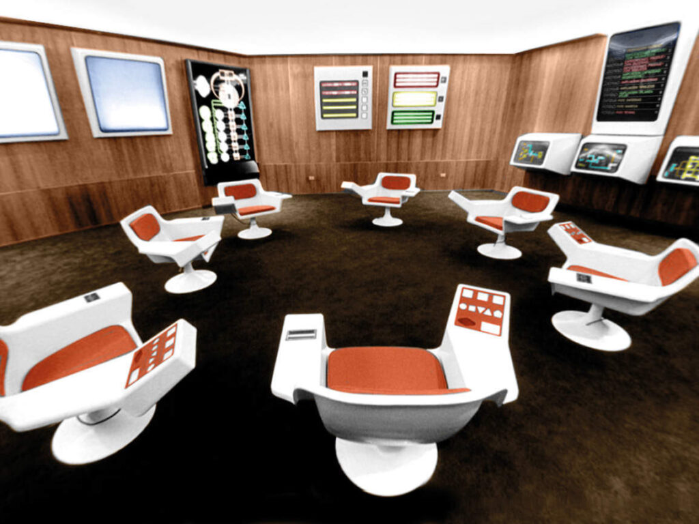

Discipline née après la seconde guerre mondiale dans le sillage des travaux de [[Norbert Wiener]]

discipline permettant de mettre au point des systèmes décentralisés et pilotables par des ordinateurs distants et connectés en réseau. La cybernétique est à l'origine de la mise au point d'Internet. 

Ancêtre de la cybernétique : 1970 à 1973, le système d'information mis en place par [[Salvador Allende]] avec l'aide du consultant britannique Stafford Beer. 
Ce système cybernétique (CyberSyn) avait vocation à rationaliser la production de différents minerais et produits agricoles et à partager de l'information depuis différents sites producteurs de données à un point central situé à Santiago du Chili. 

$\newline$
# bibliographie
$\newline$

