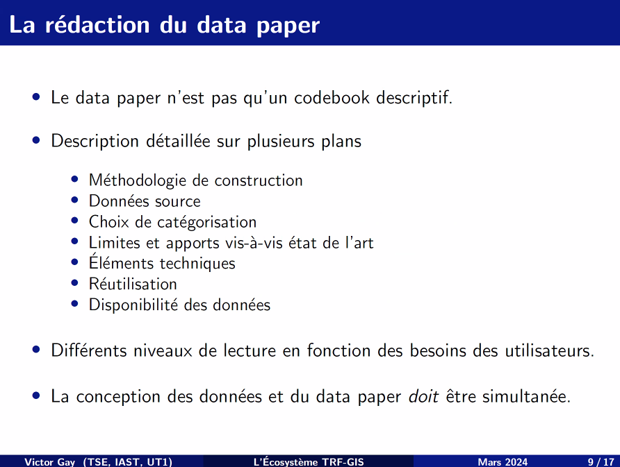
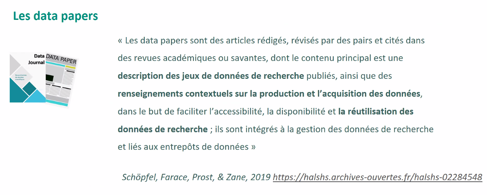
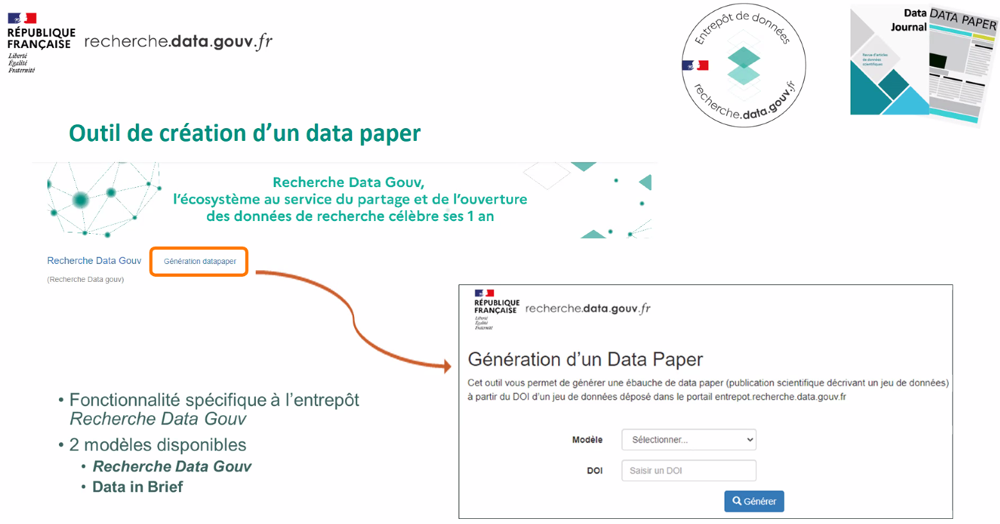

# Intérêt des data papers

# Data paper en Sciences Exactes

# Data papers en SHS

voir [[réutilisation des données#Un SIG pour la France de la Troisième République]]

(tiré de la Présentation de Cathy Tang (INRAE, Dipso, administratrice de DataINRAE, collection INRAE de Recherche Data Gouv) c@fé Renatis Présentation outil de création d'un Datapaper, 24/10/2023)

Objectif de cette forme : inciter au partage des [[données de recherche]] en inventant une forme scientifique qui met en valeur le partage de données et lui confère une valeur scientifique. 

Du fichier [[Obsidian_README]] dans le répertoire où se trouvent les données au datapaper, un enrichissement progressif des données sur les données jusqu'à obtenir la forme d'un article scientifique, mais avec quelques spécificités.  

# Outil de gestion et de création d'un Datapapers

Présentation d'un outil de gestion et de création d'un datapaper et présentation des résultats d'une enquête sur les datapapers proposée dans le cadre de Recherche Data Gouv

retour sur l'écosystème [[Recherche data gouv]]

Le data paper va permettre de valoriser un jeu de données et lui apporter une crédibilité scientifique. 

# Intérêt

article scientifique [[Révision par les pairs|relu par les pairs]]
Le datapaper sera facilement citable (DOI propre)
favorise les collaborations scientifiques
accroît la visibilité d'un jeu de données

# Fonctionnalité de l'outil Génération d'un Datapaper

Deux modèles : 
modèle général : recherche data gouv
modèle spécifique pour la revue [Data in Brief](https://www.sciencedirect.com/journal/data-in-brief) (ventile les [[métadonnées]] dans les rubriques présentes dans cette revue)
partenariat ancien (2019) entre l'INRAE et Data in brief. C'est à l'époque l'INRAE qui publiait le plus de datapapers. 

choix du modèle / fourniture du [[DOI]] du jeu de données.
Cela génère un ODT qui ventile les champs du datapaper dans le format choisi. 

L'article de recherche sera dans [[HAL]] il va renvoyer vers le jeu de données sur Recherche Data Gouv qui lui proposera un lien vers la publication associée à savoir le datapaper

# Présentation des résultats de l'enquête

Quels domaines de recherche des déposants ?
Dans quelles revues les auteurs ont déjà déposé des datapapers (pour proposer de nouveaux templates disponibles)

améliorer la fonctionnalité

connaître les pratiques en matière de DP, voir si ce nouveau type de proposition peut intéresser des chercheurs à créer davantage de DP (enquête ouverte jusqu'à la fin du mois)
Actuellement 200 résultats. L'analyse des résultats sera largement diffusée sous forme de jeu de données dans Recherche Data Gouv et article issu de ce jeu de données

# Questions posées lors de la présentation : 

- outil spécifique à l'entrepôt [[Recherche Data Gouv]], pas de possibilité de créer l'embryon d'un DP à travers RDG sans que le dataset soit sur RDG. Pas de développement prévu dans ce sens, le mapping des métadonnées est réalisé entre le jeu de données de RDG et le template mais on ne prend pas en charge les métadonnées des autres entrepôts.

- D'abord déposer le jeu de données et ensuite créer le Datapaper. 

- Coût de la publication d'un DP ? [[APC]] pour publier un DP : en moyenne, 800 euros / voir si l'institut n'a pas un accord négocié avec certains éditeurs qui publient des datapapers (accords "Publish&Read") Identifier des revues où on peut publier sur la [base du CIRAD](https://ou-publier.cirad.fr/index.php) (APC affichés sur ce site)

- possibilité de réserver un DOI dans RDG 

- on ne sait pas combien de personnes ont déjà utilisé ce générateur de datapaper

- potentiel de [[réutilisation des données|réutilisation]] (rubrique présente dans le template et à compléter lors de l'édition du DP)
# équivalent d'un data paper pour un logiciel

Software papers : liste de journaux disponibles pour ce type de publication [[@chuehongWhichJournalsShould]]

voir aussi [[software paper]]