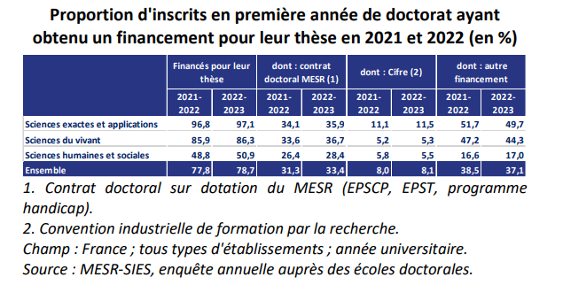

# motivations

Roger Pouivet : mener une certaine sorte de vie principalement vouée à la compréhension d'un secteur de la réalité quelqu'elle soit (poésie anglaise, géologie)
Ethique intellectuelle : comment mener cette vie pour la mener de la meilleure façon possible

# financement de la thèse

financement massif en Sciences Exactes : seuls 3% de doctorants ne sont pas financés dans ce secteur, contre 13% des étudiants en Sciences du Vivant et 29% en Sciences Humaines. Ces doctorants non financés sur crédits de labo ou par l'université doivent vivre de petits boulots. Leur nombre est bien supérieur en Sciences Humaines et Sociales par rapport aux Sciences Exactes. 

(Source : https://twitter.com/GiryJohan/status/1678779496617607170)

# maltraitances
