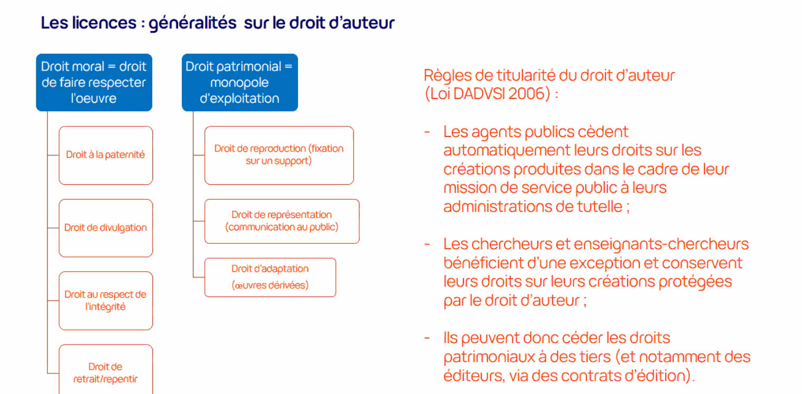

droit d'auteur : exclusivité de l'usage de la création par son auteur (sauf contrat qui ferait tomber les droits de reproduction et représentation) pendant la vie de l'auteur et 70 ans *post mortem*, après quoi, l'oeuvre entre dans le [[domaine public]]

(fait partie des [[droits de propriété intellectuelle]])

droits moraux

droits patrimoniaux

(cf. Lionel Maurel [[Le bon usage des licences dans le cadre du dépôt des publications dans HAL]])

Figures : [[droit d'auteur sur les figures]]

