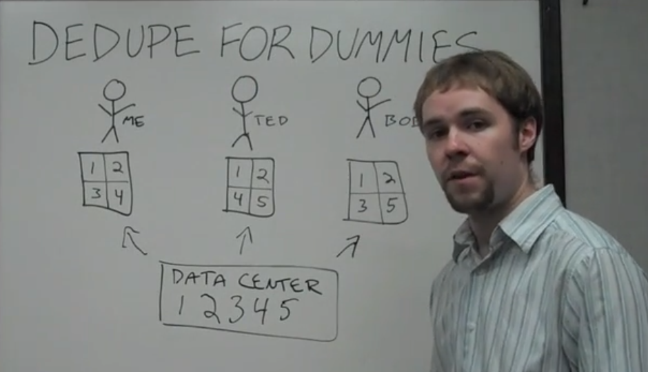

Sauvegarder des données de façon incrémentale, sans multiplier les copies d'un dossier à sauvegarder à chaque fois qu'une modification y est apportée. 


(issu de https://www.youtube.com/watch?v=jjlNMt0BGQ4)

Borg est un système de sauvegarde qui comporte la déduplication. 

notion de "secteurs"
pour afficher les secteurs que contient une partition

```shell
sudo fdisk -l
# sélectionner le bon disque, mettons sdb1
sudo fdisk dev/sdb1
# résultat : 
# Disque /dev/sdb1 : 29,3 GiB, # 31455924224 octets, 61437352 secteurs
# Unités : secteur de 1 × 512 = 512 octets
# Taille de secteur (logique / physique) : # 512 octets / 512 octets
```


Dans le cas de [[Zotero]], la déduplication consiste à ne conserver qu'une version d'un document alors que celui-ci apparaît deux fois dans une bibliothèque.


$\newline$
# bibliographie
$\newline$


