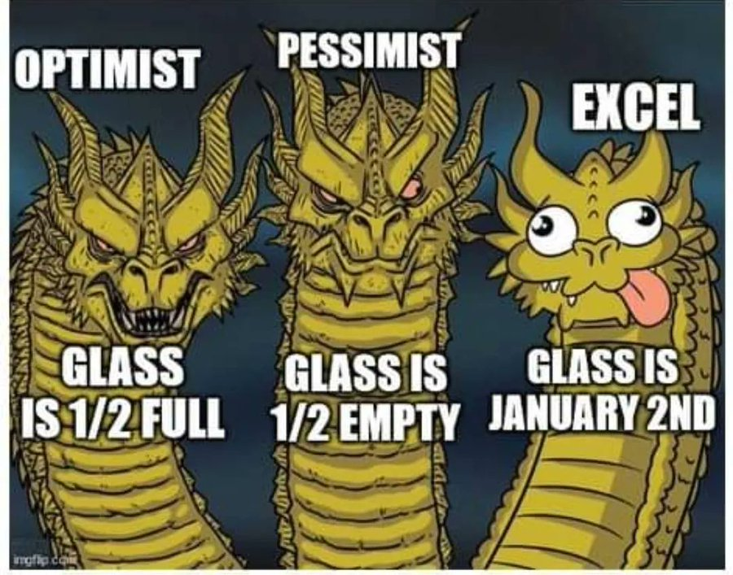

Tableur propriétaire de Microsoft
équivalent libre = [[calc]]

# XLS, XLSX et CSV

Quel format est réellement [[FAIR]] ?

Historiquement, il était impossible aux autres éditeurs et tableurs de lire des documents conçus avec Excel (xls), ce qui rendait l'usage de ce tableur indispensable la plupart du temps pour lire et interpréter les données d'autrui et donnait une position dominante à Microsoft. La firme de Redmond (Californie) a cependant du reculer face à l'Union Européenne qui a montré le caractère illégal de ce monopole sur le marché européen et l'a contraint en 2007 à adopter un format ouvert en xml : xlsx qui est compatible avec un grand nombre d'éditeurs libres (par exemple [[calc|Libre Office Calc]])

Les formats xlsx et [[CSV]] sont les formats les plus utilisés pour partager des données tabulées. 

Ces formats sont plats dans le sens qu'ils n'autorisent pas la conservation de données hiérarchiquement ordonnées contrairement à XML et JSON. 

Mais xlsx est en réalité un ensemble de fichiers qui constituent une couche de données, tandis que le CSV est l'expression la plus simple des données (sans les formules, les éléments multimédia, les tableaux croisés dynamiques)

CSV contient la donnée en [[Texte simple|texte simple]] ; c'est souvent perçu comme une limitation, mais ça l'est aussi comme une force, dans la mesure où à partir de ces données, toutes les formules et les calculs peuvent être effectués à part, par exemple à travers un logiciel comme [[R (logiciel)|R]].
Etant moins complexes, les données formatées en CSV sont aussi beaucoup plus sobres en consommation d'énergie que les tableurs XLSX. 

# erreurs d'Excel

conversion automatique de nombres en dates :

voir formats des fichiers dans les [[Plan de gestion des données|Plan de gestion de données]]

>Indeed, spreadsheets are prone to data entry, manipulation and formula errors [30], leading to problems like inadvertent conversion of gene names to dates in databases and Supplementary Excel files available online at http://bib.oxfordjournals.org/ [31–33]. Spreadsheet errors could be widespread, given that it is used as an analysis tool by ∼69% of researchers according to a survey undertaken in 2015–16 of 20 000 university academics [34].

(source : [[@ziemannFivePillarsComputational2023]])

Erreur de Rogoff et Reinhart sur un fichier Excel (Excel convertissant sans crier gare des valeurs numériques en dates), cette erreur a changé durablement (en pire) la politique économique de l'Europe pendant une décennie, présentant la réduction de la date publique comme une nécessité alors que c'est un choix politique. 
Voir là-dessus l'introduction de la présentation de ReScience à l'Urfist de Bordeaux en 2017[[@hinsenReScience2017]]

Conversion de séquences génomiques en dates

# combiner des fichiers

https://youtu.be/7EouTU_Mbsk

voir [[combiner des fichiers]]

# diverses fonctionnalités

## rechercheV

voir [[RechercheV]]

# Tableaux croisés dynamiques

voir [[tableaux croisés dynamiques]]

# limites d'Excel pour faire de l'analyse de données

> Excel si software to make pretty tables, it's no software to make data analyses

(Richard McElreath dans une conférence : https://lmu-osc.github.io/Open-Science-Summer-School-2025/Lectures.html) 

voir aussi à propose d'Excel comparé à [[R (logiciel)|R]] ou [[Python]] [[@melchorSixQuestionsAsk2025]] : 

> For pure data analysis, however, spreadsheets should not be your first choice, advises data scientist Heidi Seibold in Munich, Germany, who is co-executive director of the Digital Research Academy, a network that provides training to improve research quality. Unlike a script written in a programming language such as Python or R, which documents every step of the process and can be saved, versioned and rerun, an analysis that happens inside a spreadsheet using pointing and clicking is hard to follow and even harder to replicate.

# bibliographie

