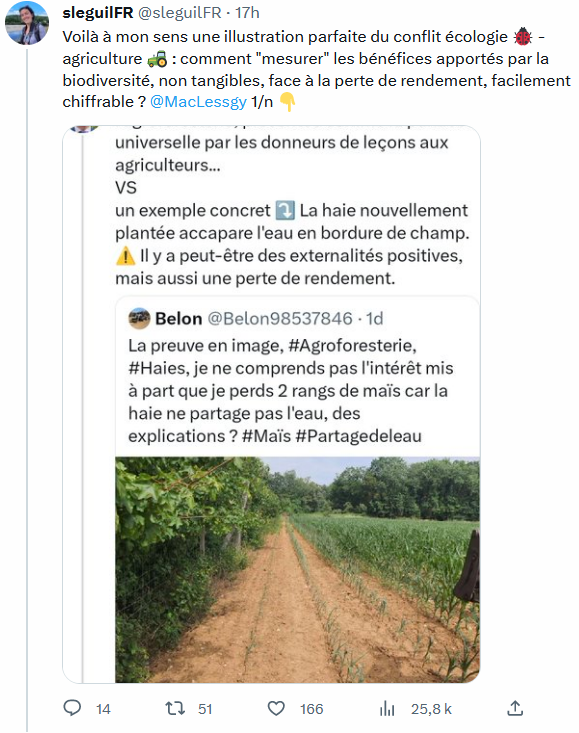

La sauvegarde de la [[biodiversité]] est une externalité positive liée à certaines pratiques consistant par exemple à laisser pousser des haies en bordure de champ et à lutter contre le remembrement en raccourcissant les parcelles. 
Ces externalités qui peuvent se traduire par une perte de rendement mesurable, sont elles difficilement quantifiables mais néanmoins très importantes pour la sauvegarde de l'économie. Cette difficulté à quantifier les externalités, qu'elles soient positives ou négatives aggrave la crise climatique que nous vivons. 

