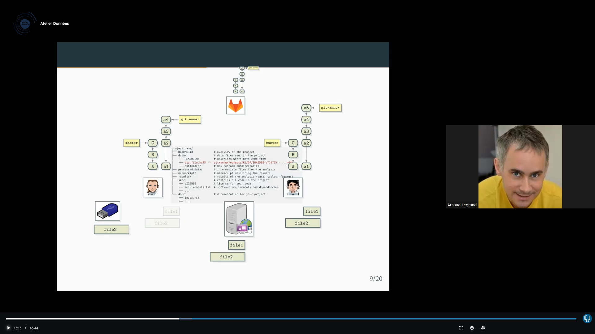

Git annex permet d'inscrire la modification de gros fichiers dans l'arbre du projet sans que les gros fichiers soient toujours partagés (push / pull) en même temps que les fichiers moins volumineux. Ces derniers peuvent être sauvegardés sur des serveurs externes et peuvent faire l'objet d'envois ponctuels. (source [[@legrandGestionDonneesScientifiques2023]])

démonstration réalisée par Distro Tube [[@distrotubeGitAnnexCoolest2022]]

initialiser des repos git (git init) avec des dossiers larges dedans, ces repos sont en local ou sur plusieurs machines. 
Faire en sorte que ces repos se reconnaissent les uns les autres
Lorsqu'on demandera la liste des dossiers et fichiers dans ce repo, on aura des liens symboliques vers les repos sur les différents ordinateurs où sont hébergées les données. Si on accès à ces ordinateurs à distance, on pourra les télécharger depuis ces machines. 

$\newline$
# bibliographie
$\newline$

