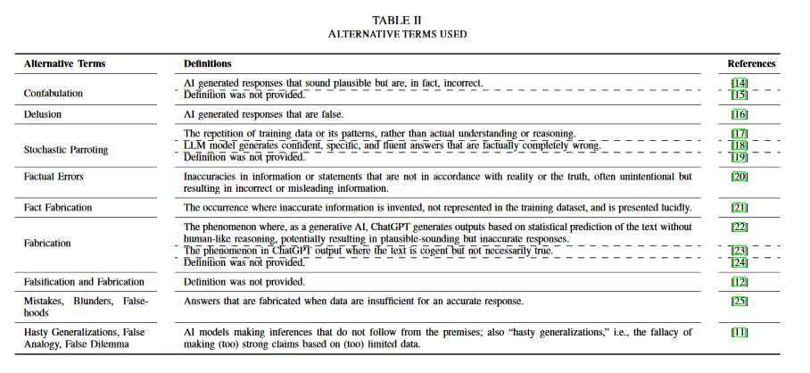
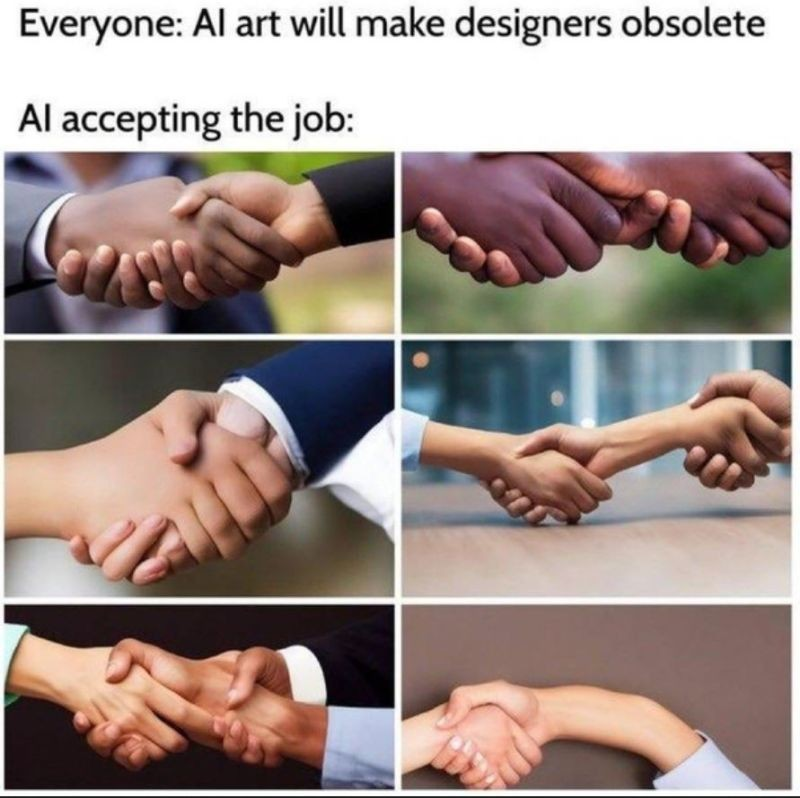

production d'une intelligence artificielle qui paraît sans rapport avec le monde tel que nous le connaissons. 

Il n'existe pas de définition unifiée de l'hallucination qui reste un mot marketing pour désigner une "invention" (bien qu'une IA n'invente rien mais se contente de générer) d'un système d'intelligence artificielle. 
Maleki et Padmanabahm ont fait un état de l'art des définitions du concept dans la littérature scientifique et trouve des résultats aussi divers que : 

- "AI hallucination" refers to LLMs’ tendency to gen-
erate factually nonsensical or incorrect text. (incorrect par rapport à quoi ?)

- "AI hallucination" occures where the model produces untruthful or misleading information

- "AI hallucination" is a phenomenon where LLMs
generate non-factual statements (le LLM se base sur des textes, non sur la réalité, le chatbot qui l'utilise ne produit donc jamais des énoncés factuels, juste des énoncés plausibles aux yeux du lecteur)

- "AI hallucination" is the generation of output that
appears convincing but is factually untrue or unrelated
to the current context. Issu on oppose un énoncé plausible à un énoncé reposant sur une réalité de terrain. dans d'autres définitions, une hallucination est réputée non plausible (et repérée comme telle)

les auteurs proposent de remplacer le terme fourre-tout et anthropomorphisé d'hallucination par une liste de termes à appliquer en fonction du contexte : 

(source: [[@malekiAIHallucinationsMisnomer2024]])

En soi, l'hallucination d'un outil d'IA est un anthropomorphisme car l'IA n'a que faire de la réalité ; ses productions sont liées au corpus d'entraînement, ses résultats sont purement statistiques et probabilistes. que le résultat soit vrai (au sens de conforme à la réalité que nous connaissons) ou faux, le processus suivi par le chatbot est exactement le même ([[@perretChatGPTLindifferenceVerite2024]]). 

>Les LLM ne perçoivent pas, ils ne peuvent donc pas “mal percevoir”. […] Lorsqu’un LLM énonce quelque chose de faux, ce n’est pas dû à un accident de parcours […] il suit exactement le même processus lorsqu’il énonce quelque chose de vrai. […] Dire que ChatGPT hallucine, c’est sous-entendre qu’en temps normal il essaye de transmettre des informations justes. Or c’est faux : le fait que ChatGPT tombe juste n’est qu’un résultat indirect de son fonctionnement. […] ChatGPT se moque de ce qu’il raconte, y compris quand il a raison

([[@perretLintelligenceArtificielleGenerative2025]])

En tant qu'indifférent à la vérité, chatGPT est un outil qui sert à générer du [[bullshit]] . En ce sens, comme l'avance Marcello Vitali-Rosati, les outils d'intelligence générative n'ont pas de relation avec la vérité du monde mais avec notre vision du monde ; ils ne nous parlent pas de faits avérés mais nous donnent des informations vraisemblables. En tant que telles, ces IAG sont aristotéliciennes (le poète fait de la poésie à partir du vraisemblable) et non platoniciennes (le philosophe dit la vérité contrairement au poête)
([[@vitali-rosatiVeriteVraisemblancePourquoi2025]])

A l'instar du terme "intelligence" (dans intelligence artificielle) et du terme "hallucination", le terme "génératif" contribuer à opacifier la réalité des IAG, non pas en l'anthropomorphisant comme dans les deux autres cas, mais en la mythifiant : en faisant croire que les intelligence génératives produisent quelque chose à partir de rien, alors que les textes ou images produites sont un réassortiment de menus textes ou morceaux d'images combinés entre eux selon un algorithme en fonction d'un but fixé : 

> Tome, the term generative relates to the systematized reconfiguration and co-agulation of data that is represented as a “novel” digital object to suit some conceptual purpose (Hall 1997). The generative in generative AI insinuates the creation of something out of nothing, when it really is just a bunch of somethings haphazardly shaped together at randomized intervals (Hicks et al. 2024; Nagy and Neff 2024).

Ces hallucinations sont en fait des situations probables d'un point de vue statistique mais qui ne font aucun sens du point de vue de notre connaissance de la réalité : 

>Évidemment, ce qui est le plus probable n’est pas toujours ce qui a le plus de sens. Les personnages générés par Dall-E ont, par exemple, souvent bien plus de doigts que nécessaire. Pour une raison toute simple : sur une image, la probabilité est très grande que ce qui est à côté d’un doigt soit un autre doigt. En fait, si vous me montriez une partie de photo représentant un doigt en me demandant de parier sur ce qu’il y a juste à côté, j’aurais tout intérêt à répondre : « un autre doigt ! ». Ce n’est pas une hallucination, c’est un résultat entièrement logique, statistique !

Pour Olivier Ertzscheid, les hallucinations ne sont pas un défaut de la machine, c'est le mécanisme même de cette machine qui est décrit dans ce terme. Comment une machine uniquement probabiliste pourrait énoncer quelque chose d'utile, si ce n'est pour remplir les cerveaux et empoisonner le débat public : 

> Tant que ces modèles seront, de par leur conception même, en capacité même temporaire d’affirmer que les vaches et les moutons pondent des oeufs, et tant qu’ils ne seront capables que d’agir sur instruction et dans des contextes où ces instructions sont soit insondables soit intraçables, jamais je dis bien **jamais nous ne devons les envisager comme des oeuvres de langage ou de conversation, mais comme des routines propagandistes par défaut, et délirantes par fonction**

([[@ertzscheidLucieDansChoux2025]])

# conséquences

voir le cas de ces avocats qui se sont servi d'une jurisprudence qui n'existe pas mais avait été créée de toute pièce par ChatGPT [[@lebriefDeuxAvocatsLeur2023]]

$\newline$
# bibliographie
$\newline$

