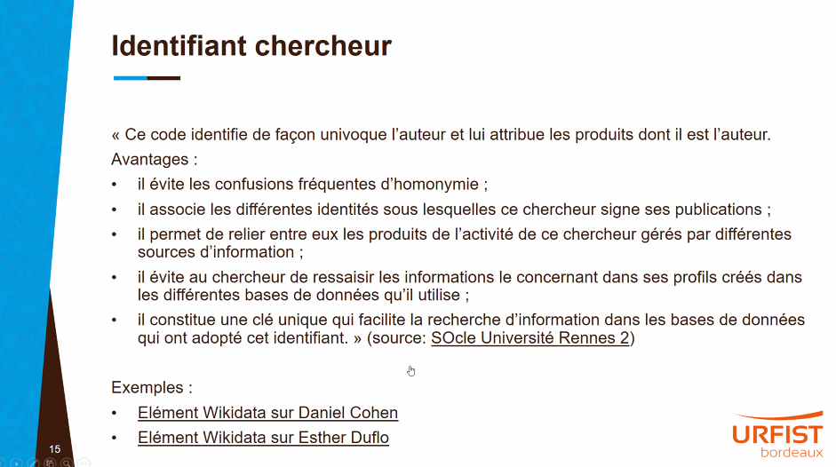
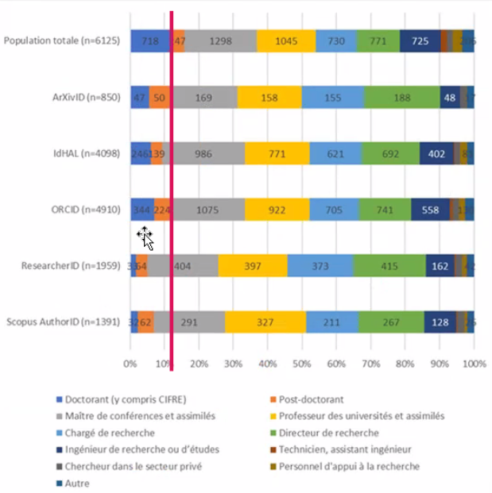
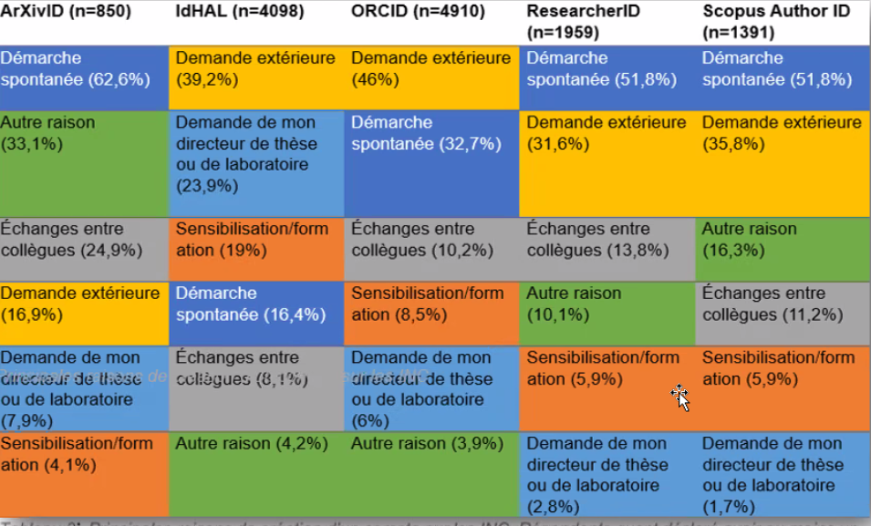
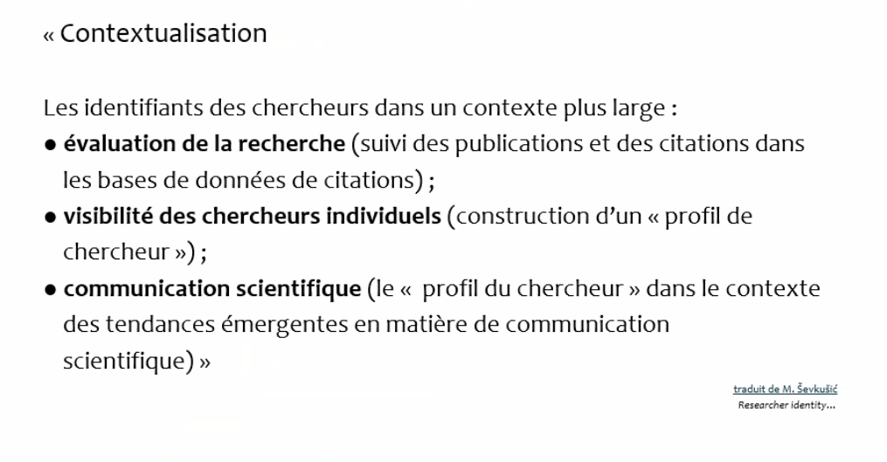
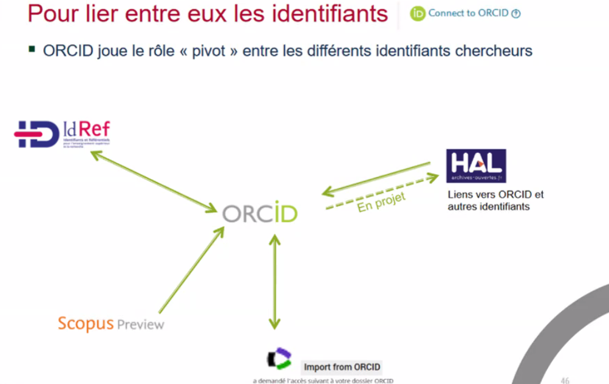
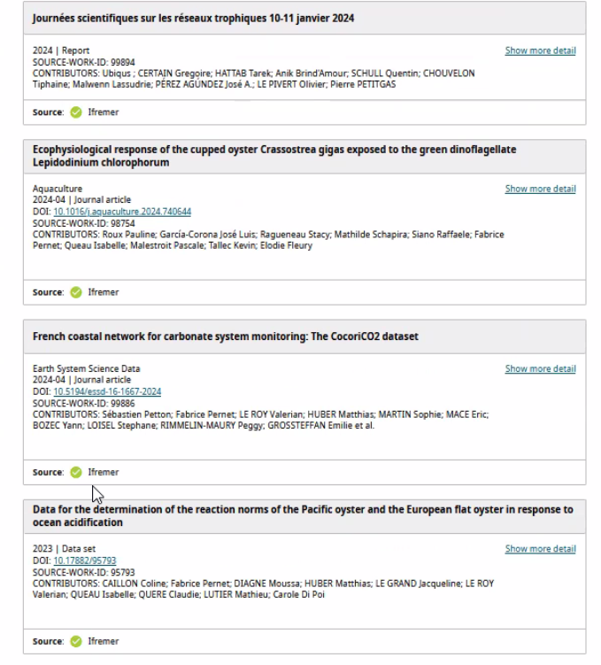

# Tour d'horizon

identifiants chercheurs

alignement des identifiants [[ORCID]]

exploitation de ces identifiants pour des bases de connaissance 

projet SoVisu+ ([[@LancementSoVisuPour]])

# Formation d'Aline Bouchard

(Lundi 27 mai 2024 / 13h-17h)
[[ORCID]] un enjeu actuel de la [[Science ouverte]] sous l'angle de la simplification administrative (alimentation de systèmes d'information de la recherche)

principe du "dites-le nous une fois" avoir accès à l'ensemble des publications à partir d'un identifiant. 

Côté métier (rapport IGB) : les bibliothèques ont la charge de sensibiliser les doctorants aux identifiants objets ([[DOI]]) et contributeurs ([[IDHAL]] et ORCID)

Les trois piliers de l'adoption : 
- soutien des parties prenantes
- intégration technique
- sensibilisation et formation

## connaître le contexte

premiers identifiants : identifiants commerciaux liés à des bases de données (Scopus, [[Web of Science]])

Puis identifiants liés à des annuaires professionnels : [[idref]], idhal ; les chercheurs ont la main sur ces identifiants.

Les URL fournis par les réseaux sociaux commerciaux ne sont pas des identifiants

Le dernier produit est l'ORCID (produit par un rassemblement de différents acteurs). identifiant important parce que c'est le chercheur qui a d'abord la main dessus. Son modèle économique est basé sur le financement de différents acteurs et ce financement assure une forme de pérennité à ces identifiants.

But : aligner ces différents identifiants. Vérification croisée que permettent ces échanges.

L'usage de ces identifiants d'un point de vue administratif représente : 
- un gain de temps
- une réducation de la charge administrative
- compréhension plus approfondie de l'impact et de l'interconnexion du monde la recherche

Lien avec l'intégrité. 
Comment présenter ORCID comme un outil renforçant l'intégrité scientifique. Usage de données vérifiées par des éditeurs commerciaux (WOS, Scopus) qui vont être utilisées par l'administration. La validation institutionnelle de certains contenus de ces éditeurs n'est pas encore actuelle. Ennjeu : permettre aux institutions d'enrichir les contenus ORCID de leurs chercheurs. 

cf. usage des identifiants numériques chercheurs en France (Ouvrir la science)[[@bouchardUtilisationUsagesIdentifiants2024]]

appropriation plus grande dans les STEM car ORCID promu par les revues (contrairement aux SHS). Développement de l'ID-HAL dans tous les secteurs.  

Les doctorants moins utilisateurs que les chercheurs plus anciens

Pour les chercheurs, un identifiant chercheur ça peut être un ORCID, mais ça peut être un login / mdp

Le terme "identifiant de chercheur" n'est pas vendeur pour eux.
Ils ont été confrontés pour la première fois avec ORCID lors de partenariats avec des étrangers (création demandée par un éditeur par exemple). Ce manque d'information, contribue à la création de plusieurs ORCID pour une même personne. Le chercheur ne fait pas forcément le lien entre la chaîne de caractères ORCID et les fonctions associées.

Certains chercheurs vont rendre leur bio privée. d'autres ne feront une revue de leur ORCID et de leurs publications associées qu'une fois par an.

Les chercheurs ne comprennent pas généralement à quoi ORCID peut servir. 

Si on regarde les freins à l'appropriation d'ORCID, ils ne sont pas d'ordre technique (assez simple à utiliser). Le premier frein, c'est que ces outils ne sont pas déployés dans chaque communauté, lien purement individuel avec ces outils. En plus du PNSO, il y a un document essentiel en circulation "politique des données, des algorithmes et des codes sources" des actions de promotion seront conduites sur tous les établissements. Ces actions de promotion ne se sont pas déployées systématiquement. Le portail https://appelprojetsrecherche.fr impose la création d'un ORCID. Plan d'action à venir sur les identifiants chercheurs en France, pour le déploiement d'ORCID dans les systèmes RH et dans les systèmes d'information d'établissements. 

Pour les doctorants, il est nécessaire de connaître ORCID et à savoir s'en servir. 
Dans ce paysage qui doit sensibiliser ? Les bibliothèques sont très bien placées pour le faire, elles ont une appétence toute particulière pour la notion d'identifiant et l'interopérabilité qui l'accompagne. Pour autant le poids des échanges entre pairs est plus important que l'apport des pros IST. Mais les SHS sont plus demandeurs de cet apport [[@petotSensibilisationAuxEnjeux2023]]. C'est surtout du côté des doctorants qu'il y a une grosse attente. 

## Sensibiliser, former, accompagner

Quelques exemples de réalisation. 

est-ce qu'ils vont vraiment réutiliser les comptes qu'on leur fait créer ? 

Est-ce qu'il est important qu'ils créent leur identifiant ORCID de 0 pendant la formation, est-ce qu'ils ne vont pas créer un doublon plus tard. 

Est-ce que c'est pertinent de rassembler dans un même groupe les doctorants et les enseignants chercheurs ? 

rôle incontournable d'ORCID.

- identifiant
- page
- registre

Il existe un bac à sable pour nous exercer sur ORCID

introduire la création du compte ORCID par des éléments de contexte : 

ORCID est utile pour relier entre eux différents documents de recherche : 
- publication
- réponses aux appels à projet
- plan de gestion de données
- plan de gestion des logiciels

Comment toucher le chercheur ?
ressources sur [ORCID-France](https://orcid-france.fr/) 
notes d'explication sur le site web de sa bibliothèque

périodes propices pour les actions de sensibilisation : pics réguliers de création et de [[mise à jour]] aux périodes où il y a des demandes de financement ANR + périodes d'évaluation HCERES.

usage fréquent de l'ORCID "login with ORCID". Ce n'est pas dans la philosophie de l'identifiant mais ça en facilite l'appropriation.

Les post-docs trouvent très pratique d'avoir un numéro ORCID pour pouvoir être suivi dans une transition entre un établissement et un autre. Indiquer la page ORCID comme lieu de référence / ORCID = outil de crédibilité scientifique. 
possibilité d'avoir un QR code depuis ORCID

## identifier les points-clé

Identifier les idées reçues. 
savoir quels sont les messages prioritaires à envoyer

connecter les plateformes entre elles :

C'est compliqué de vendre les identifiants chercheurs alors que les briques ne sont pas encore construites. Peu d'institutions au niveau fr ont fait le choix d'alimenter les contenus relatifs à leurs chercheurs (c'est le cas au CIRAD)
La logique d'ORCID c'est que c'est le chercheur qui est responsable de l'alimentation de son ORCID.

Rôle actif de l'ifremer dans la qualification des oeuvres du chercheur : 

Outil de flicage : Mêmes critiques faites sur HAL et sur ORCID
rapporté à la [[bibliométrie]] c'est normal que les organismes financeurs soient au courant des travaux associés au projet (via l'ORCID)
Sur ORCID possibilité de paramétrer le degré de visibilité des documents. On ne peut pas nier que ces outils ont vocation à être utilisés dans un cadre bibliométrique. 

ORCID et [[RGPD]]. Un certain nombre de chercheurs précisent qu'ils refusent d'utiliser ORCID parce qu'il prélève des données personnelles. 

Il faut insister sur les différentes fonctionnalités d'ORCID. Insister aussi sur le caractère international d'ORCID.

Bien représenter le travail à faire autour des identifiants dans le temps long : 
**création** ([[identité numérique]]) > **alimentation** (automatiser au maximum ses informations) > **entretien** (contexte en évolution ; il y a des choses qui sont en train de changer comme le rôle des institutions dans l'édition des profils, évolutions par rapport au contexte en général, nécessité pour les chercheurs de faire une vraie veille sur leurs contenus)
Voir comment on acculture les chercheurs à d'autres identifiants ([[DOI]] et [[ROR]])

$\newline$
# bibliographie
$\newline$

