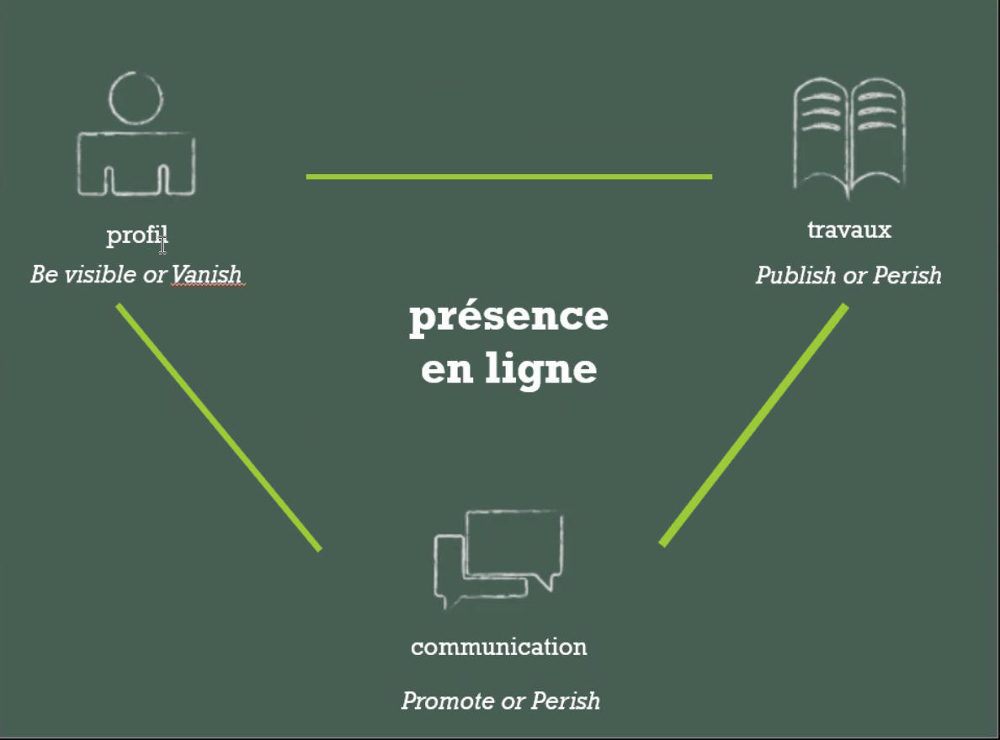
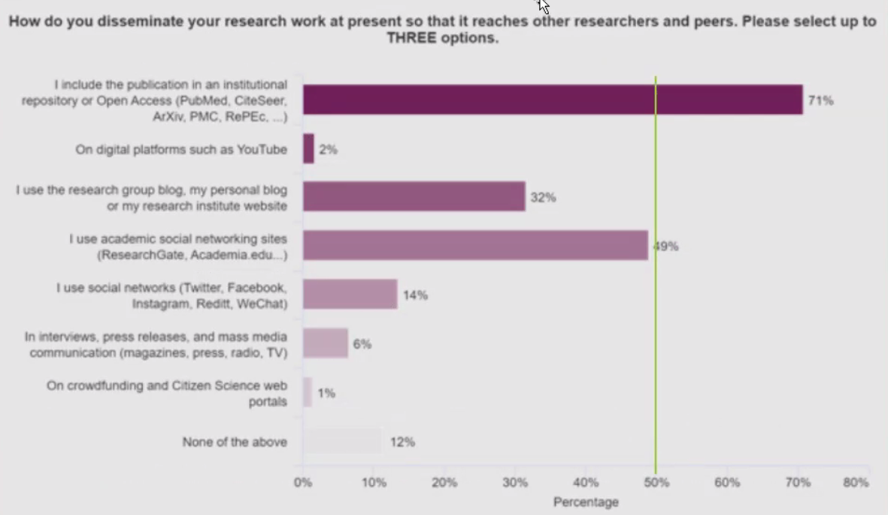
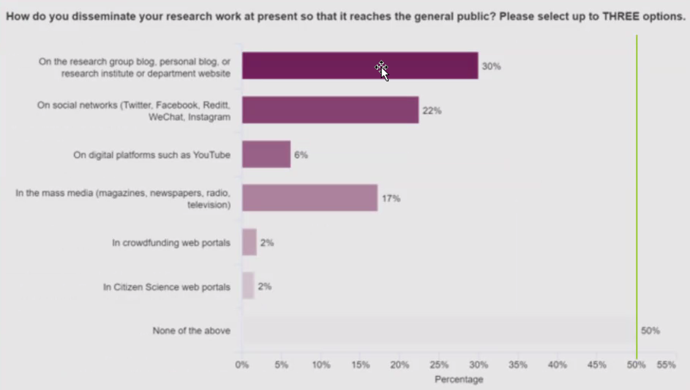
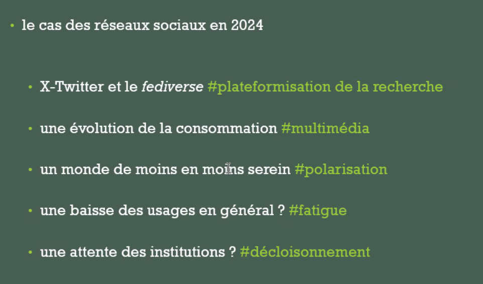
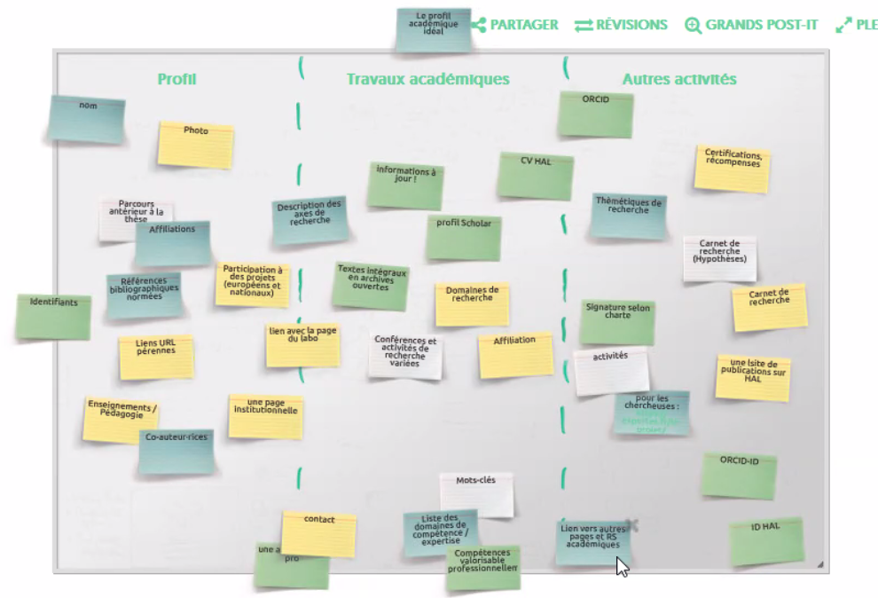

** identité numérique :** 

traces du web, dont traces passives

**visibilité :** ça passe par un intermédiaire qu'est le [[moteur de recherche]] ; visibilité d'un profil, d'une personne, de ses activités. Comprendre comment fonctionnent les moteurs de recherche pour apparaître comme on le souhaite

**e-reputation :**
interprétation que se font les internaute des traces. Remixage par les préjugés, biais, avis des internautes. 

**Impact :**
nombre de citations, de téléchargements. Plus les publis sont disponibles, plus elles seront citées ([[bénéfice de citation|citation advantage]])

Nécessité de réfléchir en termes d'objectifs, de stratégie. 

stratégies en fonction du type d'activités qu'on veut mettre en valeur (grand public, experts)

public cible : réseautage, décideurs, associations ?

Cette notion d'identité numérique doit être perçue comme évolutive. 

notion d'objectif et de contrôle. 

Un éditeur incite ses auteurs à faire la promotion de leurs articles publiés chez lui. 

[[publish or perish]] = course à la visibilité

a nombre de publis égal, il faut en plus être visible, c'est à dire au départ bien référencé (accessibilité via les moteurs de recherche, cf. [[référencement web]])

Troisième étape : promotion des activités : assurer soi-même la promotion de son travail (liée au développement des réseaux sociaux) 

profil = identification
travaux = rattachement à sa communauté de pairs
communication = activités associatives

Lien avec la [[Science ouverte]] très fort. Guide produit par le COSO destiné aux écoles doctorales. Les doctorants doivent acquérir une étape qui concerne l'écosystème de la publication mais aussi l'autre étape (construction d'une identité numérique)

présence en ligne liée aussi à l'[[science réglementaire|intégrité scientifique]]. 

Academia.edu : SHS
Les outils plutôt utilisés par les SHS sont des outils plus publics. 

usage un peu plus important sur X(Twitter) en SHS, plus grand investissement de LinkedIn et [[Google Scholar]] en STEM. 

Les doctorants ne sont pas forcément férus de réseaux sociaux. Le réseau qui se démarque c'est LinkedIn (à des fins de carrière post thèse)

Quels sont les lieux que les doctorants préfèrent utiliser pour disséminer leurs travaux de recherche ? 

Ce ne sont pas les réseaux sociaux qui leur servent le plus à disséminer leurs résultats : 

STEM:

SHS:

Place des réseaux sociaux dans le cadre académique 

X-Twitter : plateformisation de la recherche. Les réseaux sociaux sont des outils commerciaux qui ne s'alignent pas forcément sur les objectifs de la science ouverte

Sur Twitter, on attaque de plus en plus les chercheurs en tant que chercheurs ou par rapport à leur sujet de recherche

Ces réseaux sociaux qui avaient été vendus comme des lieux d'échanges académiques deviennent des outils de communication descendante au même titre qu'Internet. En même temps, les universités veulent que leurs chercheurs soient visibles sur ces réseaux sociaux à titre personnel;

engagement public des chercheurs : sujet traité par le COMETS (voir [[neutralité axiologique]])

Identité contrôlée, identité gérée = [[hygiène numérique]]

droit à l'oubli : demande de suppression à l'hébergeur
droit au déréférencement : demande de désindexation

ça ne veut pas dire que les informations disparaissent des moteurs de recherche, ça veut dire que les résultats ne sont plus visibles. Le déréférencement, ça marche de manière relative. 

Le droit au déréférencement ne s'applique qu'à des cas restreints (questions politiques, religieuses)

Les institutions ont tendance à pousser vers l'adoption d'[[identifiants de chercheurs]] : [[ORCID]] sans doute bientôt obligatoire.

notion de confiance, de crédibilité : bien que ce soit pour un temps limité, il est important que les doctorants affichent leur lien avec leur université en remplissant leur page institutionnelle.

Crise du COVID-19 , question posée à un journaliste : comment vous faites pour trouver des intervenants. passe par Google et sélectionne les pages institutionnelles. 

# Comment aborder ces questions ?

processus actif, qui demande de la vigilance. 
Importance de la publication scientifique, reconnaissance académique

3 domaines principaux à mettre en valeur : 

- profil: 
	- nom, prénom
	- photo (pour gérer l'anonymat et pour être reconnu, mettre la même photo sur tous les sites pour faciliter la mise en relation des éléments de l'exposition, c'est une question de cohérence) Vérifier les métadonnées affichées au contenu visuel
	- CV
	- contact (adresse mail pro)
	- champs de compétences sous la forme de mots-clé (référencement)
	- liens vers d'autres contenus en ligne (également pour le référencement et favoriser l'indexation). Même le meilleur site personnel du monde s'il n'est pas repéré par les moteurs de recherche, il ne sert à rien.
- travaux académiques
	- publications
- autres activités (partenariats, bourses, associations)
	- carnets de recherche

$\newline$
# bibliographie
$\newline$

