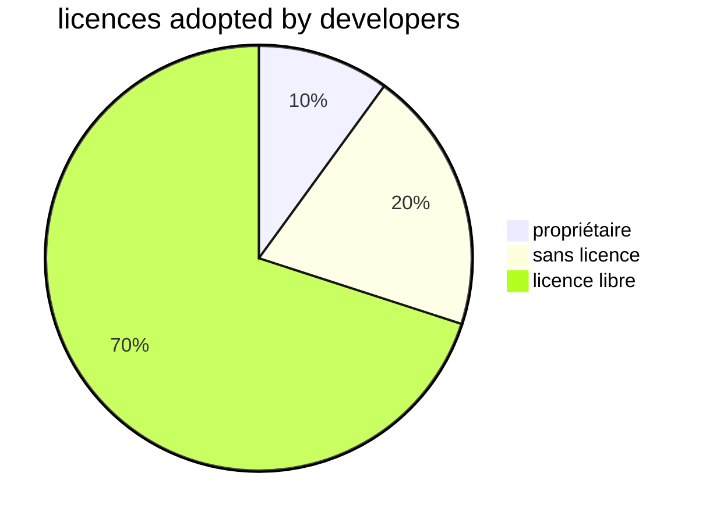
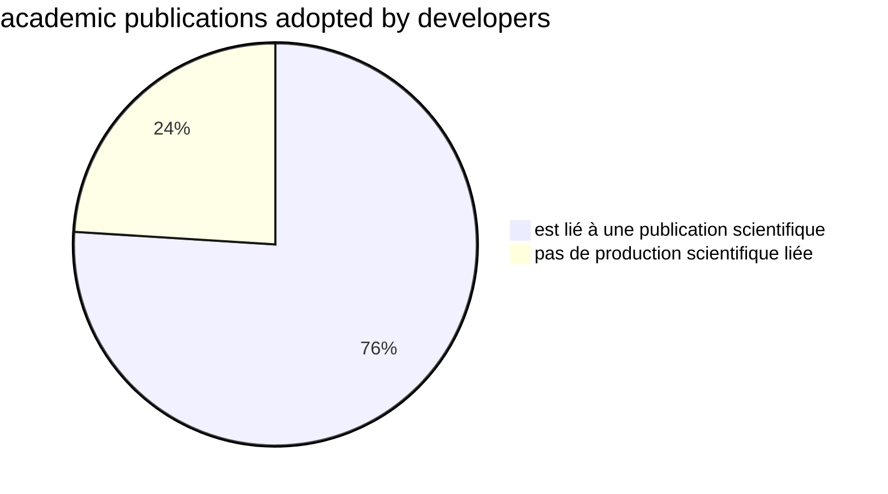
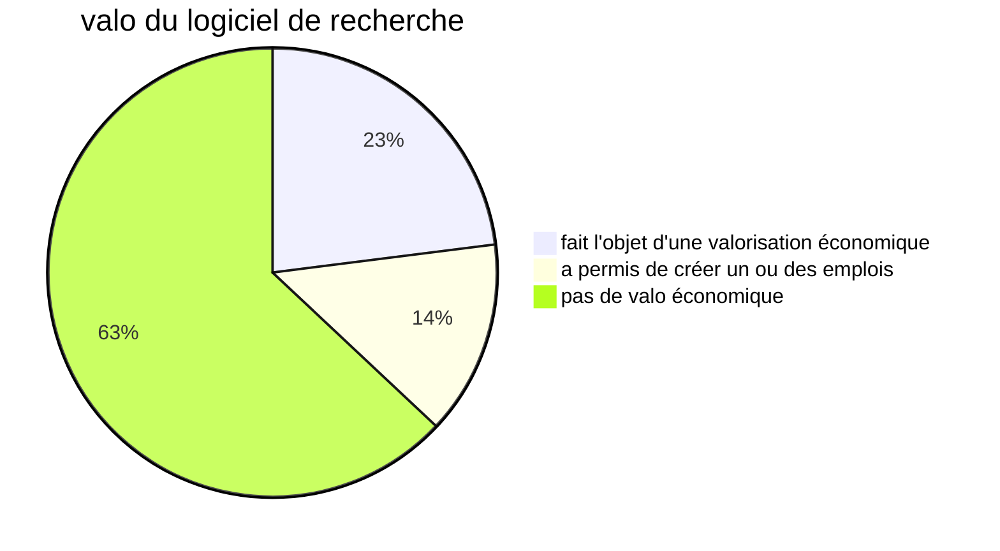

- Rapport du MSER sur le logiciel (présenté par Isabelle Blanc)
- inclusion du logiciel dans le deuxième appel pour la Science Ouverte
- Mise en place du COSO
- développement d'un catalogue du logiciel de l'ESR

Politique de [[Science ouverte|Science Ouverte]] de l'UGA intègre le [[code source]]
Cellule Code-données Grenoble Alpes (GRICAD)
C'est le premier OSPO (Open Source Programme Office) académique en France.
Défis : 
- pérennisation des développements
- [[reproductibilité]]
- valorisation du code source

Complémentarité entre les bibliothèques universitaires et le GRICAD

Projet Excellence Gates (projet développé par les Affaires internationales) : école thématique sur le logiciel libre

CNRS un des mécènes de [[Software Heritage]]
Le CNRS accompagnera la mise en place d'autres OSPO académiques

présentation d'Isabelle Blanc, administratrice des données et code source du MESR

enjeu de l'intégration du développement logiciel dans la carrière des chercheur.se.s

reconnaissance du logiciel libre : prix du logiciel libre

Perspective de la création d'un réseau de forces logicielles. 

Comment relier code, données, publications et édition.

# présentation d'Isabelle Blanc

valorisation du logiciel libre d'après le rapport logiciel [[@blancProductionValorisationLogiciels2024]]
-> la production du logiciel de recherche est intense ; 65% sont des applications autonomes, 77% est soutenu par des communautés structurées, mais 33% seulement font l'objet d'une gouvernance.
Le logiciel est présent dans toutes les disciplines.

70% des licences sont des licences open source, 10% sont des licences propriétaires, 20% n'ont pas de licence. 

Il ne faut pas que la maintenance et l'évolution ne repose que sur les labos qui l'ont développée, il faut trouver d'autres forces au-delà (au niveau des tutelles et/ou de communautés de recherche internationale)

20% seulement des collègues déposent directement leur code dans [[Software Heritage]]

Craintes sur la restriction d'accès à github ou gitlab.com par l'administration US : comment gagner en autonomie au niveau européen (souveraineté et gouvernance équilibrée)
Nécessité de concevoir une [[forge logicielle]] porteur des mêmes fonctionnalités que celles présentes sur [[Github]].

valo académique -> publications + valo économique

**77% des collègues qui ont fait de la valorisation n'ont pas fait appel à un service compétent sur le sujet (cf. [[SATT]])**
Production dynamique qui a besoin d'être davantage visible mais qui requiert la structuration d'un support pour permettre la maintenance durable de ces logiciels, maximiser les impacts techniques, scientifiques et économiques

Se doter d'une vraie politique en matière de développement et dissémination du code source. Aider les chercheurs.ses à choisir des [[licences logicielles]] appropriées à leur projet

Les OSPO et les data repositories demandent des compétences différentes et n'ont pas le même mode de valorisation (droit d'auteur dans un cas, licences de données dans l'autre)
choix possible de réunir les expertises dans un atelier de la donnée mais le code source ne sera pas dans [[Recherche data gouv|Recherche Data Gouv]]

# Présentation de Roberto Di Cosmo

présentation des [[Quatre libertés|4 libertés]]
A partir de 1998, le logiciel libre est devenu un objet industriel (correspond à la mise en place du noyau Linux)

Mise en place des Open Source Program Office dans les entreprises.
Fondée sur un besoin d'identifier le socle légal de la réutilisation d'une librairie logicielle.
De plus en plus, l'OSPO a pour rôle d'aider à produire du logiciel libre

> The 2025 OSSRA report found that open source software is nearly universal in commercial applications, with 97% of all applications evaluated for the report containing open source

([[@balsOpenSourceSecurity2025]])

8900 [[langages informatiques]] présents dans le code conservé. Plutôt que d'apprendre à utiliser un langage on préfère souvent en créer un.

la quantité de logiciel libre produit double tous les deux ans depuis 25 ans.
Le nombre de [[commits]] double tous les trois ans (on prépare davantage les commits avant de les faire que dans le passé)

Problèmes de [[reproductibilité]] massif y compris en informatique ; les 3/4 des problèmes de reproductibilité en physique viennent du fait qu'on ne retrouve pas les code-sources sous-jacents

Les [[Jupyter]] notebooks crée des aléas dans la reproductibilité (si on n'exécute par les cellules dans le bon ordre, le code ne s'exécute pas bien)

début de solutions : 
- Une archive ([[Software Heritage]]) - ne pas laisser le code source sur [[Github]], les codes disparaissent car les forges tombent.
- pour un code on change un espace dans Python ça n'est plus du tout la même chose
- description pas machine-readable
- pas de pratiques normées pour citer ([[citations académiques]])

bonnes pratiques de développement mais aussi création de communautés autour du logiciel libre et création de politiques chez les employeurs
Financement de la [[maintenance]]
Si un logiciel est utile, on trouve en général des martyrs qui passent leurs week-ends pour les maintenir

Docker, né dans l'industrie du logiciel et pas dans l'académie, ne parle de reproductibilité mais de préservation de la fonctionnalité

DOI : qu'est-ce que c'est pour un développeur ? Ce dernier ne connaît que des commits

5 groupes de travail au sein du CoSO

Les 3/4 des logiciels que nous publions sont sur des plateformes que nous ne maîtrisons pas. 
Les 3/4 des logiciels que nous publions n'ont pas de licence et donc ne sont pas réutilisables.
mêmes proportions pour les logiciels dans lesquels il y a le plus de contributions de l'UGA (> 60%)

Remarque : certes les données et les logiciels sont différents et requièrent des compétences différentes (et des infrastructures) mais ces objets ne fonctionnent pas les uns sans les autres. Les infrastructures doivent être complémentaires, mais les métiers dont différents. le [[SWHID]] permet d'identifier le logiciel de manière certaine et les collègues qui gèrent les données peuvent le savoir, en revanche, ils n'ont pas les compétences pour conseiller les chercheurs sur les licences logicielles à appliquer. 

pérennité des adresses mail pour signer les commits : comment faire quand les doctorants perdent leurs mails à la fin de leur contrat. 
réponse à ce problème [[ORCID]] est pérenne, mais comment on signe un commit avec ORCID ?
On va demander aux doctorants de se constituer un ORCID en amont de sa thèse qui permettra de les suivre après.
Deux questions : identification du commit comme venant de l'UGA, mais localiser l'étudiant qui est parti dans la nature, c'est une autre histoire. 
problème des signatures de la publication (voir Charte des Signatures dans l'Open Access)
Le fait de pouvoir repérer de façon objective des logiciels dans lesquels on met bcp de force est important pour les services de valorisation ou d'accompagnement, pour faire encore grandir 

formulaire d'[[APP]] démarre souvent la discussion avec la SATT. 

# Violaine Louvet

Comment l'OSPO a été mis en place
présence d'un centre de calcul (opéré par GRICAD)
lien très fort entre ces infras numériques et les BU à travers les données, les publications et les codes source
le contexte grenoblois croise le contexte national avec l'entrée du code source dans le PNSO
logiciel comme pilier de la recherche, pilier *open source* (69% voir plus haut)
174 notices logicielles déposées dans HAL, 11000 utilisateurs de la forge de l'UGA, 20 000 projets dont 2600 publics. Seulement 40% des logiciels mentionnent une licence

OSPO académiques regroupés dans l'alliance CURIOSS 

Activités de l'OSPO :
- développer et partage des bonnes pratiques de développement : 
		- pour soi-même et pour les autres
		- committer pour le long terme
		- essentiel pour la reproductibilité et la réutilisabilité
		- encourager les contributions
		- sujet important : comment bien utiliser un LLM pour coder.
	 (FLOSS UA)
- former (la plupart des développeurs n'ont pas été formés comme des développeurs)
		- formation des jeunes chercheurs git, gitlab, cmake, compilation, parallelisation
		-  open science module (bonnes pratiques, dissémination, problématiques numériques, problématiques de reproductibilité)
		- formation interne : explication aux collègues des bibliothèques les spécificité des logiciels
		- [FLOSS@UGA école thématique](https://floss-uga-2025.sciencesconf.org/)
		- formation des SATT qui n'ont pas de connaissance importante des logiciels libres
		- liens non académiques et internationaux pour identifier les bonnes pratiques et les outils à conseiller. 
		- ces échanges ont permis à l'UGA de se rapprocher de CURIOSS et d'OSPO-FR et OW2 (association d'entreprises qui travaillent dans le domaine du logiciel libre)

Réunions mensuelles et webinaires de CURIOSS
OSPO-FR les besoins des parties-prenantes 
UGA membre de l'OW2 (événement Alp-OSS)

Outils et infrastructures pour  le logiciel open source : 
la forge logicielle est l'outil de base du développement logiciel mais il faut que ça corresponde au besoin ([[CI/CD]] avec des runners partagés, possibilité d'importer des runners privés sur du calcul puissant)
serveurs de notebooks (quoiqu'on pense de Jupyter)

infrastructures du site
- gitlab (comporte forge, CI, registry , immediate external accounts, Gitlab pages, runners publics et privés)
- HPC-AI
- On ne peut pas passer à côté des [[grands modèles de langage|LLM]] pour développer du code, enjeu de souveraineté du code soumis 

encouragement de la création de notices HAL pour le logiciel -> modération, standard des métadonnées, extraction automatique d'informations.
identifier des codes dans des publications ('[[Linux commandes de base#gérer les dossiers et les fichiers#arguments de grep|grep]] github')

La charte Science Ouverte de l'UGA couvre le code
Question du code géré pendant la thèse : **Comment faire pour que ce code ne soit pas perdu quand le/la doctorant.e quitte l'université**)
comment on accompagne le montage des projets de recherche autour du logiciel.

En conclusion, défi multifacettes de l'accompagnement de partenaires sur un site comme l'UGA défi technique et défi juridique. 
Le monde du FLOSS est assez particulier. C'est bien de faciliter l'entrée des chercheurs dans ce monde là. 
Collaborations très étroites avec les services de valorisation. 

Former les doctorants : c'est un enseignement qui a toute sa place dans l'ensemble des disciplines. 

Requêtes sur le helpdesk
aider au choix des licences
	- situations complexes (partenariats internationaux)
	- Comment on met en place à l'échelle d'une équipe des bonnes pratiques 
	 - assurer les compatibilités licence
	
peut-être développer une forge ergonomique type gitlab au niveau d'[[EOSC]],  question aussi de la visibilité des entrepôts sur les forges. 
rapport sur la forge : idée cachée de pousser la création d'une forge nationale mais limitation technique de création aux groupes (authentification et gestion des comptes), accès aux *runners* qui sont chers. Dès qu'on a un accès à une forge, on peut faire tout ce qu'on veut ce qui est un problème.
La proposition de création d'une forge au niveau EOSC assure Roberto di Cosmo a déjà été faite, mais sans succès, il faut insister. 
On a pas besoin d'un outil commun mais d'une solution commune en vertu du principe d'interopérabilité (comme ça on aura pas besoin de choisir entre gitlab et codeberg)
problème avec gitlab : HIcorp que fait-on si la licence change. 

OSPO à Poitiers ? 

l'OSPO vient quand des services qui s'occupent du code source (centre de données, BU, laboratoire, service de valorisation) se mettent à discuter ensemble

# Présentation du service de valo UGA

travail commun autour de l'OSPO depuis un an.
Direction d'appui propriété intellectuelle et chargé de transfert des technologies. 
frustration des services Valo de ne pas être assez repérés par les chercheurs.

GRICAD : produit le code
BU : ouvre le code (fait entrer le code dans le BSO)
FLORALIS : fait du business avec le code comme produit de recherche

Qu'est-ce qu'on fait avec le logiciel libre en terme de valo ? est-ce que c'est antinomique ? Non, mais comment le faire savoir ? 

Comment un labo valorise le produit de sa recherche.
difficultés du multi-tutelle : qui signe la fiche de paye du chercheur, est-ce que cette entité à une politique ? politiques différentes d'une tutelle à l'autre. 
Ces différences de politiques se résolvent dans la discussion ; des accords ont lieu.

Réseau C.U.R.I.E association incluant les SATT, les universités, les hôpitaux, certaines entreprises. Une de leurs grosses activités est de former et de créer un congrès annuel. Différents comités (SHS, Juristes, MedTech, Communication, Juristes) essaient de se mettre d'accord pour débloquer des situations. 

Création d'un comité pour la valo du logiciel libre ? L'idée est dans les tuyaux

Quelle est la philosophie de ce groupe : 
- compétences techniques
- appétence pour le libre
- compétences juridiques

-> journées thématiques
-> création de sous-équipes qui travaillent sur des sujets très ciblés. 
-> bcp de discussions par mail

Travail sur des livrables 
créer un outil accessible pour les nouveaux arrivants (par exemple pour les doctorants)

-> école thématique logiciel libre
-> formation découverte de la valorisation et de son écosystème. 
-> logigramme pour aider au choix d'une licence (cela va traiter toutes les questions qui tournent autour de la diffusion d'un logiciel). Réfléchir aux contraintes liées au développement (contrainte de financement) si ce genre de contrainte n'existe pas

on va suivre la vision des responsables du projet : si on veut faire du libre on va les accompagner si ils veulent faire du propriétaire on les accompagne pareillement.

# SARI (Sillon Alpin Réseau des Informaticiens)

Il existe une communauté équivalente à Rennes et à Strasbourg : regroupe les ingénieurs réseau, administrateurs systèmes qui travaillent avec les communautés de recherche. 
- assistance mutuelle
- bonnes pratiques en manière de partage
- veille collaborative
- promotion du savoir-faire des personnes qui travaillent en adminsys ou devop

https://resinfo.org
[JRES](https://2024.jres.org/), ateliers en ligne, séminaires, formation (en Bretagne SARI est [CARGO](https://resinfo.org/la-newsletter-de-resinfo-38/NewsLetter-1/Focus-sur-Cargo))
 IA4Dev : développer avec des LLM, FIDLE : deep learning et code source
 Séminaire SARI 29 septembre 2025
 sari@services.cnrs.fr 240 membres
Qu'est-ce qui pourrait être fait dans le cadre de l'OSPO ?
organiser des événements en commun 

- les licences libres pour 
- les LLM ouverts sont-ils vraiment ouverts ? 
- Comment contribuer à un logiciel Open Source incontournable dans un labo Curl. 
L'OSPO permet de rendre visible les librairies qui sont très utilisées par les labos mais soutenues par un très petit nombre de personnes comme étant des librairies critiques ; y contribuer c'est moins facile on peut aussi financer leur mise à jour. 
L'ANSSI fait l'inventaire aussi des librairies critiques pour ne pas avoir à se retrouver devant une nouvelle faille #xzutils
prix à des mainteneurs européens

Rdv demain à 9h avec la présentation de CURIOSS

# CURIOSS (Claire Dillon)

> Open source is the building blocks for all software
> (Claire Dillon)

In France the support that we have seen is probably more mature than anywhere else (far better than in Ireland for example)

Open source software contributes 65-95 millions euros to the EU's GDP

si tout le monde ne peut pas accéder à la technologie, la technologie ne sera pas en mesure de résoudre les problèmes mondiaux qu'elle prétend résoudre. 

OSS in university goals
Software is being built not to be an OSS project but as an adjuvant not to be maintained on the long run. 

why have an academic OSPO ?
- discover existing activity and talent (technology trends)
- optimize research outputs for social and economic impact
- manage risk and institutiona reputation (industry collaboration)

goals of academic ospos :
- open source excellence
- research impacts
- skills & education (supporting open source skills in curricula)
- operation & outreach

**C**ommunity for **U**niversity and **R**esearch **I**nstitute **OS**pos (funded in 2023)
2022 : OSPO++ (transition to public administration) -> Curioss

libraries : CMU, JHU 
Research centre : Lero, Syracyse
Central IT : Austin
...

Research Excellence is linked to OSS (OSS can increase research influence)
Education Excellence : OSS enables hands in learning, OSS can increase employability

# Giacomo Tenaglia (OSPO CERN)

Depuis 1954, recherche fondamentale en physique des particules au moyen de synchrotrons
Le collisionneur de particules : l'endroit le plus froid de l'univers
Le CERN dispose également de hardware open source
a rendu le web accessible à tous en 1989 avec une licence libre pour le protéger d'une [[enclosure]]
Licence CERN open hardware (2011)
2022 : 70% des services informatiques du département se basent sur du logiciel libre (pour le reste 20% = service maison)
2021 : premières discussions sur l'OSPO, mandat officiel en 2023
fait du conseil vers l'intérieur et de la valorisation (activité tournée vers l'extérieur)
édition d'un catalogue pour le hardware et pour le software

août 2025 : stratégie AI pour le CERN. 

# OSPO ETH Zürich (Ying Wang)

co-directrice OSPO de Zürich
67 personnes dans l'organigramme (mais elle dit que l'OSPO forme une petite équipe !!!)

loi US :
Les universités détiennent le copyright sur les code sources produits
loi Suisse et européenne :
Universities : economic rights
authors : moral rights

conséquence :
Quand c'est de la décision de la publication qu'il s'agit et des risques légaux liés aux librairies utilisées, c'est l'université US qui investigue, tandis que cette responsabilité va aux auteurs dans le cadre européen ou suisse. 

ETH Zurich is regarded as owner/holder of the software copyright (follows international OSS community norms)
ETH Zürich authorize its researchers to distribute the software they created provided they observe certain conditions :
- obtain approval from the group leader
- assign copyrights of non-employee authors to ETH Zurich
- ensure com
- pliance and restrictions from background codes /data
- select a suitable OSS Licence recognized by the OSI for their OSS to be distributed
...

[OSS licence chart form university of California](https://security.ucop.edu/files/documents/resources/oss-chart.pdf)

[OSS licence selection flowchart](https://transfer.ethz.ch/researchers/oss/license/license_flowchart.html)

checklist for open source software OSS distribution at ETH Zürich

Cet OSPO est centré sur le choix de la licence

https://transfer.ethz.ch/researchers

# Bastien Guerry (DINUM)

B. Guerry quitte la DINUM et est recruté par Software Heritage
220 personnes travaillent au sein de cette agence de transformation numérique et la stratégie de mise en accès (données et codes)
interconnexion des OSPOs
Il y a 5 ans personne ne savait ce qu'était un OSPO, la commission européenne a annoncé en 2020 la création du premier OSPO.
Origines de l'unité du logiciel libre à la DINUM
ce qui a été fait et pas fait

PNSO en 2021 : le logiciel rentre dans la stratégie nationale de la science ouverte
2021 : création de cette unité à la DINUM
La DINUM et ETALAB mettent au point des algorithmes de recommandation pour les secours en période de COVID. 
Le député Eric Bothorel missionné pour mettre en place une stratégie de la mise en accès libre de la donnée. 
- est-ce que les entreprises privées devraient être obligées de fournir les données en cas d'urgence.
- auditer les code sources fournies par certaines entreprises
- publication pour la transparence sur le code public

Consultation publique permet à la société civile de s'exprimer. L'APRIL et le conseil national pour le logiciel libre proposent à la DINUM de favoriser la création d'OSPOs
Création d'un OSPO sur la Dinum : 
- mieux connaître et utiliser les logiciels libres
- aider les administrationsà publier leur code source
- attirer les développeurs du secteur public. 

mettre en place un conseil de logiciel libre
BlueHats semester of code

## ce qui a été réalisé

évenements pour les communautés (blue hats) rencontre autour de gitlab avec Daniel Leberre (COSO) -> on peut indiquer l'identifiant ORCID dans son profil gitlab
produits La Suite
communication institutionnelle
animation du réseau des AMDAC
catalogue des logiciels libres promus par la DINUM
développement de l'inventaire du code source

Qu'est-ce qu'on n'a pas fait :
- On n'a pas lancé de forge (production d'une liste de forges utilisables dans les différentes institutions) peut-être un jour une forge interministérielle
- Nous n'avons pas lancé de campagne pour ouvrir une issue sur les repos qui n'ont pas de licence (les 75%)
- Nous n'avons pas lancé de Mooc ni de formations institutionnelles, mais c'est un besoin.
- pas lancé l'analyse des dépendances-as-a-service
- expérimenté la démo à la demande du logiciel mais pas pu le faire passer à l'échelle par manque de moyens financiers
- pas eu les moyens d'éditer le baromètre du logiciel libre dans le secteur public

France a vu naître le premier OSPO en Europe après celui de la commission UE
La France a signé les principes open source des nations-unies

Un OSPO est un objet politique et il faut savoir exactement ce qui nous rassemble, or le logiciel libre à une définition très précise, c'est une chance.

Quelques outils : 
https://code.gouv.fr/fr/
communauté des Blue Hats
OSPO meta le [[codemeta]] des OSPO : https://github.com/Bluehats/ospometa
publiccode.yaml en Italie il faut justifier pour une administration
Ce standard utilisé par des administrations qui produisent du code entre en concurrence avec le [[codemeta]] qui a été fait pour la recherche
il est possible d'avoir à la fois publiccode et codemeta
tentatives de standardiser les fichiers CONTRIBUTING

Conseils sur comment en tant que wanna-be OSPO on s'insère dans son environnement ? 
Il faut parler très fort et garder le lien avec la hiérarchie. 
Il faut élargir la base des gens qui ont besoin de notre OSPO. 

# OW2 et OSPO Alliance (Pierre-Yves Gibello)

https://ow2.org
mission : promote a high quality code base and foster its business

$\newline$
# bibliographie
$\newline$

