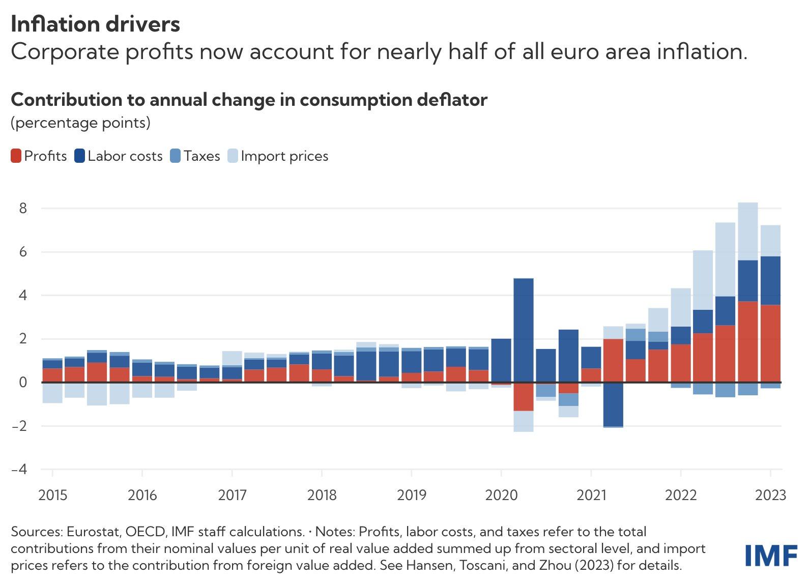

# définition

# inflation de 2022

Crise inflationniste post-Covid mise sur le compte de l'augmentation des coûts de production due à l'augmentation du coût de l'énergie et à la guerre en Ukraine. En réalité l'augmentation des profits, la généralisation des [[superprofits]] pour certaines firmes déjà très puissantes comme Total, à l'occasion de la crise ukrainienne, selon le FMI, ont joué un rôle supérieur au coût de l'énergie dans la reprise inflationniste : 

C'est ce que les Démocrates Américains ont appelé la "greedflation" et contre quoi ils se sont engagés à combattre (voir tentatives infructueuses durant le mandat Biden à cause du blocage républicain "le plus grand lobby anti-consommateur des USA" au Congrès, et campagne de Kamala Harris à l'automne 2024) en promettant un plan de réduction des super-profits pour redonner du pouvoir d'achat aux ménages modestes qui ont de plus en plus de mal à affronter les fins de mois. 
D'après une étude rapportée par le Guardian, du 19 janvier, depuis 2022, les prix à la consommation connaissent une inflation de 3 à 4% alors que l'inflation des coûts de l'énergie n'est que de 1%. La part due à l'augmentation du taux de profit est estimée à 53% depuis la crise COVID, alors qu'elle était "seulement" de 11% avant la crise pandémique [[@perkinsHalfRecentUS2024]]

>Strikingly, over half of this increase (53.9%) can be attributed to fatter profit margins, with labor costs contributing less than 8% of this increase. This is not normal. From 1979 to 2019, profits only contributed about 11% to price growth and labor costs over 60%

([[@CorporateProfitsHave]])

Lorsque les prix de production baissent grâce à la reprise post-covid ou l'ouverture de nouvelles sources d'approvisionnement en [[matières premières]], systématiquement, ces baisses de coûts sont reportés sur les dividendes, jamais sur les prix.

$\newline$
# bibliographie
$\newline$

