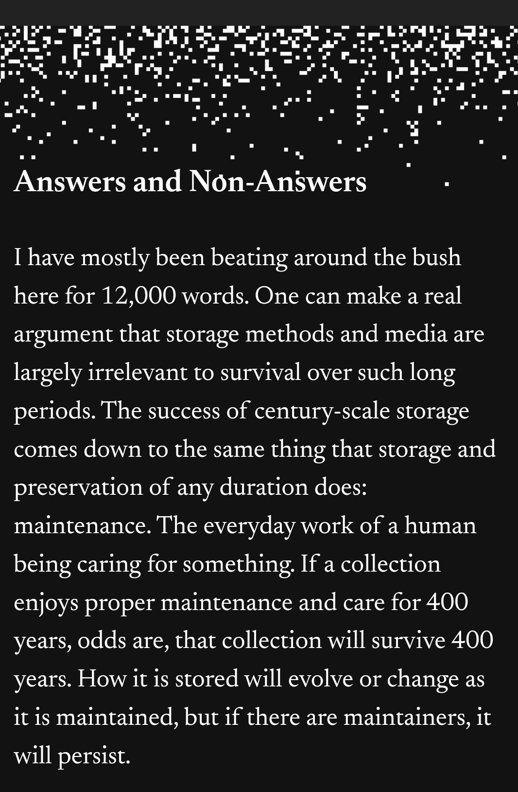

> Another flaw in the human character is that everybody wants to build and nobody wants to do maintenance.” Kurt Vonnegut

# exnovation 

remplacer par des innovations moins polluantes, les anciennes technologiques ayant une forte empreinte environnementale. 
Les technologies ont tendance à s'empiler, par forcément à se substituer. Les panneaux solaires côtoient les chauffages au fioul, en ville les véhicules électriques côtoient les vieux diesel. 
Les innovations ont tendance à s'ajouter mais pas forcément à se substituer aux technologies anciennes. 
l'exnovation désigne la capacité d'une nouvelle technologie à remplacer complètement et rapidement l'ancienne ([[@parriqueRalentirOuPerir2022]]p86). 

# la maintenance informatique n'est pas assurée par l'informatique mais par l'humain

