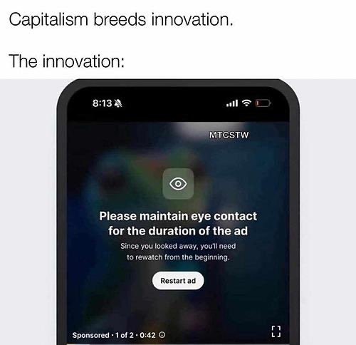

# L'injonction à l'innovation

naissance du culte de l'innovation : [[Jacques Ellul]] (La pensée technicienne, 1977) idée selon laquelle tout problème recevra une solution technique, y compris les problèmes suscités par la technologie, ce que [[Evgeny Morozov]] appellera le [[solutionnisme technologique|solutionnisme]]

L'innovation n'est plus un moyen au service d'une fin (amélioration du bien-être commun), mais devient une fin en soi (ou bien un moyen au service de la [[destruction créatrice]] de Schumpeter qui est une condition d'accroissement du capital)
voir [[@aggeriCommentRompreAvec2024]]

## l'injonction à l'innovation en matière éducative

## est-ce que le marché ou les institutions sont vraiment moteurs d'innovation ? 

(n'est-ce pas plutôt les utilisateurs des objets technologiques)
voir [[innovation ascendante]]

# La maintenance, l'envers oublié de l'innovation
voir [[maintenance]]

voir [[innovation et maintenance]]

# Les freins à l'innovation

## le droit d'auteur des éditeurs commerciaux comme frein à l'innovation

conférence du KR21
voir 

# L'innovation n'est pas toujours moteur de changement

> les situations d’innovation ne sont pas toujours porteuses de changement

(source : Baron et Bruillard, cités par )

L'innovation : un mantra du [[capitalisme]] pour résister à la baisse tendancielle du taux de profit

voir [[publicité]]

