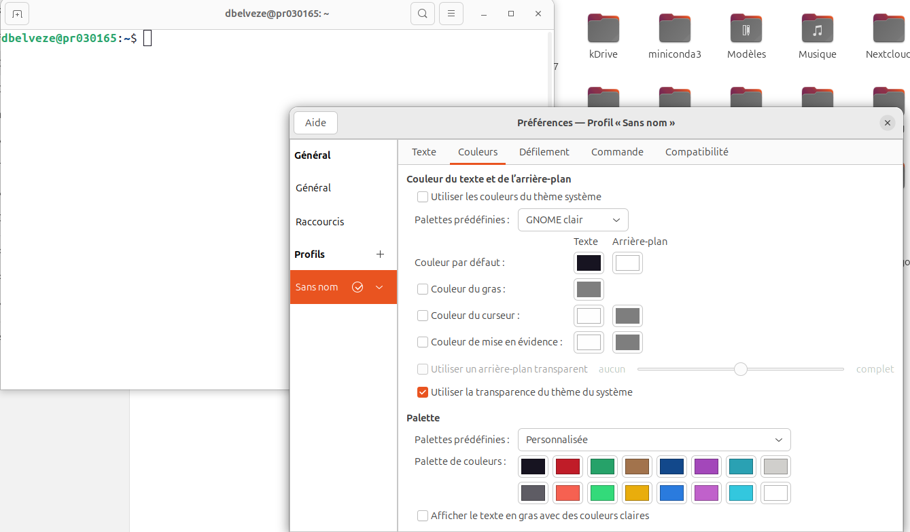

# Communication préalable

- [end of 10](https://endof10.org/)
- [calendrier de l'April](https://www.april.org/event)

Contexte : Endof10
caractéristiques requises pour passer à Windows11, voir : https://thetechgorilla.com/windows-10-end-of-life/

Quelles alternatives il reste quand son PC ne peut pas recevoir la mise à jour ([[@Windows10sEnd]]): 

- ne rien faire : dangereux (vulnérabilités grandissantes)
- payer des patchs : dangereux et coûteux (on ne fait qu'acheter un peu de temps)
- acheter un nouveau PC : coûteux et pas bon pour l'environnement : on laisse tomber un PC qui aurait pu fonctionner sans risque avec un autre OS
- passer sous Chromebook : vous n'en avez pas marre des logiciels privateurs 
- passer à Linux ; 2025, sera l'année de Linux.

## Eléments de communication

Que faire pour préparer sa venue
Exemples de messages : 
https://landinux.org/docs/install-party-linux-pour-toutes-et-tous/preparer-sa-venue-pour-linstall-party/

Demander aux gens d'indiquer une heure d'arrivée et de décrire leur matériel. 
Les personnes enregistrées auront la priorité sur les visiteurs non enregistrés. 

Prévoir des accès provisoires à Internet. 

prévoir de créer des comptes pour les autres utilisateurs éventuels de la famille : 

> When encouraging the new users to change the root password and create at least another user who is not root, find out who uses the computer in the house. Creating a separate user-name for each potential user increases the chance that newbies, who are afraid "to ruin everything", will touch the computer, knowing that Linux will protect them from messing up other people's info.

(http://ladypine.org/installfest.html)

Les animateurs prévoient des souris et des écrans (?), emmener tour ou ordinateur portable. 

Pour une install en dual boot, il faut au moins 60 Go de libre, défragmenter Windows avant de venir. 

https://www.clubic.com/tutoriels/article-892417-1-comment-defragmenter-disque-dur-windows-10.html


## Canaux universitaires :
- scd-communication / newsletter
- Mastodon
- Instagram

## Liste de diffusion
- Actux
- 


# distributions installables

## Mint

### en mode live 

https://sospc.name/linux-mint-utiliser-mode-live-usb/
avec Unetbootin (https://unetbootin.github.io/) Rufus ou Balena Etcher
### installation sur PC

## Ubuntu

## Tails


# préparation d'une install party

## matériel

>Check list install party :  
>- des clés USB bootable avec vos OS préférés  
>- 1 ou 2 clés USB vierges >=16Go (pour copier des fichiers ou faire de  
>nouvelles clés bootables)  
>- 1 PC avec une connexion internet pour faire des recherches ou  
>refaire des clés. Penser à télécharger des ISO avant sur ce PC.  
>- une connexion internet par ethernet (lors de l'install il peut  
>manquer des drivers wifi)  
>- un switch et câbles ethernets  
>- des multi-prises et rallonges électrique  
>- dans une cas où il n'y a pas de réseau ethernet sur place, mettre  
>une place un passerelle wifi vers ethernet et/ou mettre un routeur 4G  
>- bonus pour les lieux sans internet : un miroir des dépôts des  
>distribs sur disque dur  
>- bonus tourne vis et pinceau pour faire un petit nettoyage interne  
>  
>Problèmes fréquents lors d'install party :  
>- trouver l'accès au [[bios/UEFI]]  
>- désactiver le secure boot  
>- disque bloqué à l'écriture (Dans windows, ne pas faire poweroff mais  
>reboot)  
>- problème de driver wifi

(mail actux, Benjamin Cama)

## conseils aux animateurs

Conseils aux aidants d'une install party de Linux

===================================

Jauger la volonté de la personne :

  La personne doit être consciente du choix qu'elle fait en voulant utiliser Linux ; ça ne doit pas être une lubie passagère, ou quelque chose d'imposé par un facteur extérieur (pour avoir accès à un logiciel donné mais sans comprendre les implications, ou qu'on lui a dit de le faire mais elle ne comprend pas vraiment pourquoi, etc). La personne doit comprendre qu'elle devra se déblouiller majoritairement seule, en cherchant de l'aide en ligne, et que nous ne sommes pas son « support informatique » qui pourra la dépanner au moindre problème, même si nous restons bien sûrs disponibles pour des questions plus tard.


Vérifier l'adéquation de Linux à l'utilisation de la machine :

Demander quelles tâches la personnes souhaite effectuer avec son ordinateur, afin de vérifier s'il n'y a pas blocages rédhibitoire, comme des logiciels non-disponibles (suite Microsoft Office, jeux vidéos exclusivement Windows, etc) ou les problèmes potentiels d'inter-opérabilité (utilisation de formats de fichiers spécifique, etc).

Vérifier la compatibilité de la machine :

 Ça n'est aujourd'hui plus vraiment un problème, mais il peut exister des problèmes de compatibilité matérielle (manque de *drivers*) qui rendent compliqué l'utilisation de l'ordinateur avec Linux. Les machines trop vieilles ou qui manquent de RAM peuvent également poser problème : il faut anticiper les difficultés d'utilisation qui peuvent advenir.

  S'assurer que la personne a fait une sauvegarde du contenu de la machine :

 En amont de l'*install party*, il faut demander aux personnes qui viennent d'effectuer une [[sauvegarde de données|sauvegarde de leur données]] préalable à l'installation de Linux. En effet, on n'est jamais à l'abri d'un pépin qui ferait que ses données disparaissent par mégarde lors de l'installation. Les personnes peuvent éventuellement venir avec un support sur lequel on effectuera une
sauvegarde, mais cette manière de procéder peut entraîner une perte de temps assez grande.


Choisir le type d'installation, *dual-boot* ou non :

Historiquement, le *dual-boot* était assez souvent pratiqué, pour les personnes encore indécises sur leur utilisation de Linux, et n'ayant qu'une seule machine. Aujourd'hui, de plus en plus, les personnes viennent installer Linux sur une ancienne machine secondaire (ils gardent Windows sur leur autre ordinateur), ou alors souhaitent passer entièrement à Linux car l'expérience Web est aujourd'hui à peu près identique sur les deux plateformes, et elles n'ont quasiment pas d'autre utilisation. Je déconseille personnellement le
*dual-boot*, car cela peut facilement entraîner l'abandon de Linux au vu de la difficulté de passer d'un système à l'autre pour chaque type d'utilisation
différente. De plus, le partage des données entre les deux systèmes est souvent source de problème : en général, on garde les données sur le Windows, ou sur une partition tierce en FAT32 ou NTFS, car l'OS de Microsoft ne peut pas lire les données de Linux, contrairement à l'inverse.  Cela demande plus
de travail, et parfois Linux a du mal avec ces partitions.

  Choisir une distribution :

  Ce choix est à voir avec le GUL, les aidants présents, les préférences des personnes qui amènent leur machine, etc. Le mieux est d'essayer d'avoir un
choix commun, afin d'éviter les questions sur la cohérence.

  Effectuer l'installation :

  L'aidant *ne fait pas* l'installation à la place de la personne : c'est cette dernière qui l'effectue, afin qu'elle comprenne que c'est elle qui a en main sa machine, et de se rendre compte qu'il est capable de l'utiliser seule. On rend ainsi les personnes plus autonomes. Il faut *se retenir* de prendre le clavier ou la souris de la personne, et plutôt lui *expliquer* ce qu'elle doit faire quand elle est devant un choix trop compliqué ou un problème inattendu.

Quoi faire après ? TODO

# installation poste Linux

## Terminal Gnome

utile pour les formations où la lumière de la salle est trop forte : afficher le terminal en mode clair plutôt qu'en mode sombre : 
voici comment changer le mode : 



## Ubuntu 24

### LibreOffice
```shell
sudo apt install libreoffice
# note : la version issue de snap ne se connectait pas bien aux imprimantes de l'université de Rennes
```
### VLC

```shell
sudo snap install vlc
```
un très bon lecteur de vidéos
### Firefox
synchroniser avec le compte en ligne

### Chromium

```shell
sudo snap install chromium
```

Chromium est une version libre de Chrome (ou pour être plus exact, Chrome est une dérivation propriétaire que Google a faite de chromium)
### Zotero
suivre instructions sur [[Installer Zotero sur Linux]]
vérifier que le plugin Zotero fonctionne bien avec LibreOffice

### OneDrive et Nextcloud
suivre les instructions ici : https://edafe.de/2023/09/install-onedrive-client-for-linux-on-debian-or-ubuntu/

ça peut prendre du temps que tous les fichiers soient chargés...

Pour charger le client nextcloud sur la machine, en janvier, la méthode consistant à se connecter au ppa de Nextcloud conformément à cette [méthode](https://linuxconfig.org/how-to-install-the-nextcloud-client-on-debian-and-ubuntu) n'a pas permis d'avoir un client  en état de fonctionner. C'est un nouveau téléchargement de la version snap qui a permis de régler le problème : 

```shell
sudo snap install nextcloud-desktop-client
```

### Teams
depuis le Centre d'applications d'Ubuntu ou depuis snap sans problème, se connecter ensuite à son compte Microsoft. 
Ce produit Teams pour GNU/Linux peut à la longue cependant poser quelques problèmes (le client se ferme quand on essaie de charger ou télécharger une pièce depuis Teams). A la place on peut télécharger une version de Teams depuis Chrome en suivant les infos réunies ici par la DSI de l'UnivRennes : 
https://docinfo.univ-rennes.fr/prive/linux-ubuntu-installer-teams?check_logged_in=1

### Obsidian

ne pas choisir l'[[AppImage]], plutôt miser sur la version disponible dans snap ou le paquet .deb
Connecter au vault sous OneDrive quand celui-ci a fini de charger.

### Codium et/ou VScode

#### VScodium
```shell
snap install codium --classic
#nécessite que snap ait préalablement été chargé sur la distribution (c'est le cas avec Ubuntu), sinon charger snap
```

#### VScode

```shell
snap install code --classic
```

Ajouter les extensions utiles pour Codium : 
- Zotero picker
- extensions pour [[Liascript]] (au 8 janvier 2025), l'extension Liascript-snippets n'était pas disponible pour Codium rendant nécessaire le chargement de [[VS Code|VScode]].

### Git et clé SSH pour git

installer [[Git]] : 
```shell
sudo apt install git
```

générer une nouvelle clé [[SSH]]

```shell
ssh-keygen -t ed25519 -C "damien.belveze@univ-rennes.fr"
```
cela va créer une paire de clés SSH dans ~/.ssh : id_ed25519 et id_ed25519.pub

ne pas faire la bêtise de mettre dans github la clé privée, copier au contraire la clé publique (....pub) 

Aller sur github, s'identifier, dans settings sélectionner SSH and GPG keys. 
cliquer sur new ssh
coller le contenu du fichier  .pub dans l'emplacement voulu. 

### R et Rstudio, Quarto

voir [[R (logiciel)|R]], [[Rstudio]], [[Quarto]]
télécharger le paquet .deb [depuis le site de Posit ](https://quarto.org/docs/download/)(version AMD pour un ordi, ARM pour un chromebook)

```shell
sudo dpkg -i quarto-1.6.40-linux-amd64.deb
```

optionnel installer *littler* pour utiliser R en dehors de R (depuis un terminal)
```shell
sudo apt install r-cran-littler
```

### TexLive, TexMaker, Pandoc

```shell
sudo apt-get install texlive
```

si xelatex n'est pas téléchargée

```shell
sudo apt-get install texlive-xetex
```

installation de Pandoc

```bash
sudo apt-get -y install pandoc
```

Pour gérer les références via TeXmaker, installer le package [[biber]]

```shell
sudo apt install biber
```

[[Installer des polices]] supplémentaires pour gérer la biblio avec biber 

(résolution problème : [newtxtext.ty not found](https://www.reddit.com/r/LaTeX/comments/gw1poa/please_help_compiling_latex_and_ebgaramond_math/))

```shell
sudo apt-get install texlive-fonts-extra
```

### Kdenlive, Inkscape, Gimp

```shell
sudo snap install kdenlive
```

```shell
sudo apt install gimp
```

```shell 
sudo apt install inkscape
```

ne pas oublier de mettre à jour régulièrement les paquets (sudo apt update)


### Docker

voir [tuto](https://linuxiac.com/how-to-install-docker-on-ubuntu-24-04-lts/)

fonctionne également avec la méthode APT sur la doc officielle https://docs.docker.com/engine/install/ubuntu/

ajouter sudo au groupe docker pour exécuter les commandes Docker sans avoir à être en sudo : 

```shell 
sudo groupadd docker
# peut-être que le groupe aura déjà été créé, si c'est le cas, continuer avec les autres commandes. 
sudo gpasswd -a dbelveze docker
# ajoute l'utilisateur dbelveze au groupe docker
docker run hello-world
# teste l'installation de Docker
```

### Périphériques

#### Disque dur externe

Les disques formatés en nfts et qui ont été utilisés sur windows pour être lus sur Ubuntu doivent parfois être préalablement vérifiés sur windows et réparés : 

aller sur windows, brancher le disque dur (s'il est monté sur D: lancer la commande suivante - voir [ici](https://www.commentcamarche.net/informatique/windows/171-verifier-et-reparer-un-disque-dur-avec-chkdsk-sous-windows/) : 

```shell
chkdsk /F D:
```

sans l'argument /F, chkdsk ne fait qu'analyser D: sans le réparer. 
Normalement, en branchant le disque dur sur Ubuntu, on doit être en mesure de monter ce disque. Par contre, il est possible qu'on n'ait pas les droits d'écriture sur les dossiers et fichiers qu'il contient. Dans ce cas, donner ces droits à l'utilisateur : 

```shell
chmod 700 MyDrive
```
(si le disque dur externe s'appelle MyDrive)

#### Imprimante

Les imprimantes HP pour fonctionner avec Linux ont besoin que le package hplip soit chargé sur l'ordinateur de commande. 
Allumer l'imprimante. 
Charge hplip : 

```shell
sudo apt-get update
sudo apt-get install hplip
#installe hplip pour une imprimante sur un ordi Ubuntu 24.04 https://ubuntu.pkgs.org/24.04/ubuntu-main-arm64/hplip_3.23.12+dfsg0-0ubuntu5_arm64.deb.html
```

[[scanner avec hplip]]

## logiquiz

télécharger logiquiz (version pour Ubuntu) depuis le site de la Digitale

copier cette archive dans opt (droits d'admin nécessaires)
```shell 
sudo cp logiquiz-1.1.1-linux.zip /opt/
```
aller dans opt et dézipper l'archive

```shell 
sudo unzip logiquiz-1.1.1-linux.zip 
```
Aller dans le dossier issu de cette décompression
et copier le fichier Logiquiz.desktop dans /usr/share/
```shell 
sudo cp Logiquiz.desktop /usr/share
```

Si ça ne fonctionne pas appliquer la méthode suivante (plus simple) : 

1. Extraire l’archive zip dans un dossier individuel, renommer le dossier qui en résulte tout simplement "logiquiz"
2. Déplacer le dossier « logiquiz » (qui est dans le dossier créé au point 1) dans votre répertoire utilisateur: (par ex. « /home/guillaumeP/ »)
3. Editer le contenu du fichier « Logiquiz.desktop » (c’est un simple fichier texte) et changer la valeur « ladigitale » par votre nom d’utilisateur du pc (« guillaumeP » si on se réfère au point 2) Vérifier que les chemins indiqués dans ce fichier correspondent bien à votre structure de fichiers. Exemple de fichier Logiquiz.desktop :
```txt
[Desktop Entry]
Encoding=UTF-8
Terminal=0
Name=Logiquiz
Comment[fr_FR]=Création de contenus interactifs H5P
Comment=To create H5P interactive contents
Exec=/home/dbelveze/logiquiz/logiquiz/logiquiz
Icon=/home/dbelveze/logiquiz/logiquiz/logiquiz.png
Type=Application
Categories=Education
```

4. Copier le fichier « Logiquiz.desktop » ainsi modifié vers « /usr/share/applications » (il faut les droits d’administration)

5. revendiquer la propriété et les droits sur l'applicatif chrome-sandbox. (ouvrir un terminal de commande dans le répertoire logiquiz et taper les lignes de commandes suivantes : 

```shell
sudo chown root:root chrome-sandbox
sudo chmod 4755 chrome-sandbox
```


6. Supprimer le dossier individuel créé au point 1); il n’est plus nécessaire

# Twine 

voir [[Twine#problème d'installation sur Ubuntu]]


