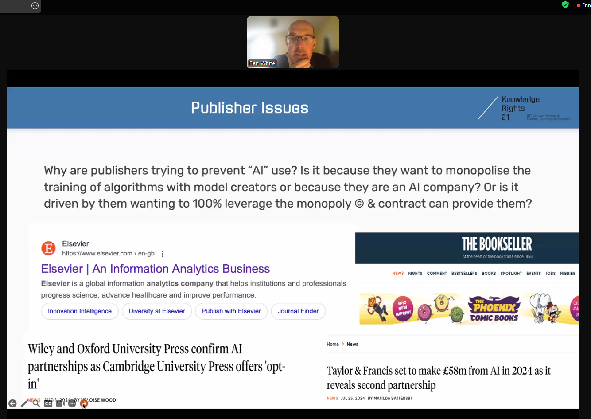
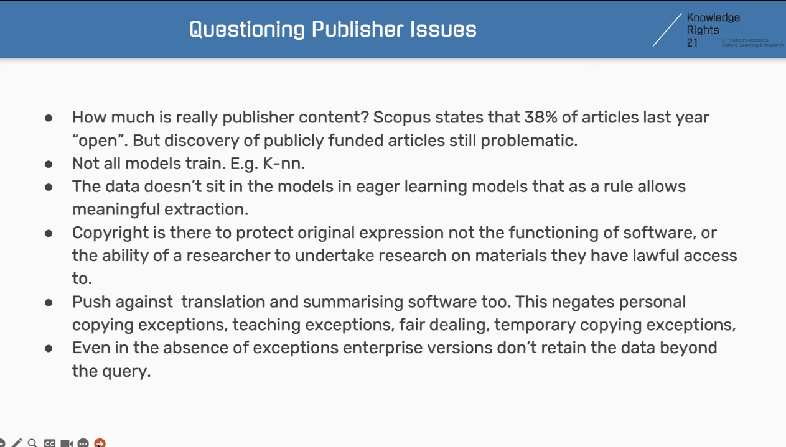
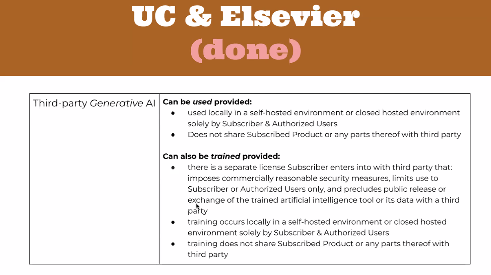

traceur (tracker) de licences passées avec les fournisseurs de contenu : https://sr.ithaka.org/our-work/generative-ai-licensing-agreement-tracker/

meeting de l'[[IFLA]]
**KR21: The AI Orphan? Protecting science and research in an AI debate dominated by the entertainment industry** (27 septembre 2024)

données sous droit des éditeurs : impossibles à utiliser pour entraîner des IA

les éditeurs prédateurs préparent leur propre gamme de services commerciaux "AI" sur les corpus dont ils détiennent les droits et pendant ce temps entravent par des licences de plus en plus contraignantes  le recours à des IA sur le matériel sous droit. 

"le copyright existe pour protéger l'expression originale de l'auteur et non pas pour empêcher de faire fonctionner un logiciel ou bien pour empêcher une chercheuse ou un chercheur d'entreprendre de faire de la recherche sur des données auxquelles il accède légalement"

les licences anti-IA des fournisseurs d'information scientifique contreviennent aux exceptions prévues par le droit comme l'[[exception pédagogique]]

Pour autant, si on se rapport au règlement de l'Université de Californie sur ce qui est permis ou pas, on peut voir que le règlement est encore plus restrictif que le contrat signé avec Elsevier. 

![[KR21_AI.pdf]]

$\newline$
# bibliographie
$\newline$

