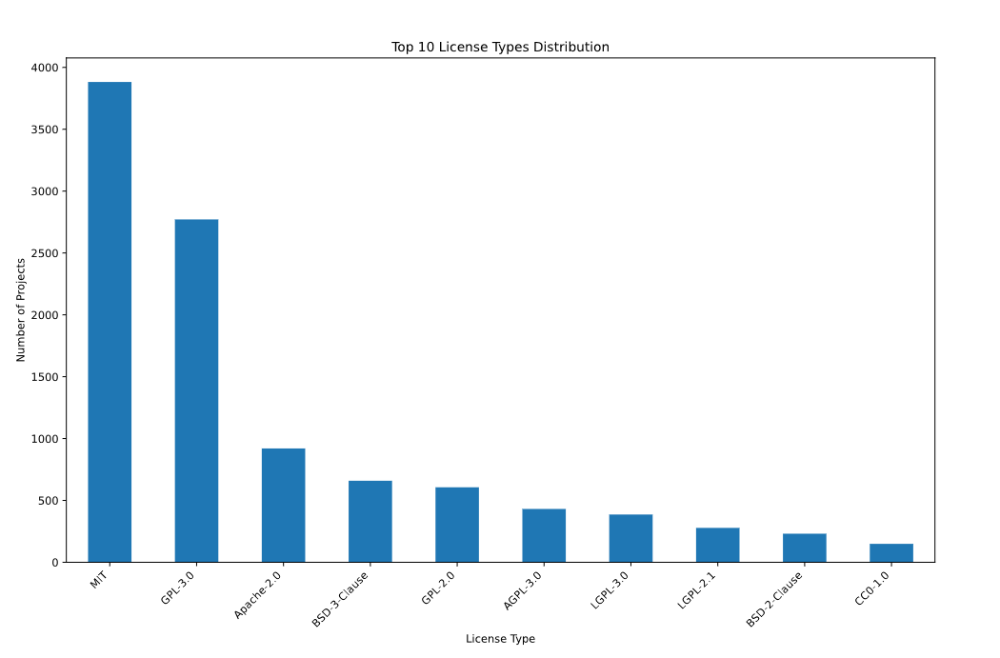

# Les usages et non-usages

75% du code de recherche dans les entrepôts git ne sont accompagnés d'aucune licence (et en théorie ne sont pas réutilisables)

Licences libres les plus utilisées dans le logiciel de recherche pour les 25% restant: 

(source [[@AcademicOSPOsFrance]])

$\newline$
# bibliographie
$\newline$

