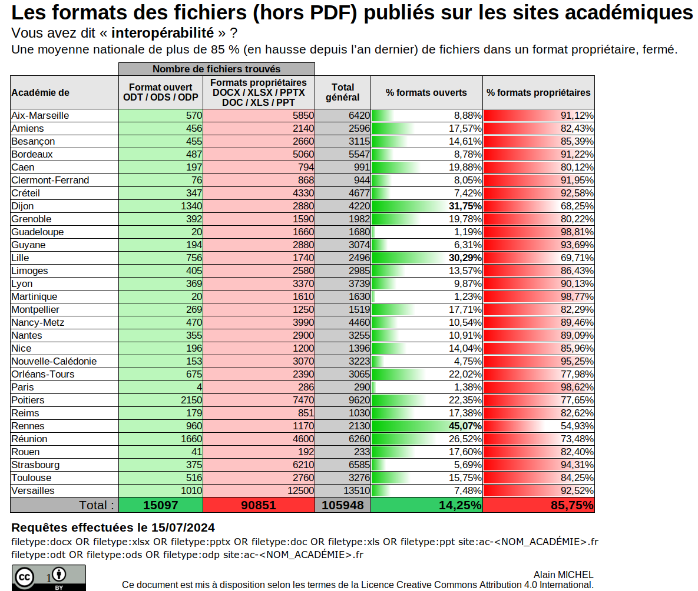

# 1 philosophie du logiciel libre

## 1.1 Les quatre libertés

un logiciel libre est un [[Communs|bien commun]]

l'open source se distingue du logiciel libre car il autorise certaines restrictions comme : 

- l'interdiction de tirer profit monétaire de la modification des sources
- la prise en compte de limitations liées à une partie du code (comme les périphériques propriétaires dans les distributions Linux) [[@bardotUbuntuAdministrationDun2023]]

Pour [[Richard Stallman]], l'open source est un modèle de développement mais le libre est un mouvement social.

>Quand on parle de logiciel libre, ce n'est pas le logiciel qui est libre, c'est l'utilisateur 

(Pierre-Yves Gosset, directeur de [[Framasoft]] dans [[LOL, une affaire sérieuse]]])

> Liberté, Egalité, Fraternité (Stallman)

Un logiciel libre respecte les libertés de son utilisateur
Un logiciel libre est égalitaire dans la mesure où il ne donne pas plus de pouvoir au concepteur qu'à l'utilisateur
un logiciel libre invite à la fraternité, parce qu'il invite tout le monde à collaborer pour l'améliorer.

4 Libertés ([[Richard Stallman]]) :

- 0. Utilisation
- 1. Etude
- 2. Redistribution
- 3. Modification

Internet est né d'échanges de protocoles et de bouts de programme entre différents utilisateurs. 
Le logiciel libre, dans l'histoire d'Internet est premier par rapport au logiciel propriétaire. 
Bill Gates est le premier industriel à avoir réclamé la propriété d'un logiciel qu'il avait créé et à en avoir privé une communauté d'utilisateurs de l'usage gratuit. C'était en 1976, pour le système d'exploitation d'Altair 8800 qui allait être commercialisé ensuite sous le nom de MS-DOS. 

Les promoteurs du logiciel libre insistent sur le mot "libre" pour indiquer qu'ils assignent à leur logiciel un objectif d'[[Emancipation sociale|empowerment]], tandis que les utilisateurs de ces logiciels qui ne partagent pas cette philosophie ont tendance à insister sur les garanties d'efficacité du logiciel *open source*, un logiciel que tout le monde peut contribuer à rendre meilleur ([[@cardonCultureNumerique2019]], p119). L'ouverture inscrite dans le terme "open" n'est pas une fin en soi, elle n'est que la méthode qui permet d'accéder à la liberté comprise dans le terme de "free software".

## 1.2 Le logiciel libre en tant que commun

le logiciel en tant que commun est conçu pour servir à une grande communauté d'utilisateurs et pour être réutilisé. Mais ce n'est pas seulement le produit qui ressort du [[Communs|commun]] mais aussi le processus à travers lequel il est produit. En effet le logiciel libre en tant que commun charrie un projet politique basé sur la contribution où la gouvernance de développement et de [[maintenance]] repose sur des décisions démocratiques et échoit autant aux concepteurs qu'aux utilisateurs (pour éviter la [[do-ocratie]]). Les institutions publiques ont tendance à abuser des communs en ne considérant que le produit et ses réutilisations 'valorisables' et à travers leur financement à s'emparer de la gouvernance des projets (qui échappe alors aux utilisateurs et aux développeurs). Cela consiste à faire d'un produit non-rival et communautaire, un produit rival, atout dans la compétition ou rattaché exclusivement à un but qui parle à l'institution mais pas aux utilisateurs, par exemple la [[souveraineté numérique]] (voir [[common-washing]])

voir [[critique du logiciel libre]]

# 2. économie du logiciel libre

>Quant on achète un téléviseur, la part de responsabilité contractuelle de l'entreprise s'arrête naturellement lors du transfert de propriété. Bien sûr suivant la technicité du produit (on ne compare pas une boîte de petits pois à un téléviseur), la mise en place d'un service après-vente pour d'éventuelles réparations s'impose, avec éventuellement l'introduction de sociétés tierces car l'entreprise peut déléguer cette activité et pas l'effectuer elle-même. On ne parle pas de la responsabilité légale, qui traite du respect de la nature et de la fonctionnalité du produit vendu. 
>Dans le cas d'un logiciel informatique, l'accompagnement pour l'utilisateur est essentiel. Il faut une offre de support technique, des possibilités d'extension, des certifications, de la formation... C'est là que se trouve la rentabilité du modèle open source.

[[@bardotUbuntuAdministrationDun2023]]

# 3 logiciel libre dans le domaine de la recherche

## 3.1 visibilité du code produit par les chercheurs 

### 3.1.1 publiccode.yml

Accroît la visibilité du code public (développé par des organismes publics et placés sous une licence libre). 

https://github.com/search?q=filename%3Apubliccode.yml+path%3A%2F

> Concernant `publiccode.yml`, j'aime l'idée de faire reposer la charge   (entre autres) de sa propre visibilité sur l'équipe productrice du  logiciel : c'est elle qui sait le mieux les choses, donc c'est moins  chronophage que ce soit elle qui s'en charge. Et ça permet derrière  d'automatiser des traitements de plus haut niveau : méta-moteur de  recherche (sur tous les repo de l'ESR ayant un publiccode.yml), alertes automatique lors de la publication d'une nouvelle version, génération de graphes de dépendances, ...

voir ici [éditeur de publiccode.yml](https://publiccode-editor.developers.italia.it/)

(mail de Régis Witz, 3 mars 2023, données inter-réseaux)

# 4. logiciel libre dans l'administration

très faible progression, voir dans certains cas régression de l'usage des formats libres dans les fichiers mis à disposition sur les sites des rectorats et inspections académiques (source : https://mamot.fr/@alainmi11/112789011323125359 )

Dans le même temps, progression des clouds commerciaux au détriment des clouds [[souveraineté numérique|souverains]] : 
OneDrive à l'université de Lausanne supplante en 2024 SwithcDrive la solution mise en place par la Confédération pour ses écoles supérieures et universités
(source : https://mathstodon.xyz/@yrochat/112769630420452639) )

