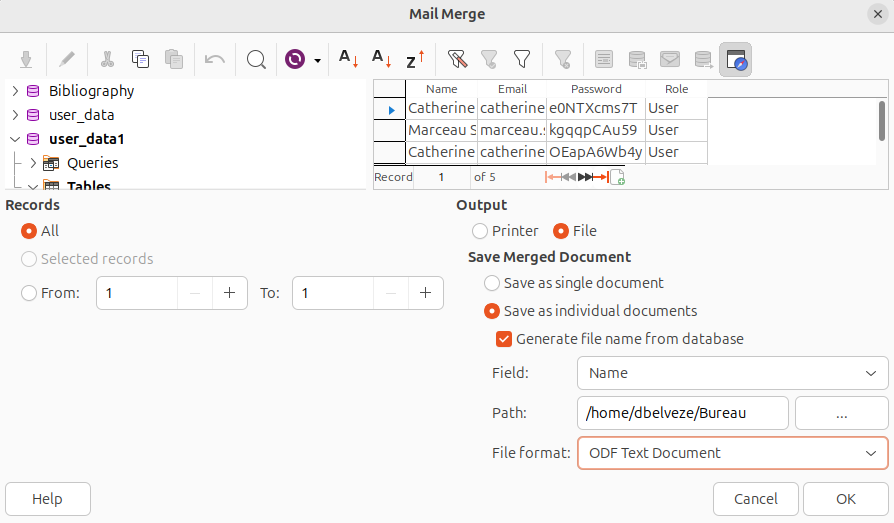

voir [[messageries instantanées]]

# naissance des mails

# protocoles

# appropriation sociale des mails

Les familles modestes, selon Dominique Pasquier utilisent prioritairement les messageries intégrées aux réseaux sociaux. Un des premiers gestes des formateurs pour sortir les personnes en recherche d'emploi de la précarité consiste à les aider à ouvrir un compte de messagerie (le plus souvent sur Gmail). Le mail est resté l'outil de prédilection des cadres, des classes supérieures : 

> il continue de faire partie du monde de "ceux d'en haut", ceux qui utilisent les logiciels de bureautique, communiquent volontiers par écrit, et acceptent volontiers que la frontière entre le monde du travail et celui de la maison soit poreuse

(Source : [[@pasquierInternetFamillesModestes2018]], p195)

# étiquette

voir [[Netétiquette]]

## les règles de Crocker

Pour maximiser le flux d'information utile, on décide de passer outre les formules de politesse : 

> Declaring yourself to be operating by "Crocker's Rules" means that other people are allowed to optimize their messages for information, not for being nice to you.  Crocker's Rules means that you have accepted full responsibility for the operation of your own mind - if you're offended, it's your fault.  Anyone is allowed to call you a moron and claim to be doing you a favor.  (Which, in point of fact, they would be.  One of the big problems with this culture is that everyone's afraid to tell you you're wrong, or they think they have to dance around it.)  Two people using Crocker's Rules should be able to communicate all relevant information in the minimum amount of time, without paraphrasing or social formatting.  Obviously, don't declare yourself to be operating by Crocker's Rules unless you have that kind of mental discipline.
   **Note that Crocker's Rules does _not_ mean you can insult people; it means that _other_ people don't have to worry about whether _they_ are insulting _you_.**  Crocker's Rules are a discipline, not a privilege.  Furthermore, taking advantage of Crocker's Rules does not imply reciprocity.  How could it?  Crocker's Rules are something you do for yourself, to maximize information received - _not_ something you grit your teeth over and do as a favor.

"Crocker's Rules" are named after Lee Daniel Crocker.

## publipostage

(mail merge) publipostage avec [[R (logiciel)]]) : https://rmarkdown.rstudio.com/articles_mail_merge.html

avec [[LibreOffice]], voir [tuto](https://www.youtube.com/watch?v=srl8c-_PvDA)

Dans LO
1. Lier à la base de données
Edition > changer de base de données, sélectionner, cliquer sur Définir

2. Lier les champs
Affichage > source de données + faire un glisser-déposer des entêtes de la source des données vers les espaces prévus dans le document de LO

3. "Imprimer"
cliquer sur imprimer comme si on voulait imprimer le document mais choisir "fichier"

# bibliographie

