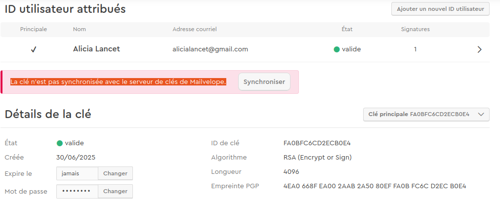
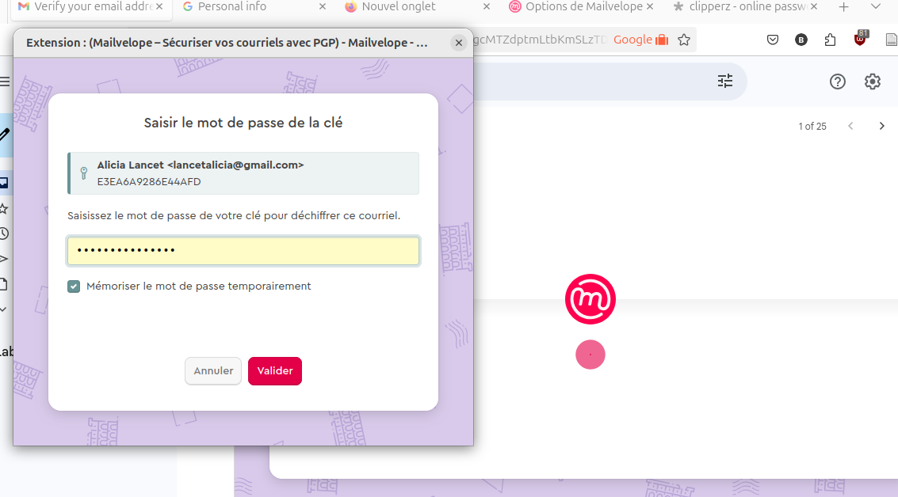
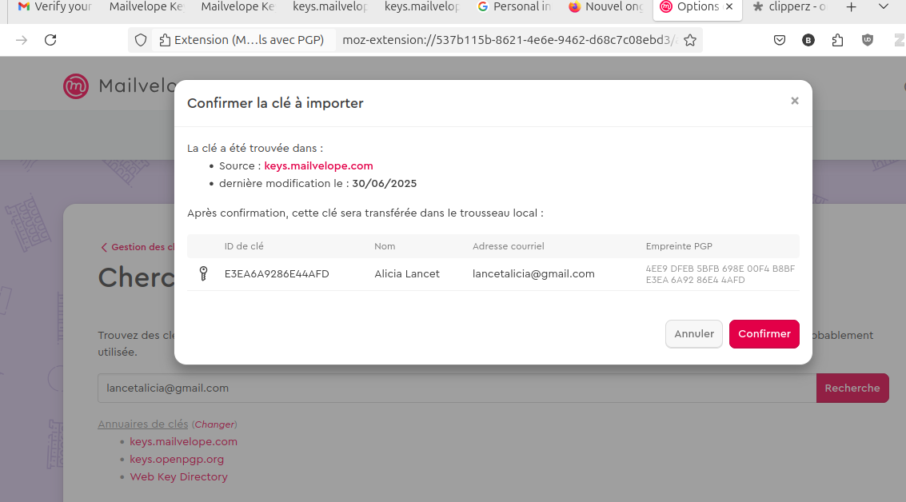

ajouter l'extension mailvelope au navigateur : 
cliquer sur *retirer*, puis sur *installer pour Firefox*

		épingler l'extension pour la faire apparaître dans la barre d'outils du navigateur (pièce-puzzle, engrenage > ajouter à la barre d'outils)

cliquer sur l'extension
cliquer sur *Commençons*
cliquer sur générer une clé

Nom : Marin Belvèze
mail : marin.belveze@telemak.fr

saisir une phrase de passe
*créer une phrase de passe dans Clipperz.is et l'utiliser ici*

Cela génère un jeu de clé. 
Un jeu de clé comporte : 

- une clé publique qui sera accessible à d'autres (à tous ou à ceux avec qui on veut correspondre)
- une clé privée qui ne doit jamais être donnée à quiconque et qu'il faut protéger. 

ta clé publique permet aux autres de chiffrer des messages que tu vas pouvoir déchiffrer avec ta clé privée. 
Ta clé privée, en plus de déchiffrer les messages qui te sont adressés et ont été chiffrés à ton intention avec ta clé publique vont aussi permettre de démontrer que c'est bien toi qui envoie des messages chiffrés à un.e correspondant.e et pas quelqu'un.e qui se fait passer pour toi. 

une clé publique comporte les éléments suivants : 
- un identifiant
- un algorithme de chiffrement (RSA par exemple)
- une longueur de clé (4096 = 4096 bits)
- une empreinte (=fingerprint), par exemplel l'empreinte de la clé publique Alicia Lancet est 4EA0 668F EA00 2AAB 2A50 80EF FA0B FC6C D2EC B0E4 (le compte d'Alicia Lancet (lancetalicia@gmail.com existe, mais Alicia Lancet n'existe pas, je l'ai inventée))

Un message t'indique que ta clé publique n'a pas vraiment été rendue publique, pour qu'elle le soit, il faut synchroniser ton jeu de clés à peine créé avec le serveur de mailvelope, ce qui permettra à n'importe qui de trouver ta clé publique depuis ce serveur ou bien un autre serveur de clés avec lequel mailvelope est en contact. 
Rendre ta clé publique accessible encore une fois, permet à tout le monde de t'envoyer des mails chiffrés, donc sécurisés, inviolables par des personnes qui auraient accès à ta boîte mail ou celle de ton correspondant. 

clique sur *synchroniser*

cela envoie un message chiffré sur la messagerie qui a permis la création du jeu de clé (en l'occurrence ici celui d'Alicia Lancet lancetalicia@gmail.com)

Il faut entrer la phrase de passe choisie pour afficher un message chiffré reçu automatiquement. 

Le message une fois déchiffré dira à peu près ceci : 

>   please verify your email address [lancetalicia@gmail.com](mailto:lancetalicia@gmail.com) by clicking on the following link: After verification of your email address, your public key is available in our key directory.  You can find more info at [keys.mailvelope.com](https://keys.mailvelope.com).  
>   Greetings from the Mailvelope Team

confirmer le compte et l'envoi de la clé publique vers les serveurs de clés publiques à commencer par celui de mailvelope. 

Une fois cette démarche faite, Alicia Lancet reçoit un mail avec un lien ; si on clique sur ce lien, on a accès à sa clé publique : https://keys.mailvelope.com/pks/lookup?op=get&search=lancetalicia@gmail.com

Je t'invite à faire de même avec ta clé marin.belveze@telemak.fr

Une fois que c'est fait, tu vas envoyer un message chiffré à Alicia. 
Pour cela tu as besoin de charger sa clé publique dans son trousseau de clé. 

Dans mailvelope (gestion des clés), clique sur *chercher*
Fais une recherche par adresse mail : lancetalicia@gmail.com 

Tu devrais arriver à ouvrir ce popup : 

Cliquer sur confirmer, ça va importer la clé publique d'Alicia dans ton trousseau. 

refais au passage cette opération avec ma clé publique. 
Vérifie que la clé qui t'est proposée au téléchargement a bien pour empreinte la suivante : 
57CA 63E0 B259 9250 0335 6276 6DC2 B51E F1DB CBE5
Si ce n'est pas le cas, c'est que quelqu'un a associé une clé publique à mon adresse de messagerie en pensant que cela lui permettrait de recevoir des secrets qui me seraient en fait adressés (c'est ce qu'on appelle une attaque par l'homme du milieu (man in the middle attack)). 

Si Alice veut envoyer un mail chiffré à Bob, il faut qu'au préalable Bob lui ai donné l'empreinte de sa clé par téléphone ou en mains propres pour permettre à Alice d'être sûr que ce n'est pas Mallory qui a créé une clé publique avec l'adresse de Bob. 

(En cryptographie, on appelle toujours Alice et Bob les gens qui veulent échanger des messages sécurisés et Mallory celui qui veut les intercepter, c'est un peu comme le A, B et C du triangle)

Bref, comme je t'ai donné mon empreinte, en théorie la communication avec moi est beaucoup plus sécurisée qu'avec Alicia qui ne t'a pas donné la sienne (de fait, Alicia c'est moi, si je ne te l'avais pas dit, tu aurais été dans la situation d'Alice et moi de Mallory).

Partons du principe qu'Alicia t'a donné son empreinte et qu'elle correspond à celle de la clé que tu as enregistrée dans ton trousseau. Tu vas pouvoir lui envoyer ton premier mail chiffré. 

Va sur ta message (mail.infomaniak.fr)
Clique sur l'extenson 'mailvelope' dans le navigateur
clique en bas du popup sur *autoriser ce domaine*, ça te permettra de chiffrer le mail que tu vas écrire à Alicia. 

Mets lancetalicia@gmail.com comme adresse 
comme objet, indique quelque chose de banal su type "information supplémentaire"
écris seulement dans le message "bonjour Alicia"

