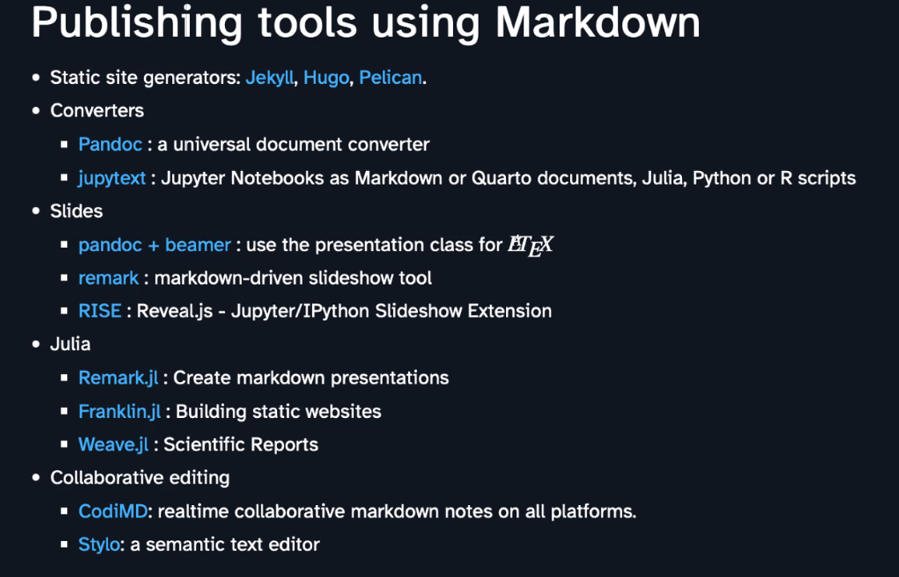

# Qu'est-ce que le markdown

Le markdown est un langage de balisage simple inventé par [[John Gruber]] avec l'aide d' [[Aaron Swartz]]. Cette syntaxe est  facilement interprétable par un humain ou une machine (à l'origine pour produire du HTML, l'édition en HTML étant ressentie comme compliquée et facilitant les erreurs). 
Le markdown est devenu la syntaxe standard dans lequel sont documentés les projets libres (en particulier les projets éducatifs libres ou [[ressources éducatives libres]])[[@dietrichLIASCRIPTDOMAINSPECIFICLANGUAGEINTERACTIVE2019]]

Certains considèrent que le Markdown devraient rester un langage de balisage et ne pas devenir un format de mise en page (comme le format word), mais le fait de parser à la volée le Markdown dans les applications et les éditeurs de texte (typiquement c'est le cas chez [[Obsidian]]) a tendance à rendre le markdown invisible, ce qui contredit l'esprit initial du projet, voir à ce sujet [[@anonymeMarkdownSlowFade2025]]
qui cite Gruber [[@gruberThingsSupportMarkdown]]

# Avantages du markdown

## un format alternatif à $\LaTeX$ et au traitement de texte et parfaitement interopérable

Format interopérable, réutilisable


Il s'agit d'une syntaxe très simple à apprendre et faite pour éditer des textes vers une grande variété de formats (wiki, odt, doc, pdf, html, [[LaTeX]]), c'est cette souplesse à donner à lieu à des formats différents qu'on appelle la versatilité du markdown. 

## traitements de texte vs éditeurs de textes

Depuis 1984, ceux qui écrivent de la poésie et ceux qui écrivent du code, à quelques exceptions près, n'écrivent plus sur le même support numérique. (le traitement de texte Wordstar vendu à partir de 1978 avec la microinformatique de l'époque (MSDos) permettait auparavant d'écrire des codes exécutables en même temps que des textes imprimables et formatés pour être lisibles sans changer de logiciel)

L'essor du traitement de texte -qui ne permet plus d'écrire du code- a eu pour corrolaire le développement séparé des éditeurs de texte orientés langages de programmation. ([[@DehutfiniravecWord2018]])

>Nous avons donc perdu progressivement la capacité d’écrire dans un langage interprétable par la machine

Un traitement de texte est fait pour vous faciliter certaines mises en page de façon automatique : il prend en charge (tout en les invisibilisant) des opérations sous-jacentes.  Cela vous fait gagner du temps mais jusqu'à un certain point. 

Le fait de recourir à ces traitements de texte opaques (parce que propriétaires et parce que ne permettant pas d'accéder à la liste des opérations) constitue un danger pour écrire la science (Cela comporte un risque d'erreur du au manque de transparence du logiciel). Par ailleurs, le traitement de texte développé par Microsoft est un logiciel de bureautique, idéal pour envoyer des commandes, des reçus, des notes administratives mais pas approprié aux écrits académiques sur certains points. On ne peut pas par exemple placer si on le souhaite disposer les notes de bas de page en notes de marge (style Tufte). La placement des images est toujours un défi avec Word. 


Pour ces besoins moins communs existe depuis les années 90 le langage de programmation orienté édition $\LaTeX$ qui découple le contenu du texte de sa mise en forme. Cela ouvre la voie à des fonctionnalités qui permettent une finesse d'édition plus importante que celle dont sont dotée les traitements de texte. 
Bien sûr, ce langage convient particulièrement aux chercheurs en informatique pour qui l'édition est aussi une affaire de programmation. Mais on voit de plus en plus de chercheurs et chercheuses en Sciences Humaines s'en emparer, sans parler des éditeurs chez qui ils font paraître leurs écrits qui ajoutent $\LaTeX$ à leur chaîne éditoriale. 

## Découplage structure / contenu

Ce découplage forme/fonds (qui va à l'encontre de l'impératif du [[WYSIWG]]) est un acquis important dans l'acquisition d'un [[compétence#Compétence vs capital|capital informatique]] selon Julie Denouel ([[@denouelNumeriqueEducationFormation2022]] p77)

> Certains parents montrent à leurs enfants d’autres logiciels, tableur-grapheur, des fonctionnalités de mise en forme de texte qui confrontent les enfants à l’idée d’une séparation entre la forme visible du texte et sa structure sous-jacente


En 2024, Aaron Swartz et John Gruber ont inventé le markdown plus simple à utiliser que HTML comme on l'a vu mais aussi beaucoup plus rapide à appréhender que le complexe langage $\LaTeX$ (même si ce dernier permet de faire des réglages que Markdown à lui seul ne peut pas prendre en charge, notamment en vue de la composition de PDF ;  mais il est toujours possible de réserver dans un texte en markdown des environnements en $\LaTeX$ au besoin)

>Le HTML comprend un grand nombre de balises. La mise en page du texte peut être également enrichie au moyen du CSS. La force du Markdown résulte dans l’utilisation de balises peu nombreuses, simples à mettre en place et à mémoriser. Il devient aisé de réaliser un document dont on maîtrise la mise en page sur le Web, sans pour autant devoir apprendre le HTML. Plus encore, en conjonction de Pandoc qui est un moteur de conversion, il devient possible de produire aussi bien du HTML, que des pdf, des docx, des epub, et même des présentations de type PowerPoint. On ne produit alors ses données qu’une seule fois et on les exporte mises en forme automatiquement pour plusieurs supports. 

[[@dehutFinirAvecWord2018]]


Au lieu d'apprendre à utiliser des [[interface graphique|interfaces]] qui changent régulièrement avec les changements de version et n'engendrent qu'un savoir restreint à l'éditeur de texte, apprenons plutôt le langage homme-machine pour compiler du texte avec des instructions de mise en forme. 

Marcello Vitali-Rosati voit également dans la combinaison du Markdown pour la simplicité et du $\LaTeX$ pour la finesse un moyen de dépasser sa frustration d'universitaire qui souhaite donner plus de sens à la structure d'un texte [[@vitali-rosatiChercheursSHSSaventils2018]]


# un format qui gagne du terrain

Entre les paradigmes des outils TeX et celui des traitements de texte (Word, Writer de LibreOffice, Google Docs), un autre paradigme alternatif se met en place autour de markdown et de Pandoc mais qui permet à présent de s'ouvrir aux revues en ligne. Au lieu d'avoir à transformer son texte en markdown dans un template word ou LaTeX, il est désormais possible de l'envoyer via Pandoc en XML-TEI sans rien connaître à ce format, à travers Stylo un éditeur mise au point par Marcello Vitali-Rosati et qu'Humanum s'est réapproprié pour permettre aux auteurs et autrices de passer plus simplement à une écriture en Markdown. Stylo est l'éditeur de base des revues qui sont éditées avec la deuxième version de Lodel (sortie en avril 2024), c'est à dire des revues hébergées sur OpenEdition ou la plateforme Metopes [[@perretLodel2Stylo2024]]. 

# 2 petite démonstration

## 2.1 conversions de base

Les fichiers qui seront utilisés au cours de l'atelier sont téléchargeables sur [github](https://github.com/damienbelveze/stretchnum)


**instructions pour le formateur ou la formatrice : **

- cloner le dossier sur le bureau de son ordi
- ouvrir le fichier kanagawa.md
- montrer la structure, à quoi correspond le markdown (éléments de syntaxe : headers, italique, titre, préambule, caractères gras italiques)

### 2.1.1 conversion en PDF

**Instructions pour le formateur ou la formatrice :**

- montrer la versalité du markdown, faire d'abord une conversion en [[PDF]] avec [[pandoc]]

``````shell

pandoc kanagawa.md -o kanagawa.pdf

``````

Note1 : pour la conversion en PDF, on a besoin d'une version de LaTeX sur son ordinateur. 
Pandoc est installable sans besoin d'avoir les droits sur sa machine, en revanche pour installer une version de LateX (même légère TinyTeX, on doit avoir les droits sur sa machine)

Note 2 : si beaucoup de conversions sont réversibles (de MD à ODT, de ODT à MD, de MD à DOC, de DOC à MD), ce n'est pas le cas de toutes : on ne peut pas convertir un fichier PDF en MD à moins d'utiliser des logiciels propriétaires comme ceux d'Adobe. 
Par ailleurs toutes les conversions ne sont pas réversibles au même niveau. LaTeX et HTML étant potentiellement plus riches que Markdown, des éléments de mise en forme peuvent se perdre en route. 
Les champs dans Word ou Writer dont les styles peuvent être modifiés ne sont pas toujours aisément appariables à la syntaxe Markdown.

### 2.1.2 conversion en open document avec un modèle

[template](mypdf/lettre.odt)

un modèle se constitue en travaillant les styles sur le traitement de texte (définir qu'un titre aura telle forme, telle police, un titre 2, telle taille, telle [[police de caractères]], une image sera alignée, ancrée au texte, etc. )
Quand le modèle est fait, la conversion est simple : 

```````shell
pandoc -s kanagawa.md --reference-doc lettre.odt -o kanagawa.odt

```````

### 2.1.3 conversion simple en html

Conversion simple avec HTML

``````shell

pandoc -s kanagawa.md -o kanagawa.pdf

``````

l'argument -s(tandalone) permet de compiler le visuel et le document en html


### 2.1.4 conversion en HTML avec feuille de style

On va appliquer la feuille de style ([[feuille de style|CSS]]) suivante (essai.css dans un dossier css) au document en markdown pour faire une page web avec la forme souhaitée : 

```````css

<style>

/* le fait de mettre le css à l'interieur de balises <style> permettra

d'utiliser la commande pandoc suivante :

pandoc -s fichierdépart.md -H fichier.css -o fichier_destination.html

l'argument -H encapsule tout le css dans le header du document créé, avant le  
body, ce qui fait que le Css qui s'y trouve va être utilisé pour présenter 

l'ensemble du document */


/* dimensionnement de la page à la taille de l'écran
couleur de fond */

html, body{

background-color: #11191f;
width:100%;
height: 100%;
margin:0 auto;
color: #ffffff;
}

/* couleur, taille et alignement du titre 1 = titre du document en markdown */

h1{

  text-align:center;
  font-size: 2rem;
  color: #edf0f3;
}

/* couleur, taille et alignement du titre 2 */

h2 {
  font-size: 1.75rem;
  text-align:center;
  color: #599fa6;
}

/* espace de la citation */

blockquote.style {
  font: 14px/20px italic Times, serif;
  padding: 8px;
  background-color: #141e26;
  color: #a65980;
  border-top: 1px solid #e1cc89;
  border-bottom: 1px solid #e1cc89;
  margin: 5px;
  background-position: top left;
  background-repeat: no-repeat;
  text-indent: 23px;
  }

/* liste à puces, puces carrées */

ul{
   list-style: square;
}

</style>


````````

Le script de conversion s'écrit de la manière suivante : 

``````shell

pandoc -s kanagawa.md -H css/essai.css -o kanagawa.html

``````

Envoyer avec [[Git|git]] la page vers le site github (ajouter, commettre, pousser)

# 3 créer son premier document en markdown avec l'éditeur en ligne Stylo

## 3.1 éditeurs en markdown

On peut  écrire en markdown avec des éditeurs de toutes sortes : emacs, Atom, [[R (logiciel)]]) (on utilise alors une version de markdown qui s'appelle Rmarkdown). 
Le bloc-note de Windows suffit même si pouvoir bénéficier de la coloration syntaxique d'un éditeur de texte un peu plus élaboré est une aide appréciable. 

L'éditeur va interpréter comme du texte en markdown tous les fichiers qui ont l'extension .md

Si dans un premier temps on ne souhaite pas télécharger d'éditeur de texte supplémentaire, ni pandoc, ni [[LaTeX|LaTeX]] et qu'on veut pouvoir utiliser ces logiciels en ligne, un éditeur en ligne a été conçu pour les chercheurs en SHS. Il s'agit de [Stylo](https://stylo.huma-num.fr/)

Pour utiliser Stylo, il faut se créer un compte sur Huma-Num (infrastructure de recherche française dédiée aux [[Humanités numériques]]). Ce compte vous permettra d'ailleurs d'avoir accès à d'autres services de cette infrastructure. On peut aussi se connecter avec son compte Twitter, [[ORCID]] ou [[HAL]]

## 3.2 Editer avec Stylo


créer un nouveau document
Pour ouvrir la console d'édition, cliquer sur "open" (en grisé en haut à gauche), quand elle gêne, la refermer ("close")

Mettre en forme le texte suivant en se basant sur la structure du document : 
https://damienbelveze.github.io/stretchnum/kanagawa.html

``````text
[titre] la vague de Hokusai
[date] 2022-03-14
[sous-titre] atelier Markdown comme syntaxe universelle


[Titre 2] La grande vague de Kanagawa

[Citation] "les vagues
lentement déferlent vers le rivage
une lune à peine visible"

Le peintre Hokusai a peint cette estampe en 1830 ou 1831 pendant la
Période [Edo : mettre en italiques] Cette oeuvre est la plus connue du peintre. La couleur qui
y domine est le bleu de Prusse

Mettre ici une image de votre choix en suivant la syntaxe : 


[Titre 2] signification de cette estampe

Il s'agit d'une [scène réaliste : mettre en gras] mais avec un [aspect dramatique : mettre en gras].
La signification de l'image varie d'ailleurs selon qu'on est occidental
(sans de lecture : gauche à droite) ou japonais (sens de lecture
vertical puis de droite à gauche)

Pour un occidental, les barques se dirigent vers la droite et tentent de
fuir la vague Pour un japonais, les barques dont les rameurs rament à
contre-courant se précipitent vers le creux de la vague.

[Titre 2] Préfecture de Kanagawa (principales villes)

[liste à puces]
- Atsugi
- Ayase
- Chigasaki
- Ebina
- Fujisawa
``````

Quand le texte a été mis en forme, faire un export en HTML5 et un export en PDF

# 4 markdown en lien avec des générateurs de sites statiques


Source : Pierre Navaro, présentation de [[Quarto]]


création d'un petit site en markdown à partir de CodIMD ([[HedgeDoc]]) et en utilisant l'interpréteur Markpage développé par Eyssette[[@eyssetteMarkpage2023]]
voir 


# 5 éditorialisation de textes écrits en markdown : 

https://eyssette.forge.aeif.fr/a4/

# 6. Markdown et écriture scientifique

## Les limites de Pandoc pour l'écriture scientifique : ajout de LaTeX

Les éditeurs estiment généralement que LaTeX est préférable au markdown pour publier des textes académiques, mais

les éditeurs en markdown comme [[R (logiciel)|R]] ou [[VS Code|VScode]] permettent d'incorporer les environnements LaTex nécessaires pour compléter la syntaxe Markdown

Certains journaux proposent des documents en markdown comme templates à leurs auteurs, c'est le cas par exemple du Journal of Open Source Software dont les templates md et bib [sont en ligne](https://joss.readthedocs.io/en/latest/submitting.html#example-paper-and-bibliography)

## Les limites de Pandoc pour l'écriture scientifique : ajout de HTML

>Unfortunately, HTML figures and sections don’t have special Markdown syntax. To include them in your document, you’ll have to use the raw HTML. On the bright side, this usually ends up being pretty painless.

(source : [[@zimmermanTuftePandocCSS2016]])

# 7. relecture de textes avec passages du markdown au traitement de texte

si on veut commenter un texte en markdown pour que ce commentaire s'affiche dans le document word généré ou inversement, si on souhaite que le document word comportant des commentaires soit modifié dans markdown avec ces commentaires. 

ajouter --track-changes=all à la commande pandoc : 

```shell
pandoc text.md --track-changes=all -o text.docx
```

Pour rédiger un commentaire en markdown

```markdown

c'est ici que je place[voici comment on crée un commentaire]{.comment-start id="0" author="Damien Belvèze" date="2024-04-26T10:12:00Z"}un commentaire.[]{.comment-end id="0"}
```
Ne pas oublier de numéroter les commentaires
Le commentaire à apparaître en marge dans le document Word est voici comment on crée un commentaire, avec son auteur (Damien Belvèze) et sa date (2024-04-26T10:12:00Z), pour la date voir [[Format de date]]

Source : https://github.com/jgm/pandoc/issues/5106