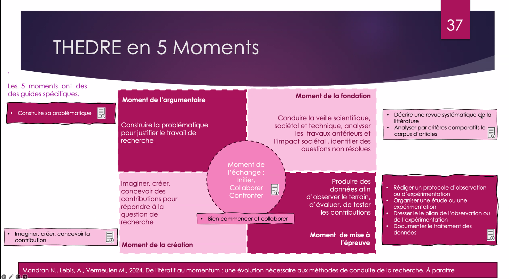

modèle développé par Nadine Mandran dans le cadre de la science des artefacts[[@mandranTHEDRELangageMethode2017]]. 

voir [[épistémologie]]
voir [[reproductibilité#là où la reproductibilité des expériences n'est pas possible]]

$\newline$
# bibliographie
$\newline$

