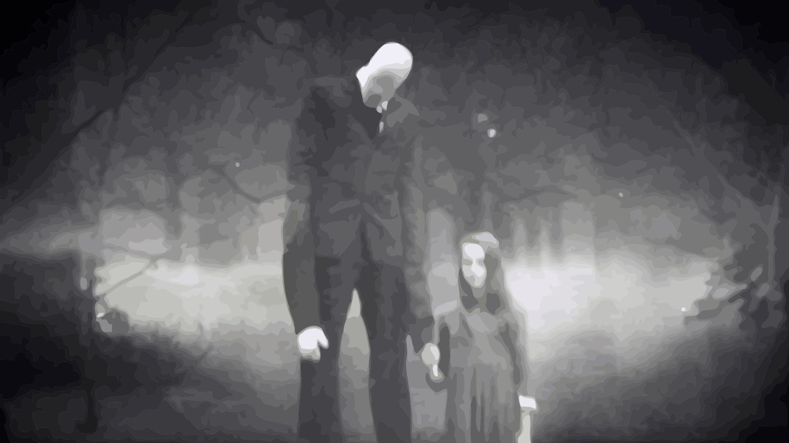

Discussion pour savoir si les mythes nés sur Internet sont du floklore ou pas. 
Certains folkloristes disent que non parce que :
1. on peut tracer la naissance de ces mythes (contrairement au folklore)
2. on considère que très peu de gens croient réellement à ces mythes. 
Ces deux points peuvent être discutés. 

Ainsi [[Pacôme Thiellement]] présente le mythe du slenderman à la fois comme un mythe né sur Internet mais à qui les internautes ont trouvé des antécédents dans des gravures anciennes. 

Le slenderman ressemble à un croquemitaine des temps anciens, affublés dans certaines représentations d'attributs effrayants (mains tentaculaires), mais il est habillé à la manière d'un "man in black", c'est à dire avec le costume noir années 50 d'un inspecteur d'une agence gouvernementale étatsunienne (CIA, FBI, NSA). Le slenderman par sa présence inquiétante sur des [[found footages]] n'a pas besoin de recourir à des actes de violence ou de cruauté pour faire peur. Il lui suffit d'être présent en arrière plan de photos anodines, sans aucune raison, pour lever l'angoisse chez le spectacteur. Le slenderman est une création qu'on peut dater sur Internet (2009) mais qui emprunte à la fois à des motifs anciens (croquemitaine, forêt interdite aux enfants) et à des motifs récents (homme sans visage = anonymat, costume = présence d'une agence gouvernementale qui échappe au contrôle citoyen, présence en arrière-plan = pays sous surveillance). A ce titre, le slenderman et son succès dans la culture internet s'explique par l'attrait pour les [[théorie complotiste|théories conspirationnistes]] qu'on les fasse sienne ou qu'on s'en distancie pour en faire des motifs de séries ou de jeux vidéo. 

$\newline$
# bibliographie
$\newline$

