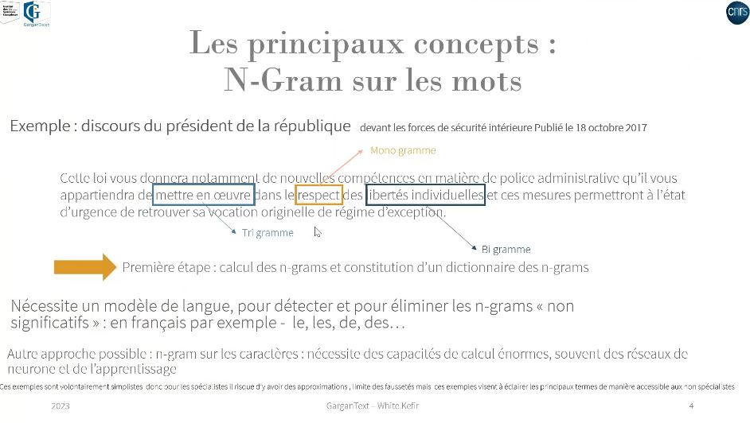
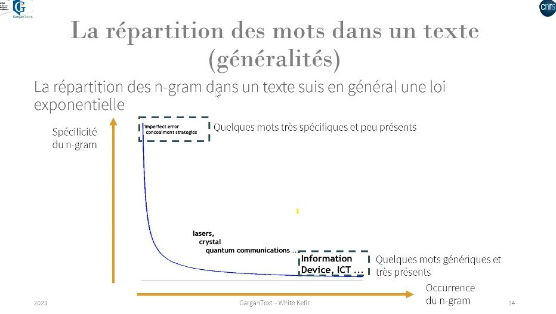

constitution des dictionnaires à partir de ngrams dans [[Gargantext]]: 

la ponctuation (à l'exception des . qui terminent les phrases) est supprimée ainsi que les majuscules de manière à comparer des ngrams identiques. Gargantex va jusqu'au tetragramme. 

La boule d'un graphe représentant un mot est proportionnel à leur occurrence et la longueur du lien avec une autre boule est proportionnelle à leur co-occurrence.

$\newline$
# bibliographie
$\newline$

