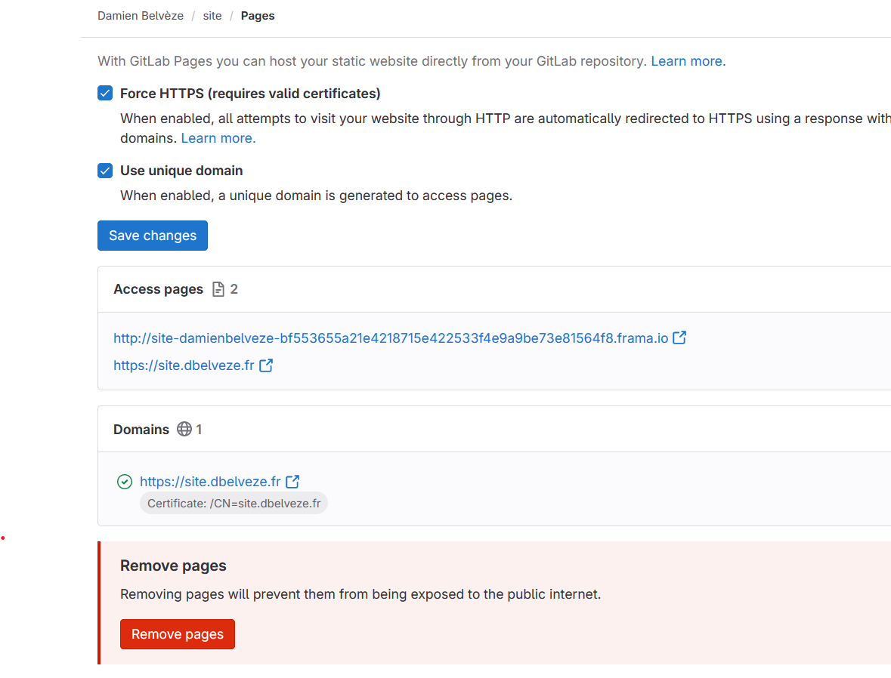
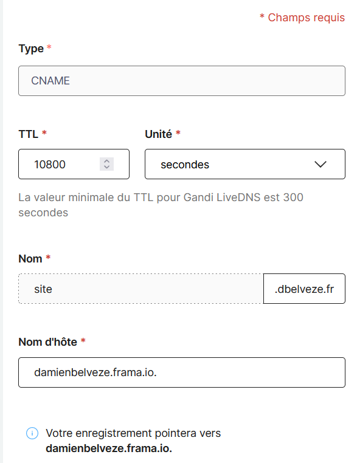
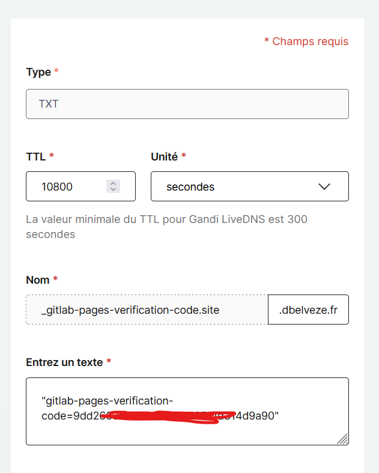
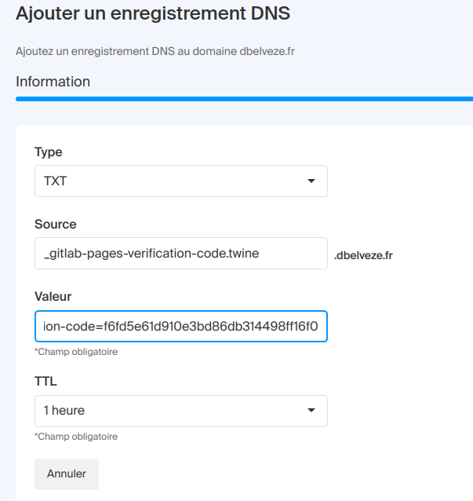

# confiance et noms de domaines

[[phishing]] : tentative de contrefaire un nom de domaine pour obtenir des informations privées, par exemple des coordonnées bancaires
par exemple laposte.net (avec un l) et Iaposte.net (avec un i majuscule)

validation des diplômes : la [[chaîne de blocs]] n'est qu'un gadget coûteux en argent et en ressources pour valider les diplômes ; la présentation du diplôme sous l'aspect d'une page html lié au nom de domaine de l'université devrait suffire ; l'intervention de la blockchain n'a qu'une valeur rhétorique. 
Cf démonstration d'Arnaud Levi [[@levyAlternativeLowtechAux2024]]

# Gestion des DNS sur Gandi

nom de domaine acheté à l'année : dbelveze

côté Framagit

nécessité de créer dans Gandi un CNAME avec la référence site.dbelveze.fr et un fichier TEXT avec la clé fourni par Framagit pour obtenir le certificat de Let's Encrypt

## Gestion des DNS sur Infomaniak

Aller sur le domaine : 
ne pas choisir "connecter un service", mais "ajouter un enregistrement", ajouter un site A

par exemple avec un site "site" auquel on veut accoler le nom de domaine "nomdedomaine.fr"

A 

source : site.nomdedomaine.fr

Valeur : 176.9.183.74 (IPV4 de Framagit)

TTL : 1 heure

Pour vérifier la propriété du nom de domaine, ajouter un enregistrement TXT

TXT

source: \_gitlab-pages-verification-code.site

valeur: gitlab-pages-verification-code=f6fd5e61d910e3bd86db314498ff16f0

(le code de vérification est disponible sur l'onglet page > custom domain du projet dans Framagit)

revenir à cette page et retenter la vérification de propriété

Vérifier que l'entrepôt dans Framagit : 
1. est public
2. **Settings > General > Visibility** : **Everyone** est sélectionné dans la section pages

$\newline$
# bibliographie
$\newline$

