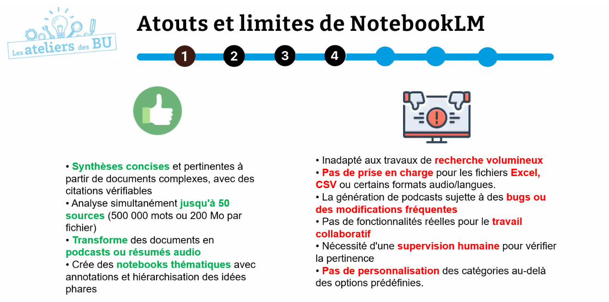

instance du [[grands modèles de langage|LLM]] Google Gemini
carnet de notes personnalisé possibilité d'y organiser différents projets. 
Les sources sont intégrées par l'utilisateur. 
conçus pour permettre une "prise de notes intelligente". 
Adapté à des publics divers. 
NotebookLLM est un [[RAG]]
Récupération récupère les documents pertinents par rapport à une requête
Augmentation 
Génération rédige une réponse en langage naturel en s'appuyant sur ce que l'IA a trouvé dans les documents fournis

NotebookLLM cite ses sources. 
Il va faire référence aux endroits du texte qu'on lui a fournis dans sa réponse. 

permet de faciliter l'analyse et la synthèse de document (extrait les notions-clé d'un écrit)

permet d'améliorer l'accompagnement du travail de recherche

optimise la gestion des ressources et la [[Veille Informationnelle|Veille]] (classement des documents fournis)

fonctionnalité intéressante pour se mettre au défi, il peut être aidant pour comprendre des notions complexes

démonstration du traitement par le notebook à partir du rapport du GIEC (110 pages)

$\newline$
# bibliographie
$\newline$

